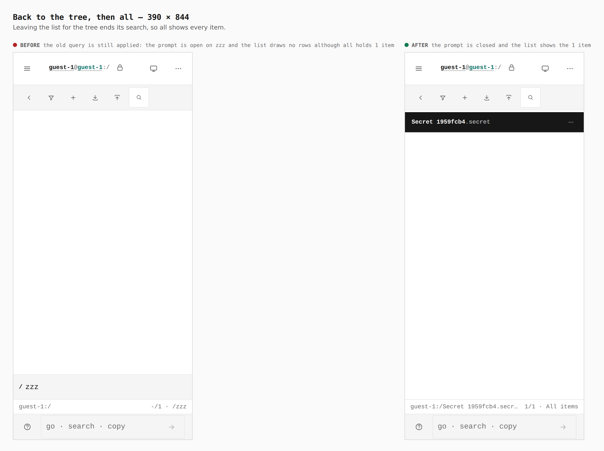
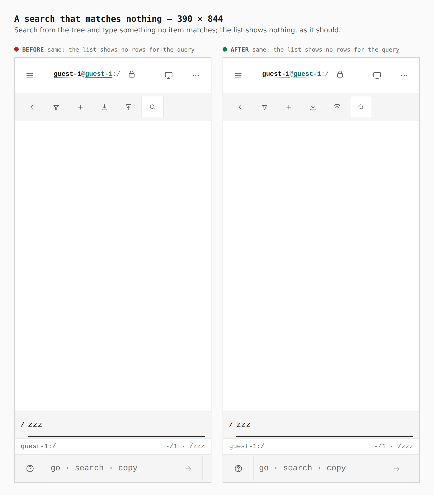

# A phone's search ends when the tree comes back

Before/after from two real builds — `main` (`49c9e43`) and this branch — same
journey (`journey.json`), a touch context at 390 × 844. The vault holds one
item; the walk searches from the tree for something no item matches, goes back
to the tree and opens `all`.

Measured in the browser: before, `all` opens with the prompt still open on
`zzz` and **0 rows** although the vault holds 1 item (`-/1 · /zzz` in the
status line). After, the prompt is closed and the list shows **1 row**
(`1/1 · All items`). The phone gate (`verify:mobile`, `search-round-trip`
stop) fails the unfixed build with `all shows its items again (0 rows)` at
320, 390 and 430, and passes this branch.

## 1. Back to the tree, then all — 390

## 2. The search itself — 390

Unchanged: a query that matches nothing draws no rows, as it should. An item
opened from a search still comes back to that same search; only the tree ends
it.
