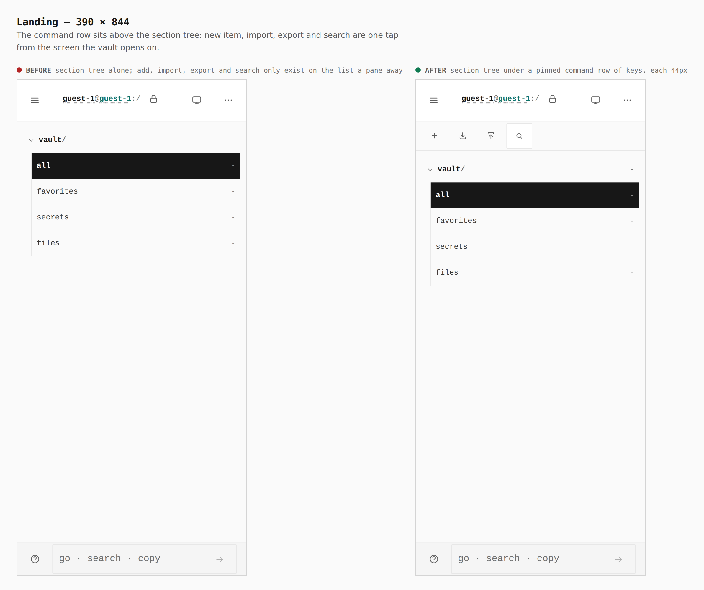
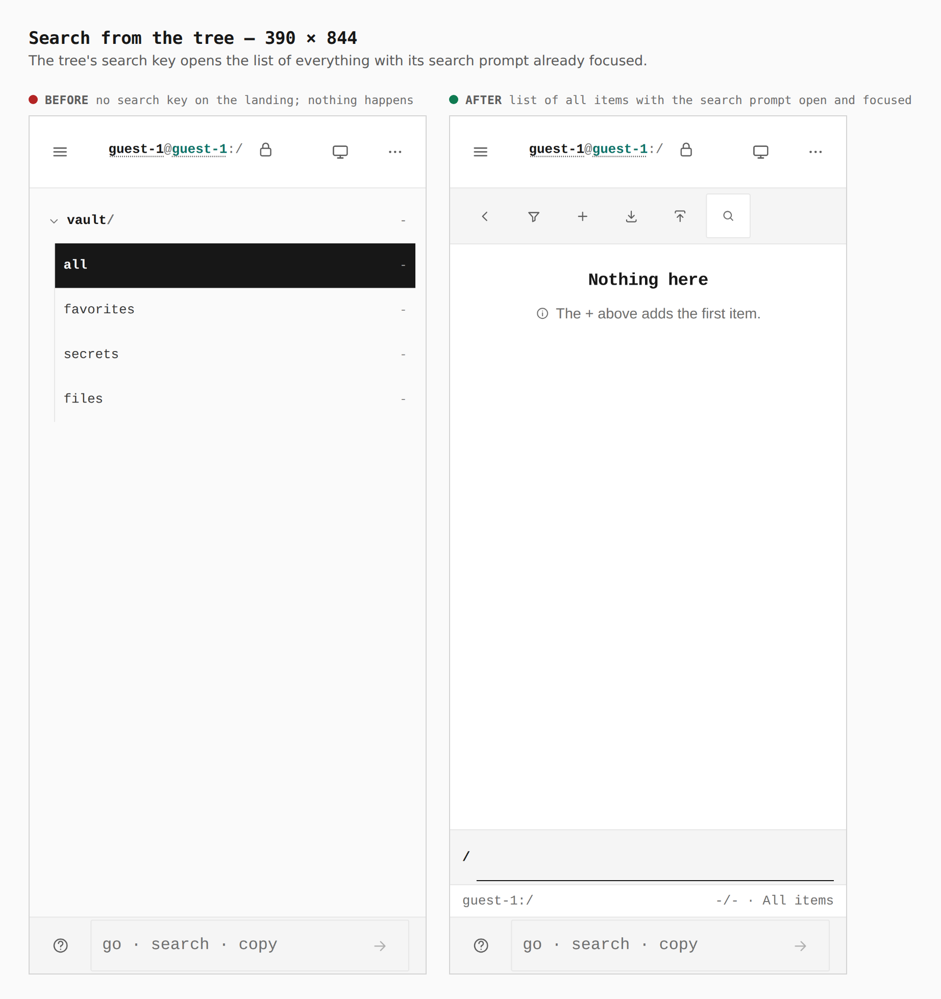
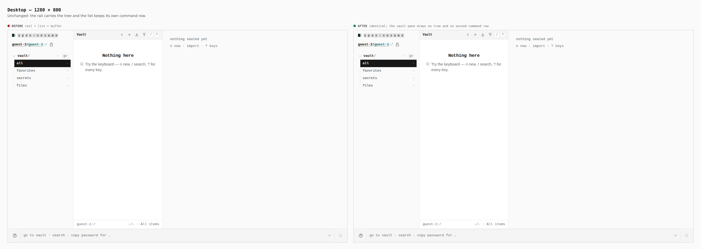

# The phone's section tree carries the vault's command row

Before/after from two real builds — the base (stack tip `74b3827`, which
already opens on the section tree) and this branch — same journey
(`journey.json`), a touch context at 390 × 844 and a mouse context at
1280 × 800.

Measured in the browser on the branch (`verify:mobile`, `tree-actions` stop,
at 320, 390, 430 and landscape): the tree pane carries New item, Import items,
Export items and Search keys, each 44 × 44; the search key lands on the list
(`data-pane="list"`) with the `Search items` prompt focused, at 16px so iOS
does not zoom on focus. At 1280px the vault pane draws no tree and no second
row.

## 1. Landing — 390

Before: the tree alone; adding, importing, exporting and searching only
existed on the list a pane away. After: a pinned row of keys above the tree.

## 2. Search from the tree — 390

The tree's search key opens the list of everything with its prompt open.
Its input was 13px, which makes iOS zoom the page on focus; it is 16px under
the touch rules now, and the phone gate opens the prompt so it stays so.

## 3. Desktop — 1280

Unchanged.
