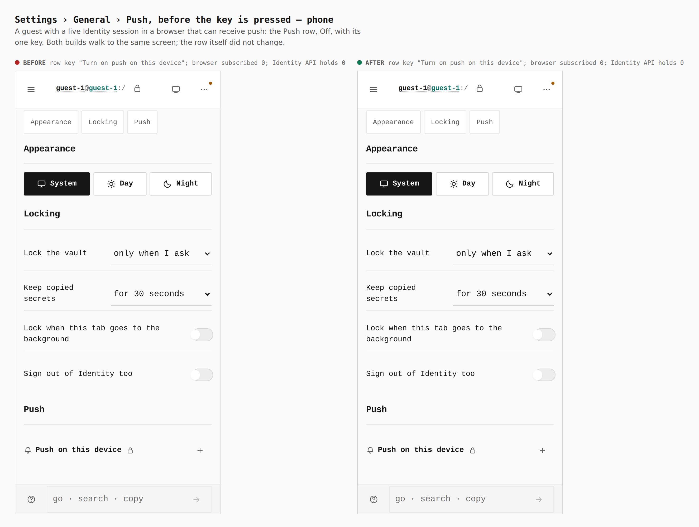
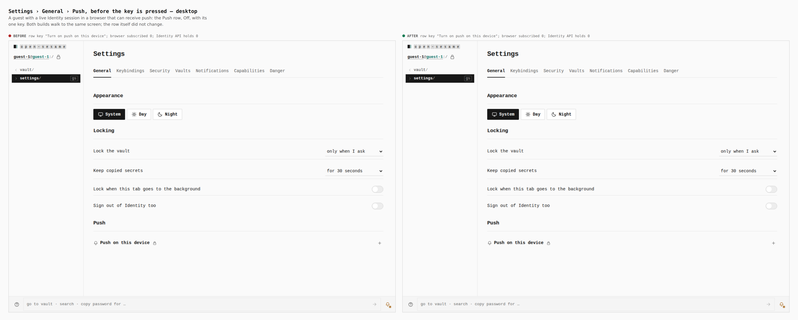
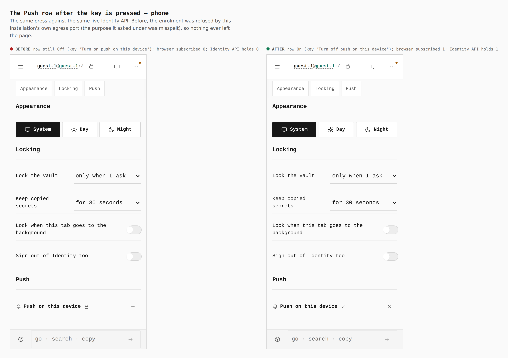
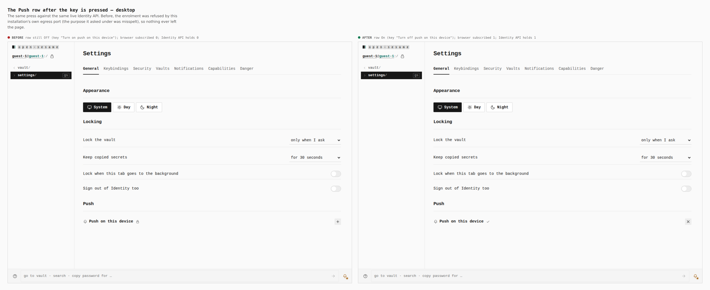
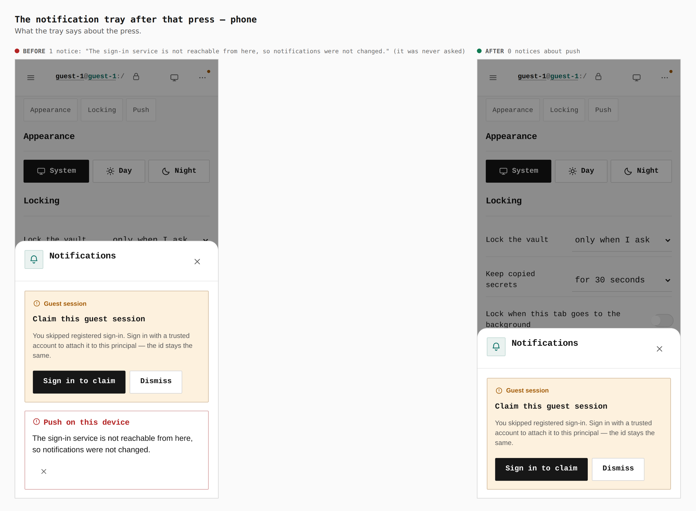
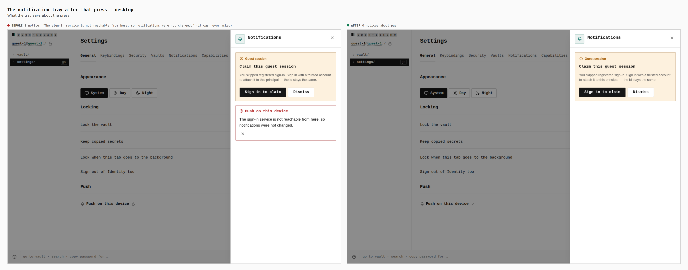
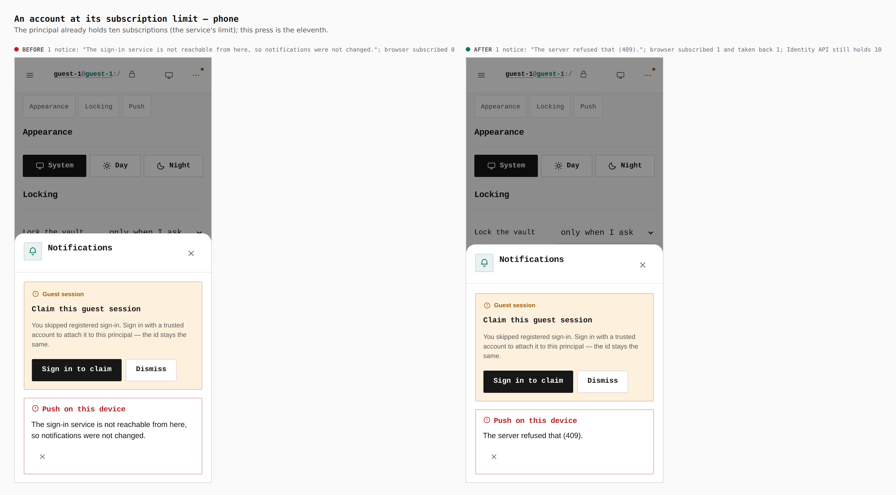
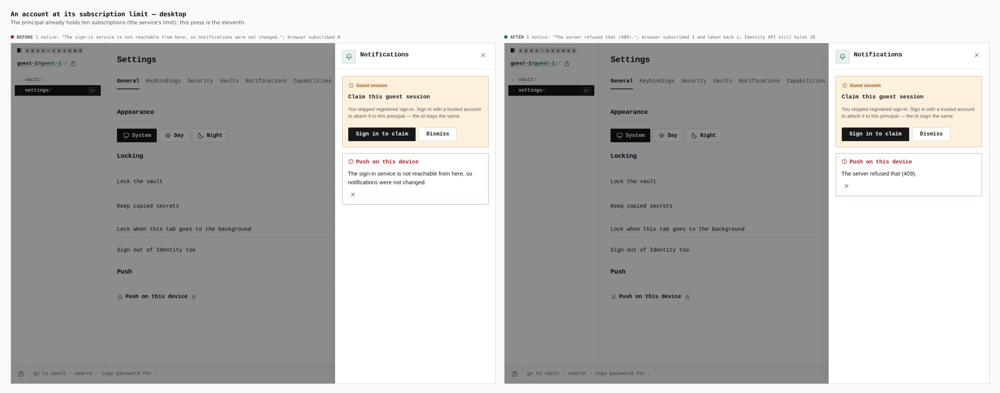
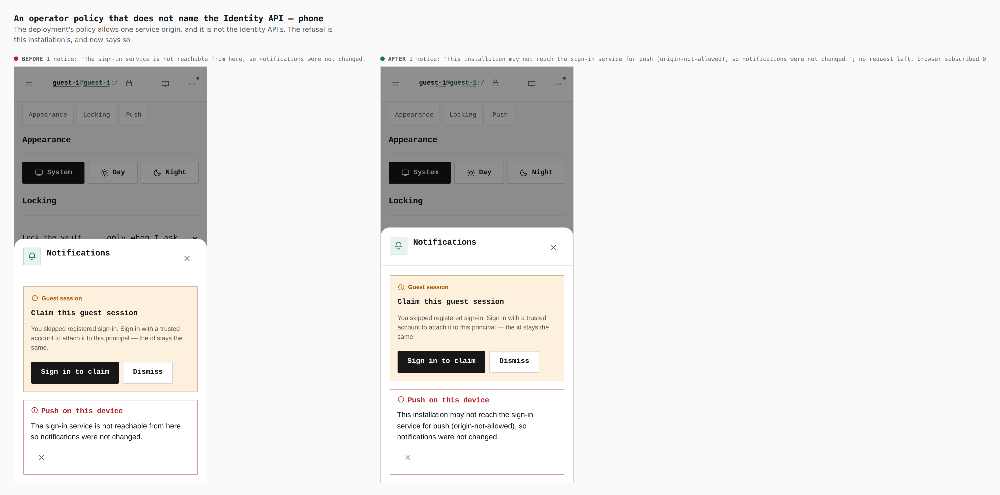
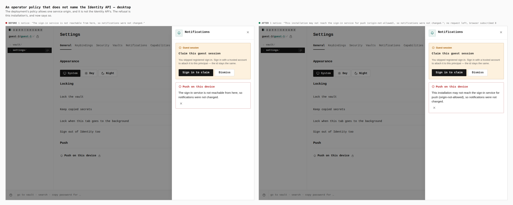

# Push enrolment: the Push row and its notices, before and after

The Push row (Settings › General › Push) is drawn only for a person with an
Identity session (ADR 0158), so it never appears in the static, backend-less
captures. These sheets are taken against a **real Identity API** instead: the
control-plane (`startServer()`, in memory), the Host's Web Push delivery and a
stand-in push service, with Pages in a real browser at a real localhost origin,
service workers on. The only thing stood in for is the browser's own push
subscription (headless Chromium has no push service): `lib/push-browser-shim.mjs`
answers `subscribe`/`getSubscription`/`unsubscribe` with real P-256 subscriptions
the stand-in can decrypt for. Nothing on screen is drawn by hand.

- **Before** is the `origin/main` build (618b48e0), exported with `git archive`
  and built in its own directory. **After** is this branch. Both are built with
  `PAGES_DEPLOYMENT_PROFILE=loopback_development` for `http://localhost:41877`,
  the one origin that profile honours, and both are walked by the same
  `journey.json` against the same stack, at phone (390 × 844, touch) and
  desktop (1280 × 900).
- Every measurement below is printed by the capture (`pushFacts`, `report`),
  read from the browser and the stack, not from the diff.
- Reproduce: `pnpm --filter @opensesame/pages build:push-verify` (after) and the
  same steps into another directory for the base, then
  `pnpm --filter @opensesame/control-plane exec tsx apps/pages/scripts/capture-evidence.mjs capture <before|after> <abs path to journey.json>`
  with `EVIDENCE_DIST` naming the build, then `compose`.

## What the before build does

Every press of the key is refused by this installation's own egress port
before a request leaves the page (the purpose the enrolment asked under was
misspelt), and the person is told the service "is not reachable". Identity API
rows stay at 0, the push service sees nothing. After, the enrolment goes
through, and each refusal says who refused.

## Settings › General › Push, before the key is pressed

Same in both builds: the row, Off, one key. Measurement, both: key
"Turn on push on this device"; browser subscribed 0; Identity API holds 0.

| phone | desktop |
| --- | --- |
|  |  |

## The key is pressed

Before: row still Off, browser subscribed 0, Identity API holds 0.
After: row On (key "Turn off push on this device"), browser subscribed 1,
Identity API holds 1.

| phone | desktop |
| --- | --- |
|  |  |

## The tray after that press

Before: one notice, "The sign-in service is not reachable from here, so
notifications were not changed." After: no notice about push.

| phone | desktop |
| --- | --- |
|  |  |

## An account at its subscription limit (409)

The principal already holds ten subscriptions. Before: the "not reachable"
notice, browser subscribed 0. After: "The server refused that (409).", the
browser made one subscription and took it back (subscribed 1, unsubscribed 1,
holds none), the Identity API still holds 10. (Found by this walk: a full
account used to be retried as an endpoint conflict, churning two
subscriptions; only `endpoint_already_registered` is retried now.)

| phone | desktop |
| --- | --- |
|  |  |

## An operator policy that does not name the Identity API

Before: "not reachable". After: "This installation may not reach the sign-in
service for push (origin-not-allowed), so notifications were not changed."
No request left the page, browser subscribed 0, Identity API holds 0.

| phone | desktop |
| --- | --- |
|  |  |

## Other copy this branch changed (verified by tests and `verify:push`, not pictured)

| Situation | Before | After |
| --- | --- | --- |
| The permission prompt is dismissed | "Notifications are blocked for this site, so nothing can be delivered here. Requests still wait for you in the app." | "Notifications were not allowed for this site, so nothing can be delivered here. Requests still wait for you in the app." (a blocked site keeps the old sentence) |
| The browser refuses to subscribe | the browser's own exception text | NotAllowedError: the "blocked" sentence. AbortError / NetworkError: "This browser's push service could not be reached, so push was not turned on. Try again later; requests still wait for you in the app." NotSupportedError / SecurityError: "This browser cannot subscribe to push from here. Requests still wait for you in the app." Anything else: "This browser could not subscribe to push. Requests still wait for you in the app." |
| No service worker is registered | the key hung with no notice | "No service worker is running for this app yet, so push cannot be turned on. Reload the page and try again." |
| The push worker has not taken the scope yet | a subscription was taken against a worker with no `push` handler | waits, then "The push worker is still being installed on this device. Try again in a moment." |
| The Identity API says nothing, or the browser never answers `subscribe` | the key hung | after 15 s / 30 s: the "not reachable" sentence / the "push service could not be reached" sentence |
| Another principal holds this browser's endpoint (409) | "The server refused that (409)." and push could never be turned on | a fresh subscription is registered (verified end to end: their record untouched, no notice) |

## What else was verified

- `pnpm --filter @opensesame/pages verify:push` walks all of the above against
  the same stack, plus the doorbell: a real authorization request makes the
  Host send `{kind: "authorization_request", action: "review", ref}` to this
  browser's subscription, the stand-in verifies the RFC 8292 VAPID token and
  decrypts the RFC 8291 body, the payload is handed to the worker over CDP
  `ServiceWorker.deliverPushMessage`, and "Authorization requested" rings.
  Turning off removes the server row and the browser's subscription. About 18 s
  end to end (front door and approval 7.0 s, enrolment 0.6 s, doorbell 0.4 s,
  turn off 0.4 s, the four failures 0.4 / 0.7 / 0.4 / 4.3 s); 10 of 10
  consecutive runs passed.
- `push-enrolment.test.ts`, `PushPanel.test.tsx` and `verify:push-worker`
  assert each message and the worker swap, including a second tab.
