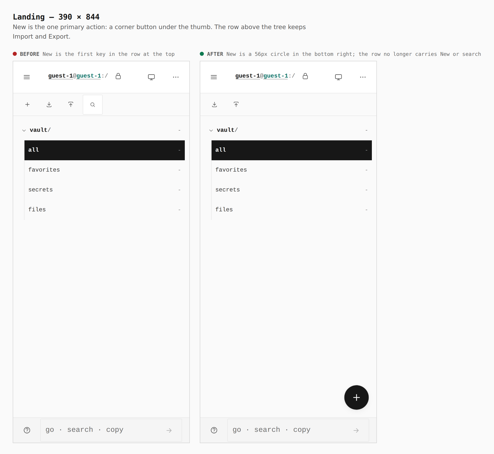
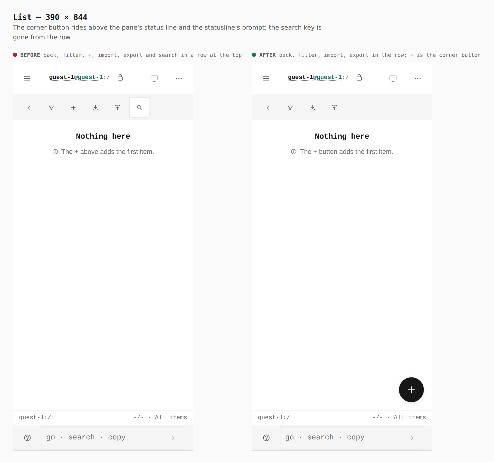
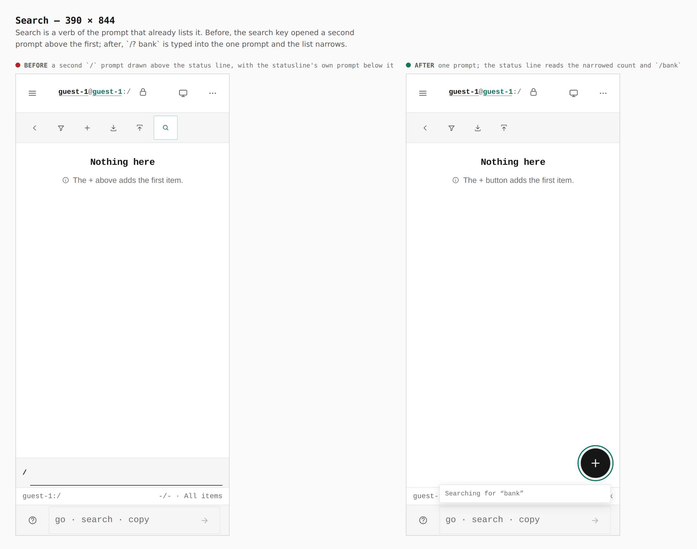
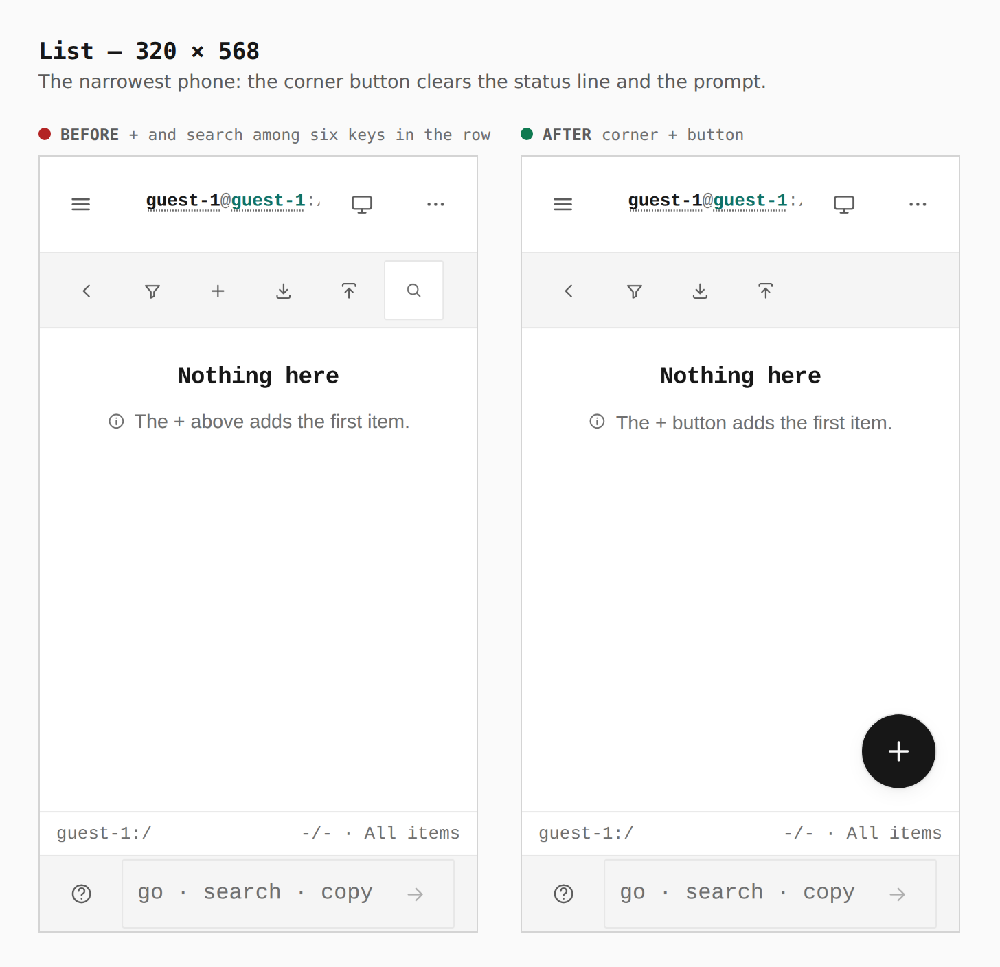
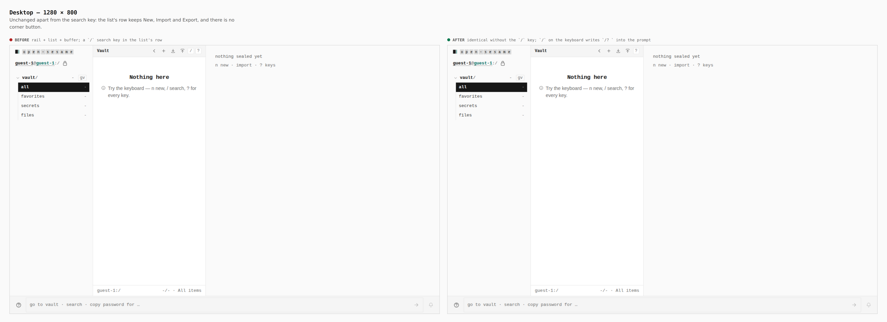

# Search is the prompt's `/?` verb; New is a phone's corner button

Before/after from two real builds — the base (`49c9e438`, `main`) and this
branch — same journey (`journey.json`), a touch context at 390 × 844 and
320 × 568, and a mouse context at 1280 × 800. Steps marked `only` run on one
side of the pair: the base has a search key to press, the branch has a verb
to type.

Measured in the browser (`capture-evidence.mjs` `measure` / `count`, and
`verify:mobile` at 320, 390, 430 and landscape):

| | before | after |
|---|---|---|
| New item, 390 | key `44 × 44` in the top row | `56 × 56` circle at `318,716`, 16px above the statusline |
| New item, 320 | key `44 × 44` in the top row | `56 × 56` circle at `248,408` |
| Keys in the list's row, 390 | back, filter, +, import, export, search (six, `44 × 44`) | back, filter, import, export (four, `44 × 44`) |
| Keys in the tree's row, 390 | +, import, export, search | import, export |
| Search boxes drawn when searching, 390 | 2 — `.vtree__cmd` `390 × 55` above the status line, and the statusline's `248 × 44` prompt | 1 — the statusline's `248 × 44` prompt; `.vtree__cmd` count `0` |
| Status line after `/? bank` | n/a | `-/- · /bank` (read from `.vault__status-meta`) |
| Desktop 1280, corner buttons | 0 | 0 |

## 1. Landing — 390

New leaves the top row for the corner, where a thumb already rests. The
section tree keeps Import and Export above it.

## 2. List — 390

The corner button sits above the pane's status line and clear of the
statusline's prompt. The empty-state tip now says "The + button" instead of
"The + above".

## 3. Search — 390

Before: the search key opened a second `/` prompt above the status line, with
the statusline's own prompt (whose hint already lists `search`) below it.
After: `/? bank` is typed into that one prompt and run; the list narrows to
the words (`?f=all&q=bank`). The "Searching for “bank”" notice is the command
bar's own, and sits over the pane's status line until the next keystroke, so
the `-/- · /bank` count is quoted from the browser above rather than visible
here. Focus lands on the corner button because the guest vault is empty and
an empty list hands the keyboard to its New control; in a vault with items it
lands on the tree.

## 4. List — 320

## 5. Desktop — 1280

The list's row keeps New, Import and Export; there is no corner button. The
`/` search key is gone from the row, and the `/` key on a keyboard writes
`/? ` into the prompt and focuses it.
