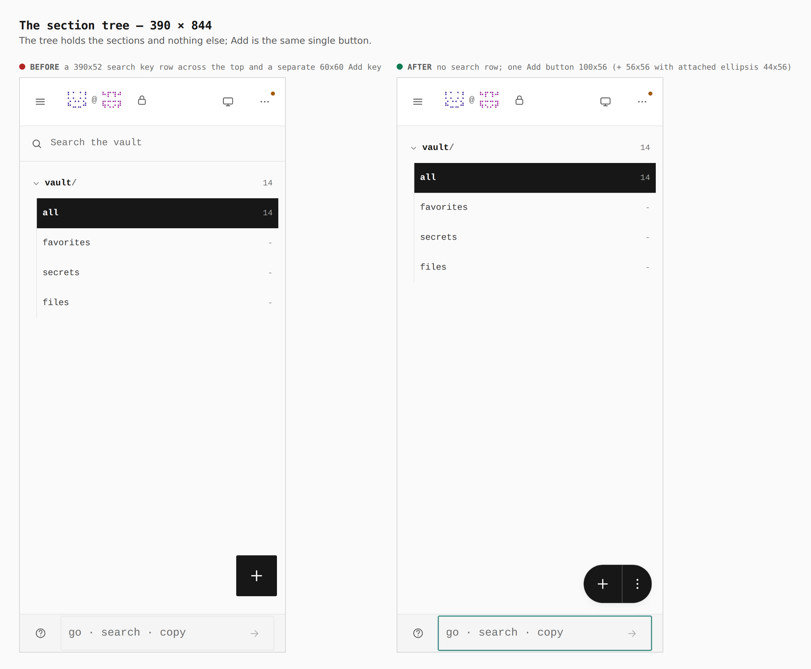
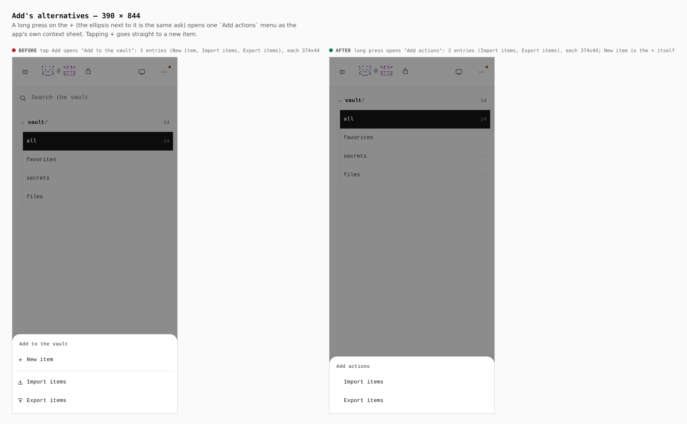
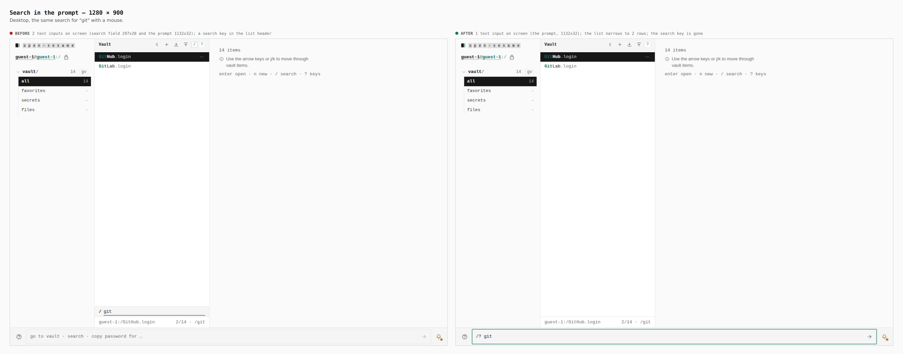
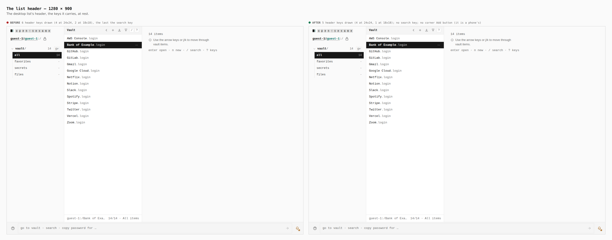

# Search in the prompt, Add as one button

Before/after from two real builds: `origin/main` at `6c6fd74d` and this branch
(`ccr-stack-3`), the same journey (`journey.json`), walked the same way. A
guest vault seeded with 14 logins (GitHub, GitLab, Gmail, Google Cloud, AWS
Console, Netflix, Notion, Slack, Stripe, Spotify, Twitter, Vercel, Zoom, Bank
of Example), at a touch context of 390 × 844 and a mouse at 1280 × 900.
Every number below was printed by the browser while the journey ran (the
`measure`, `count` and `report` steps), not read from the CSS.

Text inputs "on screen" are the visible `input` and `textarea` elements that
have a box. Both builds also keep one 1 × 1 visually hidden input off the edge
of the screen; it is not counted.

## Measurements

| what | before | after |
|---|---|---|
| Text inputs on screen while searching, 390 | 2 (search field 352x44, prompt 248x44) | 1 (prompt 248x44) |
| Text inputs on screen while searching, 1280 | 2 (search field 297x20, prompt 1132x32) | 1 (prompt 1132x32) |
| Search for "git" in a vault of 14, 390 and 1280 | 2 rows, typed into the second field; status `2/14 · /git` | 2 rows, typed as `/? git` into the prompt; status `2/14 · /git` |
| List header, 390 | 6 keys, each 44x44 (back, filter, +, import, export, search) | back 44x44 and the view's name 331x48, `All items` |
| List header, 1280 | 6 keys drawn (4 at 24x24, 2 at 18x18), the last the search key | 5 keys drawn (4 at 24x24, 1 at 18x18); no search key |
| Add on the list, 390 | a 44x44 key in the header row | one button 100x56 in the corner: `+` 56x56, attached ellipsis 44x56 |
| Add on the section tree, 390 | search row 390x52 and a separate Add key 60x60 | one button 100x56 (`+` 56x56, ellipsis 44x56); no search row |
| Add on the desktop list, 1280 | `+`, import and export keys in the header | the same three keys; no corner button (it is a phone's) |
| Add's menu, 390 | tap Add opens `Add to the vault`: 3 entries (New item, Import items, Export items), each 374x44 | long press on `+` opens `Add actions`: 2 entries (Import items, Export items), each 374x44; New item is the `+` tap |
| Tap on the ellipsis, 390 | not drawn | opens the same `Add actions` menu (the two captures are byte-identical) |

## 1. Search in the prompt, 390

## 2. The list, its header and the Add button, 390

## 3. The section tree, 390

## 4. Add's alternatives, 390

The long press is raw touch events held for 900ms, the road a phone takes to a
context menu. The base has no long-press menu: the closest picture is the sheet
its Add key opens when tapped. Both are taken on the section tree.

## 5. Search in the prompt, 1280

## 6. The list header, 1280

## What this does not show

- Desktop has no corner Add button (`NewItemFab` is drawn only on a phone), so
  there is no desktop pair for the button or its menu.
- The ellipsis tap has no sheet of its own: it opens the menu in sheet 4, and
  the two screenshots are byte-identical.
