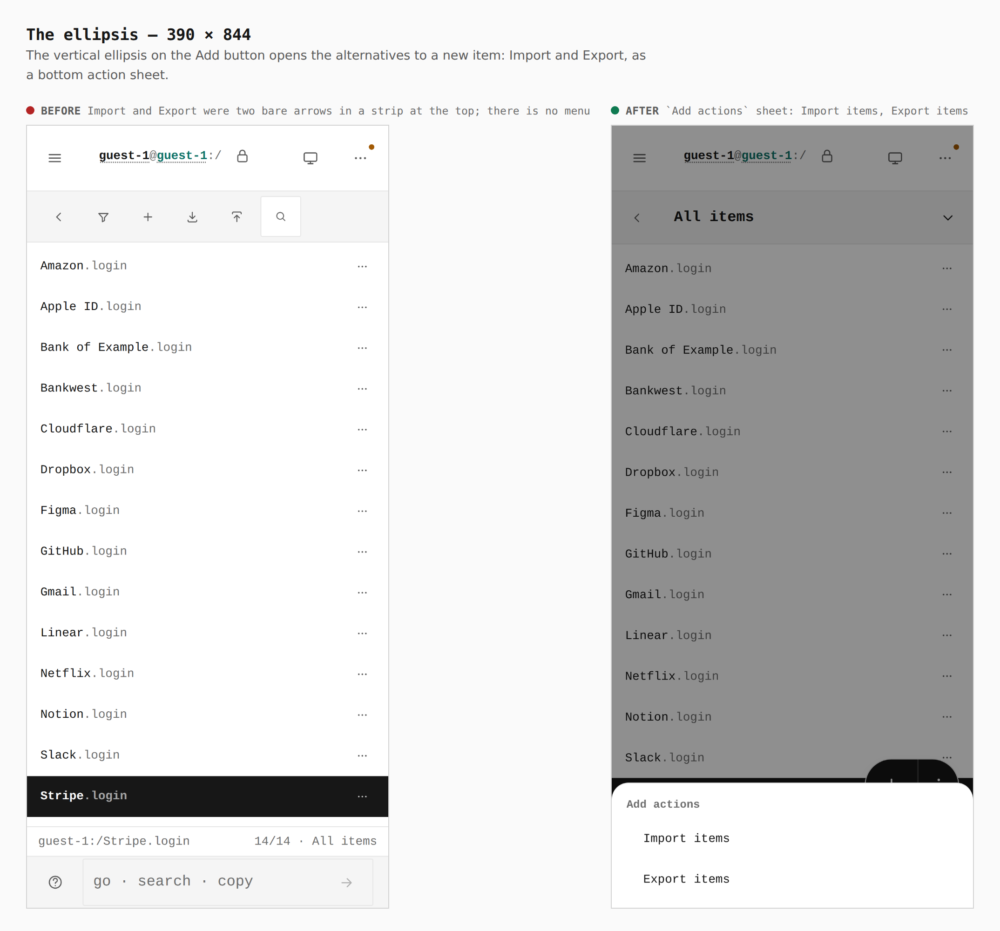
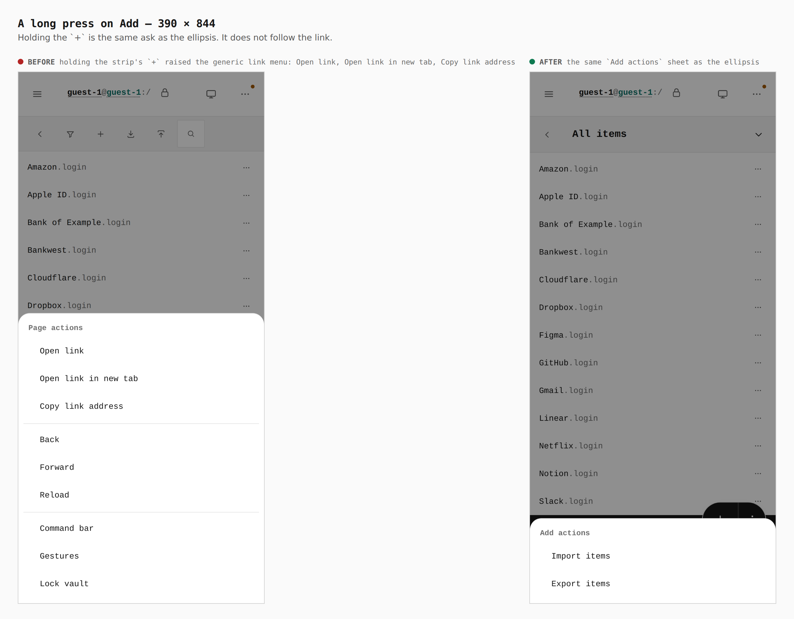
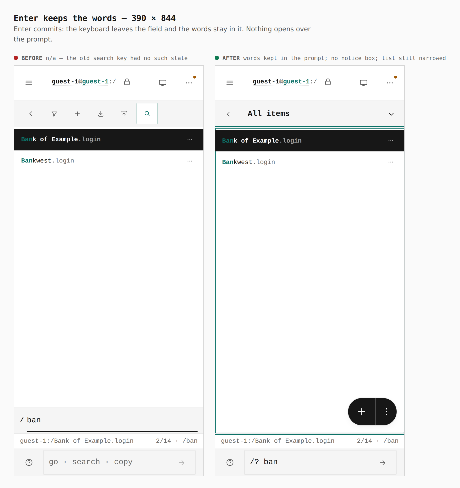

# One text input; Add is one button

Before/after from two real builds — the base (`49c9e438`, `main`) and this
branch — same journey (`journey.json`): a vault seeded with 14 logins through
the editor, a touch context at 390 × 844 and 320 × 568, a mouse context at
1280 × 800. Steps marked `only` run on one side of the pair: the base has a
search key to press, the branch has a verb to type.

Everything below is read from the browser (`capture-evidence.mjs` `measure` /
`report`), and `verify:mobile` fails the build on the same facts at 320, 390,
430 and landscape — including a real long press sent as raw touch events.

| 390 × 844 | before | after |
|---|---|---|
| Text inputs on screen while searching | **2** — `352 × 44` (a `/` box above the status line) and the prompt `248 × 44` | **1** — the prompt, `248 × 44` |
| What the section tree carries | a strip of 4 glyph keys (`44 × 44`) above it | nothing but the sections |
| Add | a `44 × 44` glyph `+` in a strip at the top | one button, `100 × 56` at `274,684`: a `+` target (`56 × 56`) with a vertical ellipsis attached (`44 × 56`), above the status line and the prompt |
| Import / Export | two bare arrows in the strip, `44 × 44` each | the alternatives in the Add button's menu: tap the ellipsis, or hold the `+` |
| Holding the `+` | the generic `Page actions` sheet: Open link, Open link in new tab, Copy link address, Back, Forward, Reload, Command bar, Gestures, Lock vault | `Add actions`: Import items, Export items; the hold does not follow the link (the gate checks the address is unchanged) |
| List header | 6 unlabelled glyphs, each `44 × 44` | back `44 × 44` and the view, named: `All items ▾` at `331 × 48` |
| After Enter on a search | `/search ban` emptied the prompt and opened a bordered "Searching for…" box over it (from the command bar's code; the list never read the `?q=` it navigated to) | the words stay in the prompt; `.command-bar__status` absent (measured) |
| Search `ban` | `2/14 · /ban` after typing in the second box | `2/14 · /ban` while typing in the prompt, before Enter |
| 320 × 568 | funnel `44 × 44` among six keys | `All items ▾` `261 × 48`; Add `100 × 56` at `204,408` |
| 1280 × 800 list row | icon keys, one of them the `/` search key | the same icon keys without it; no Add button (`.fab` count `0`) |

## 1. Landing — 390

The tree is the sections and nothing else. Add is one button in the corner.

## 2. List — 390

The header is back and the view the list is showing, named, as one choice the
width of the rest. Narrowed is said in the accent colour.

## 3. The ellipsis — 390

The vertical ellipsis on the Add button opens the alternatives to a new item,
as a bottom action sheet. Before, Import and Export were two arrows nobody
could tell apart.

## 4. A long press on Add — 390

Holding the `+` is the same ask as the ellipsis. Before, it raised the page's
generic link menu.

## 5. Search — 390

Before: a search key opened a second `/` box above the status line, with the
statusline's own prompt below it. After: `/? ban` is typed into that one prompt
and the list narrows as it is typed, with the count in the status line. The
same prompt searches Activity and the connector catalog.

## 6. Enter keeps the words — 390

Enter hands the keyboard to the list; the words stay in the prompt, no notice
box opens over it, and Esc empties it.

## 7. List — 320

## 8. Desktop — 1280

The list's row keeps its icon keys for New, Import and Export. The `/` key on
a keyboard writes `/? ` into the prompt and focuses it.
