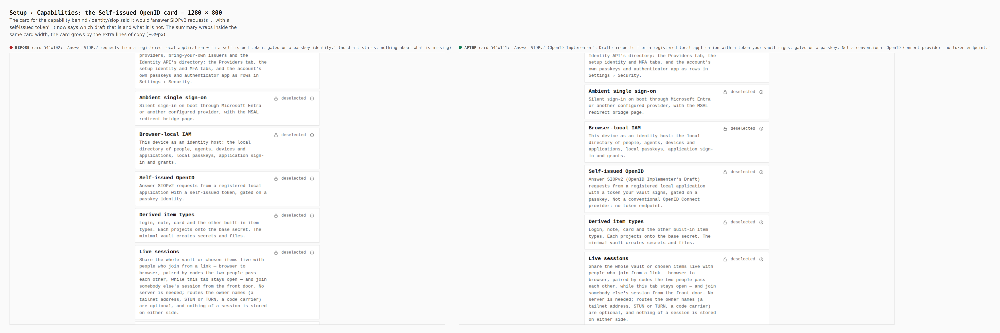
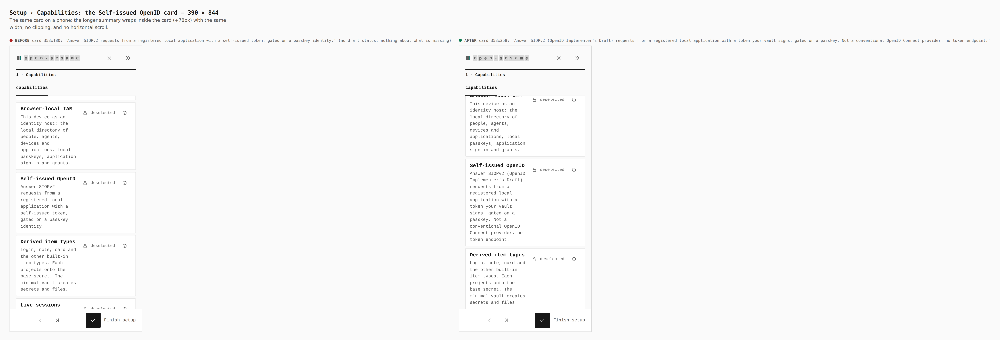

# The Self-issued OpenID card says what Pages is not (ADR 0161)

Before/after from two real builds of `apps/pages`: the base (`6c4aa77b`, the
tip of `main` this branch was cut from) and this branch, walked the same way
by `apps/pages/scripts/capture-evidence.mjs` with [`journey.json`](journey.json)
(`VITE_BASE=/OpenSesame/`; the base built in its own `git worktree` and
captured with `EVIDENCE_DIST`). Sizes are read from the browser by the
journey's `measure` step; the text by its `report` step.

The walk: front door › Set up your own › Custom › Customize this installation ›
Custom, then the **Self-issued OpenID** capability card
(`[data-testid="capability-card-identity.siop"]`), at desktop and phone width.

What changed: the card for the capability behind `/identity/siop` described a
"self-issued token" without saying which draft it is or what it is not. Pages
is a SIOPv2 (OpenID Implementer's Draft) provider and is **not a conventional
OpenID Connect provider**: it has no token endpoint
([ADR 0161](../../adr/0161-what-a-static-origin-can-be-as-an-openid-provider.md)).
The card now says so in one sentence. The explanation itself lives in the ADR
and in [Use OpenSesame Pages as your login](../../operators/use-pages-as-your-login.md),
not on a screen (AGENTS.md §5: no explainer captions).

| Screen | Before | After |
|---|---|---|
| Setup › Capabilities, 1280 × 800 | card 544x102, 113-character summary | card 544x141, 201-character summary (+39px) |
| Setup › Capabilities, 390 × 844 | card 353x180 | card 353x258 (+78px), same width, no clipping |

## 1280 × 800

## 390 × 844

## What is not pictured, and what was verified instead

- The guided-help goal (`identity.local.siop.authorize`) and the capability
  registry title carry the same statement. The first is spoken by the support
  panel only when someone asks, the second is read by agents and the support
  model's context; neither has a fixed place on a screen to capture. Both are
  covered by the tutorial-registry and registry tests (GuideLang parser and
  validator accept the text; `siop-boundary.test.ts` pins the title).
- `siop-metadata.json`, the relying-party kit and the examples have no rendered
  surface; their evidence is `pnpm --filter @opensesame/pages verify:siop`
  (see the ADR's *Testing* section), not images.
- The Settings › Capabilities tile for this capability shows its name only, as
  every tile does; it is unchanged.
