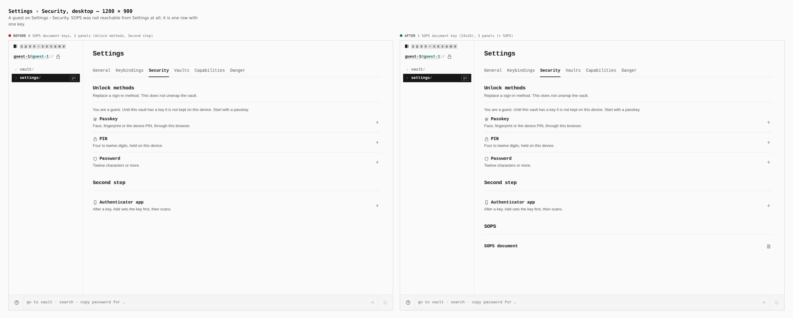
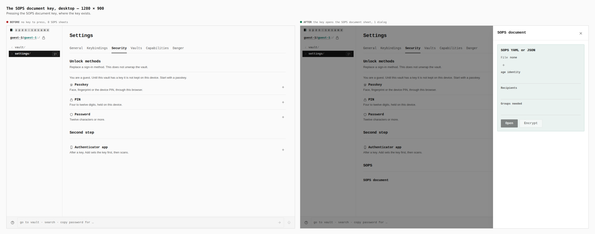
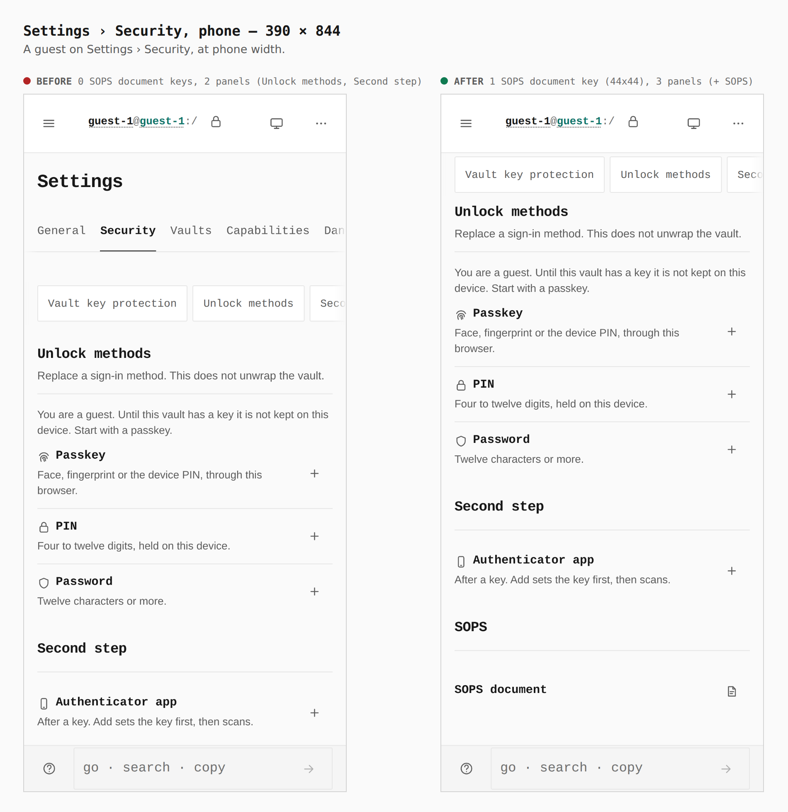
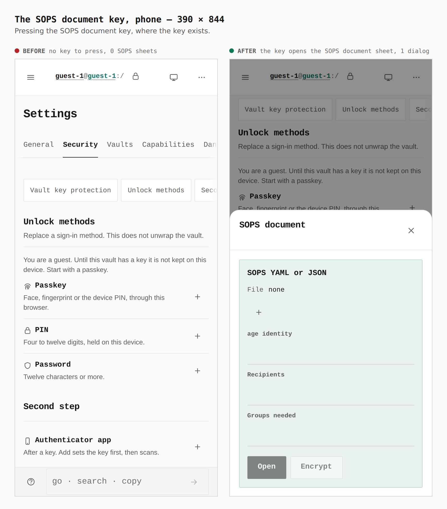

# SOPS document key under Settings › Security — before and after

Two real Pages builds walked the same way: `origin/main` (107ec5e1) as
"before", this branch as "after". Journey: guest → Settings → Security → the
SOPS document key → the sheet. Phone (390 × 844, coarse pointer) and desktop
(1280 × 900). The journey and its measurements are in
[`journey.json`](journey.json); the numbers below were read from the browser.

#618 removed the Formats panel, and the SOPS document sheet with it, so a
person could no longer open a SOPS file from Settings (ADR 0130 §1). It is back
as one row under Security: a name and one icon key.

| measured in the browser | before | after |
|---|---|---|
| `button[aria-label="SOPS document"]`, desktop | 0 | 1, 24 × 24 |
| `button[aria-label="SOPS document"]`, phone | 0 | 1, 44 × 44 |
| Security panels (`main section.panel h2`) | Unlock methods, Second step | Unlock methods, Second step, SOPS |
| `[role=dialog][aria-label="SOPS document"]` after pressing the key | 0 | 1 |

## Security, desktop

## The sheet, desktop

## Security, phone

## The sheet, phone

