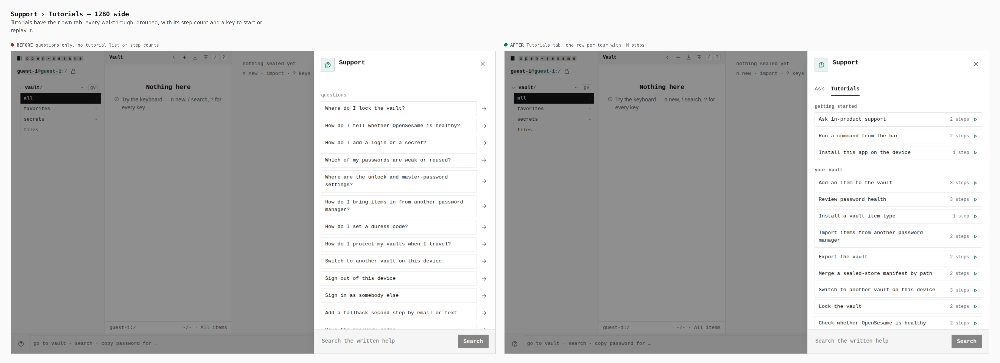
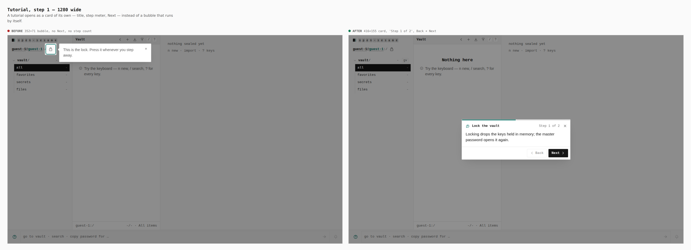
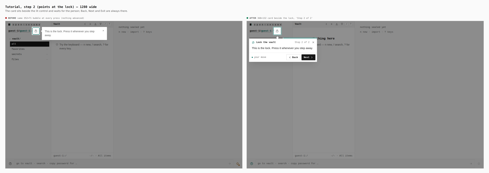
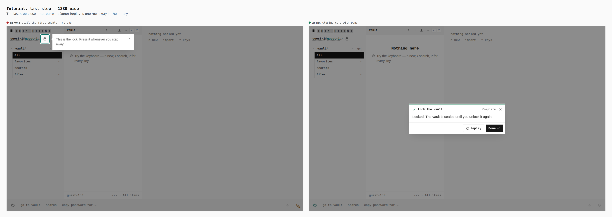
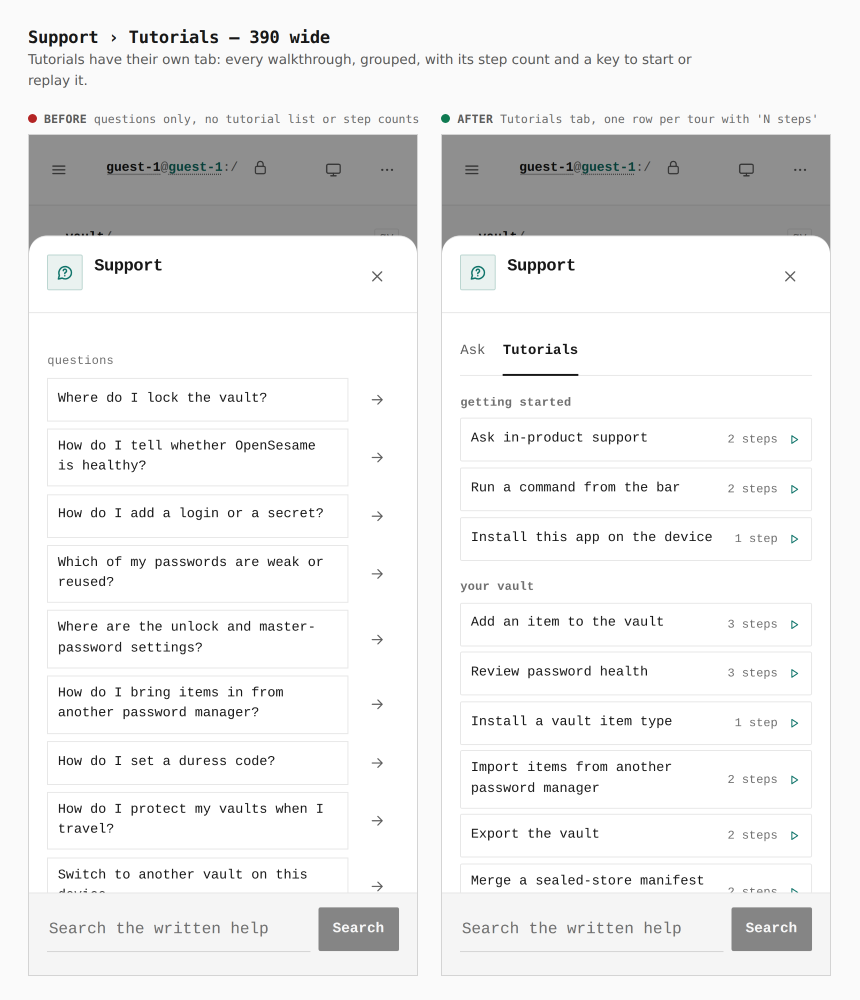
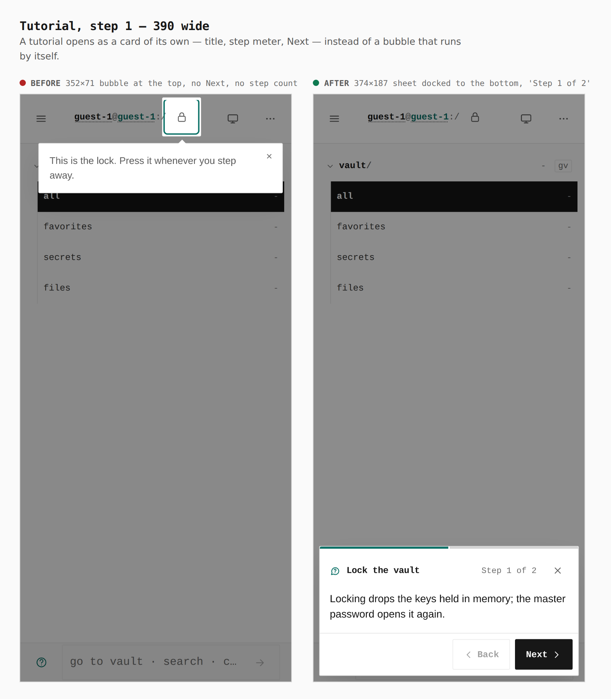
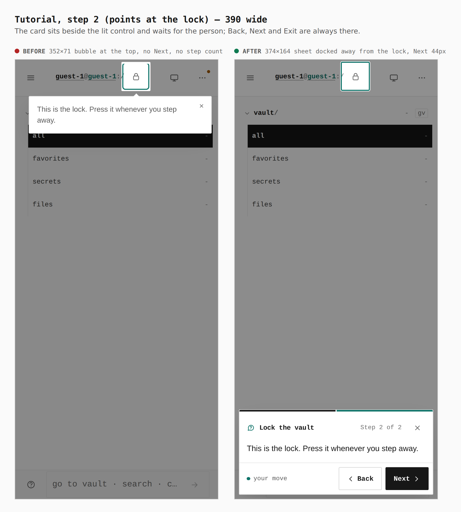
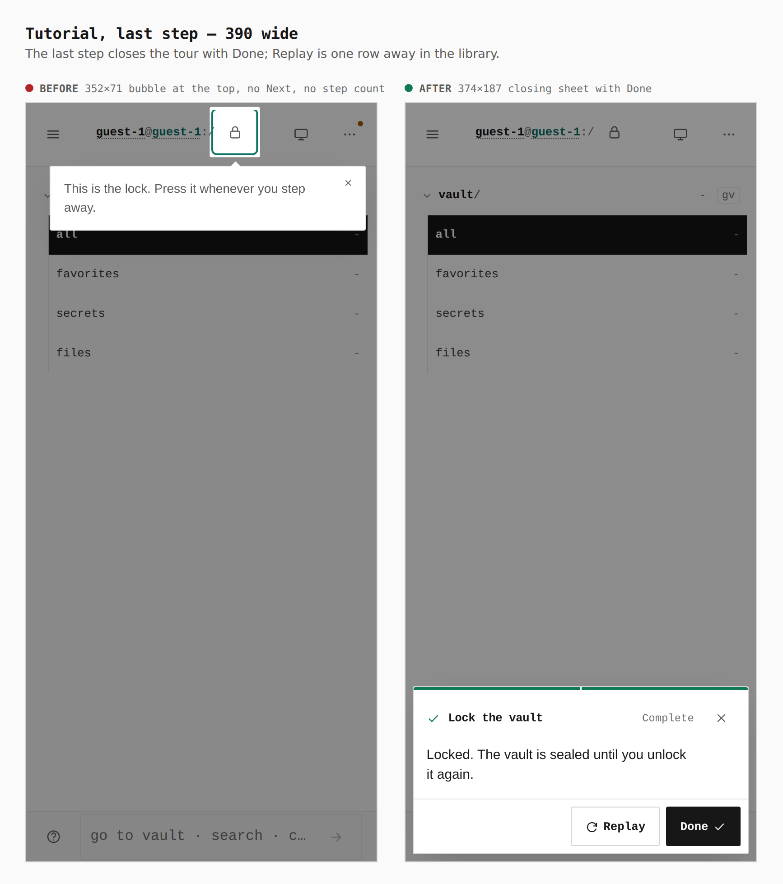

# Tutorial mode — before / after

Two real builds walked the same way: `origin/main` (Driver.js bubble) and this branch (tutorial mode, ADR 0163). Guest vault, the *Lock the vault* tutorial, Next pressed twice. Desktop is 1280×800 with a mouse, phone is 390×844 with touch. Measurements come from the browser (`.coach__card` / `.driver-popover` box); the full interaction contract is checked by `pnpm --filter @opensesame/pages verify:tutorials` (62 tutorials, both widths, 6608 checks, 0 failed).

Reproduce: `docs/evidence/2026-10-04-tutorial-mode/journey.json` with `apps/pages/scripts/capture-evidence.mjs` (verbs `supportOpen`, `tutorialsTab`, `tour`, `tourNext`, `tourMeasure`).

## Support › Tutorials — 1280 wide

Tutorials have their own tab: every walkthrough, grouped, with its step count and a key to start or replay it.

- before: questions only, no tutorial list or step counts
- after: Tutorials tab, one row per tour with 'N steps'

## Tutorial, step 1 — 1280 wide

A tutorial opens as a card of its own — title, step meter, Next — instead of a bubble that runs by itself.

- before: 352×71 bubble, no Next, no step count
- after: 416×155 card, 'Step 1 of 2', Back + Next

## Tutorial, step 2 (points at the lock) — 1280 wide

The card sits beside the lit control and waits for the person; Back, Next and Exit are always there.

- before: same 352×71 bubble at every press (nothing advanced)
- after: 368×132 card beside the lock, 'Step 2 of 2'

## Tutorial, last step — 1280 wide

The last step closes the tour with Done; Replay is one row away in the library.

- before: still the first bubble — no end
- after: closing card with Done

## Support › Tutorials — 390 wide

Tutorials have their own tab: every walkthrough, grouped, with its step count and a key to start or replay it.

- before: questions only, no tutorial list or step counts
- after: Tutorials tab, one row per tour with 'N steps'

## Tutorial, step 1 — 390 wide

A tutorial opens as a card of its own — title, step meter, Next — instead of a bubble that runs by itself.

- before: 352×71 bubble at the top, no Next, no step count
- after: 374×187 sheet docked to the bottom, 'Step 1 of 2'

## Tutorial, step 2 (points at the lock) — 390 wide

The card sits beside the lit control and waits for the person; Back, Next and Exit are always there.

- before: 352×71 bubble at the top, no Next, no step count
- after: 374×164 sheet docked away from the lock, Next 44px

## Tutorial, last step — 390 wide

The last step closes the tour with Done; Replay is one row away in the library.

- before: 352×71 bubble at the top, no Next, no step count
- after: 374×187 closing sheet with Done
