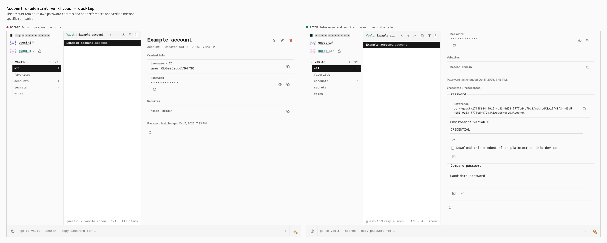
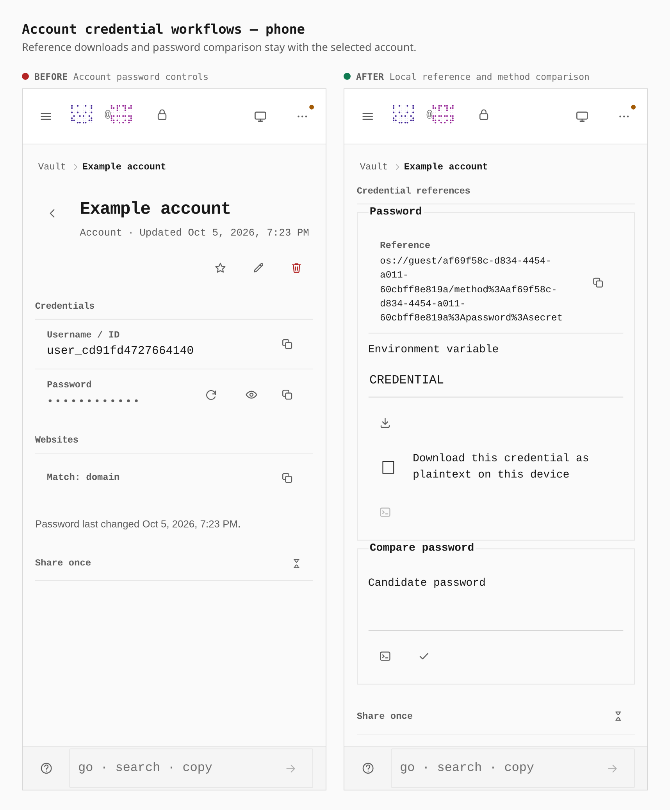

# Account credential workflows

The same real guest journey enables the Account pack and creates an account
on two production builds: unchanged main `e53d2a2ca` and the integrated parity
implementation. Both builds were captured at 1280 × 900 and 390 × 900.
The existing account password controls remain above the new credential section.
The after image scrolls to that section; candidate inputs are empty and stored
passwords remain concealed. The final after capture uses the integrated working-tree production build with
index SHA-256
`37e211d4845ee6c59bdea4ef9ee5b07d6222bf506c3434371b5ab3124f0c6d9a`.
Both captures include the customer-envelope integration and application/transport verification from upstream
`e53d2a2ca`. The before build has index SHA-256
`ee8559e3ba57cb1c0e1c86d726e4692a67205c6310c3363eb8e402e6e3545fd5`.
Build hashes identify the captured artifacts. The pull request links the signed
implementation revision and its separate parity validation report.

| Measurement | Main | Parity implementation |
| --- | --- | --- |
| Credential reference section | 0 | 1 |
| Reference and comparison fieldsets | 0 | 2 |
| Phone action and confirmation targets | Absent | 44 × 44 px |
| Desktop action targets | Absent | 32 × 32 px |

References identify the selected account method. Accounts with several methods
have numbered labels, and comparison updates only the chosen password method.
Protected passwords use the account's existing private-input controls; the
metadata workflow does not bypass pepper or Sphinx protection.

The browser parity journey separately verifies exact method references,
clipboard and downloads, password comparison and update, and preservation of
sibling API-key and token methods. Human UI regressions exercise ambiguous
method selection, protected-first guide targeting, safe persistence failures
and an account withdrawn while its pepper prompt is open. These failure tests
verify that private error text is suppressed and the account is not recreated.
