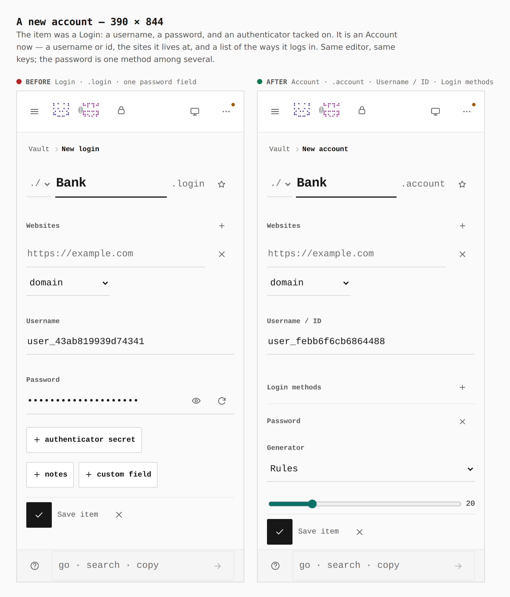
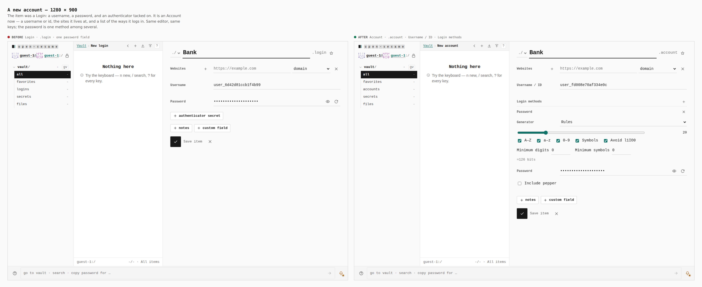
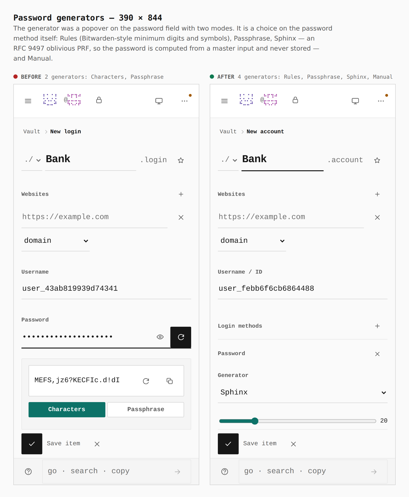
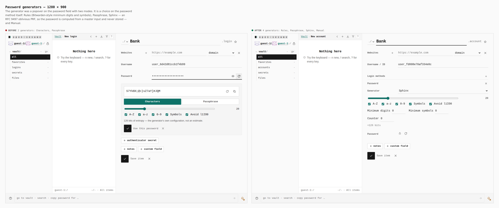
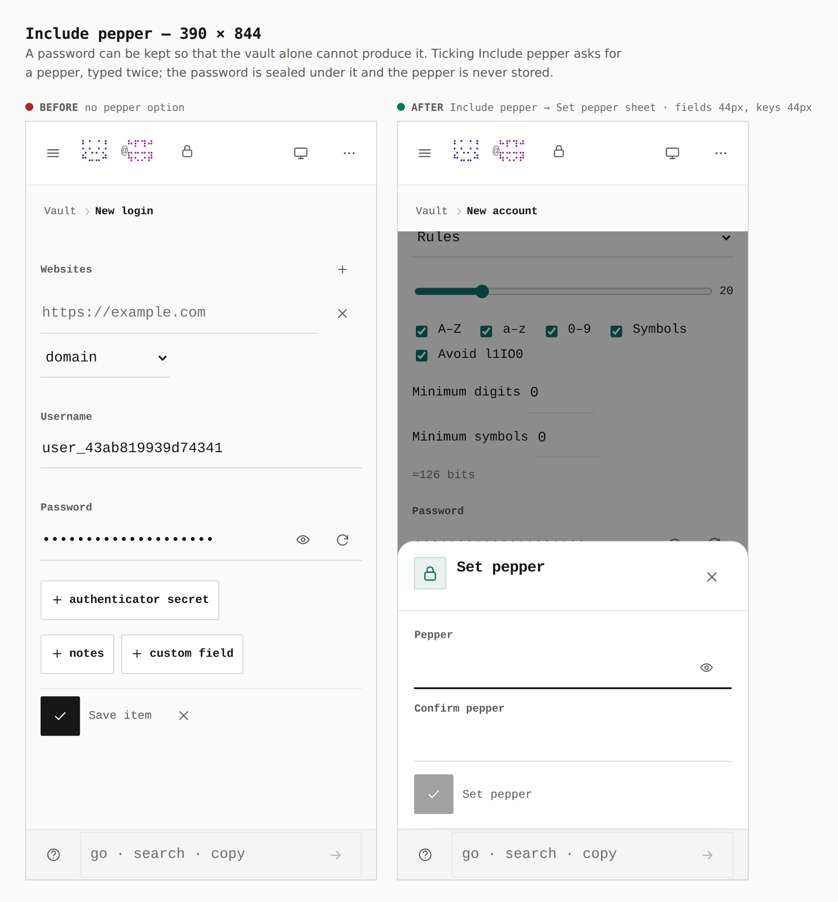
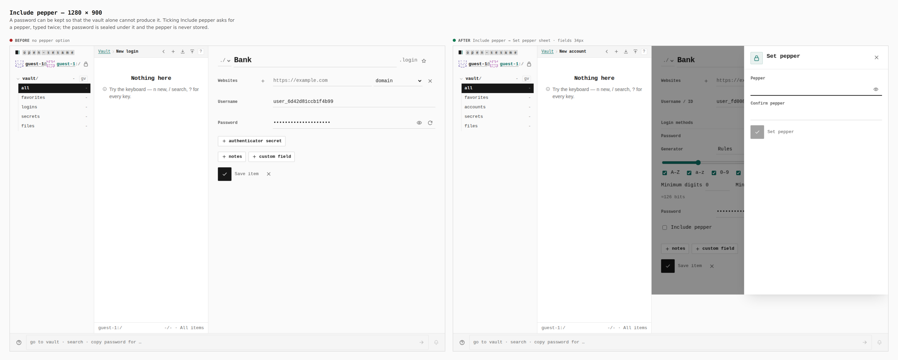
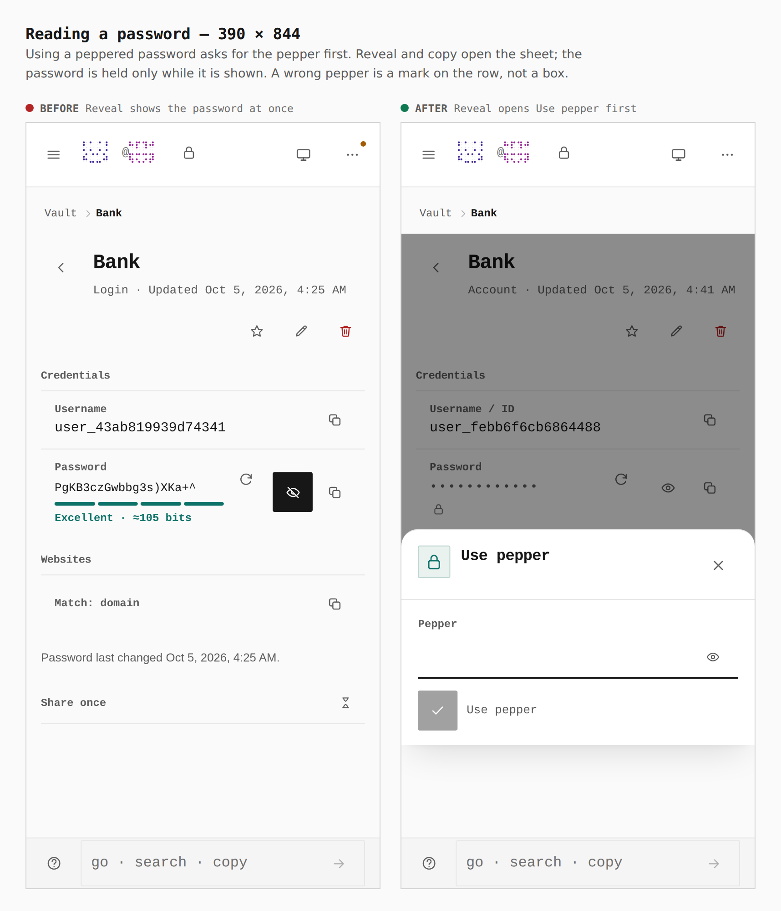
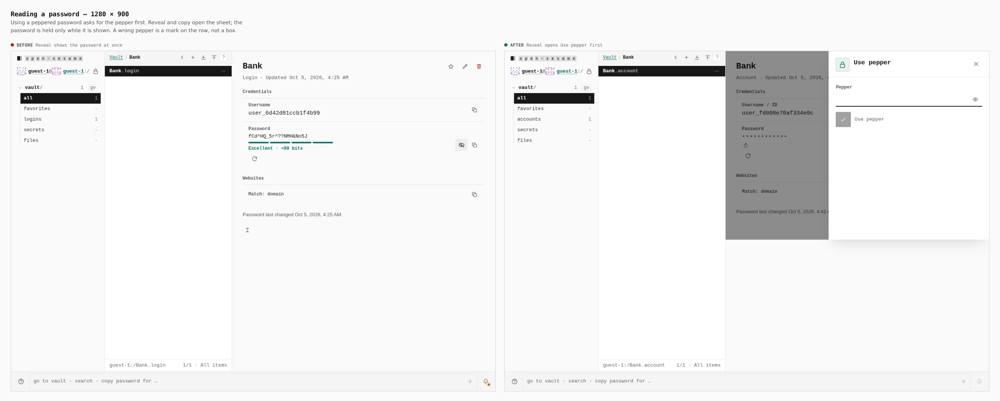

# An account owns its login methods; a password is one of them

Before/after for ADR [0171](../../adr/0171-accounts-and-login-methods.md).

Every pair is the same walk captured from two real builds — `origin/main`
(built in its own worktree) and this branch — with the same steps, at phone and
desktop width. Nothing is staged and nothing is cropped. The walk and the
captions are in [`journey.json`](journey.json); regenerate with
[`skills/visual-evidence`](../../../skills/visual-evidence/SKILL.md), pointing
`EVIDENCE_DIST` at the base build.

The pepper prompt, Sphinx and the method picker have no counterpart in the base
build; each pair shows the screen the base offered at that step beside the
branch's.

---

## A new account — 390 × 844 and 1280 × 900

**`Login · .login · one password field → Account · .account · Username / ID · Login methods`**

The item was a Login. It is an Account: a username or id, the sites it lives at,
and a list of the ways it logs in.

## Password generators

**`2 generators: Characters, Passphrase → 4: Rules, Passphrase, Sphinx, Manual`**

The generator is a choice on the password method, with its own options inline.
Sphinx is an RFC 9497 oblivious PRF: the password is computed from a master
input and a key that stays in the vault, and is never stored.

## Include pepper

**`no pepper option → Include pepper → Set pepper sheet · fields 44px, keys 44px (390) · fields 34px (1280)`**

Ticking it asks for a pepper, typed twice; the password is sealed under it and
the pepper is never stored. On the phone every field and key in the sheet meets
the 44px floor (measured from the browser).

## Reading a password

**`Reveal shows the password at once → Reveal opens Use pepper first`**

Reveal and copy ask for the pepper (or, for Sphinx, the master input) before
anything is read; what is read is held only while it is shown.

