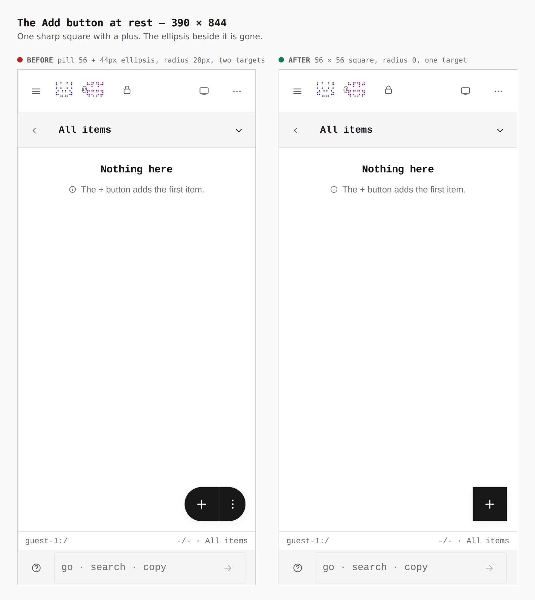
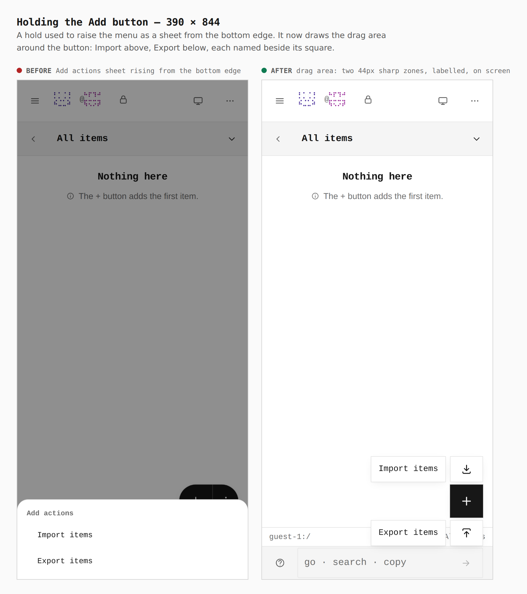
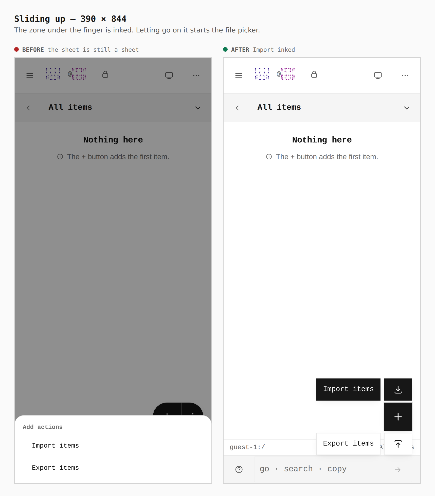
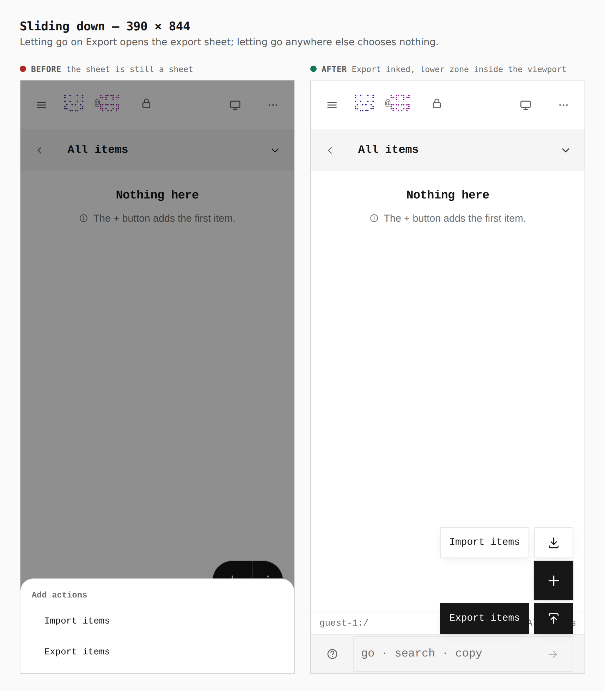
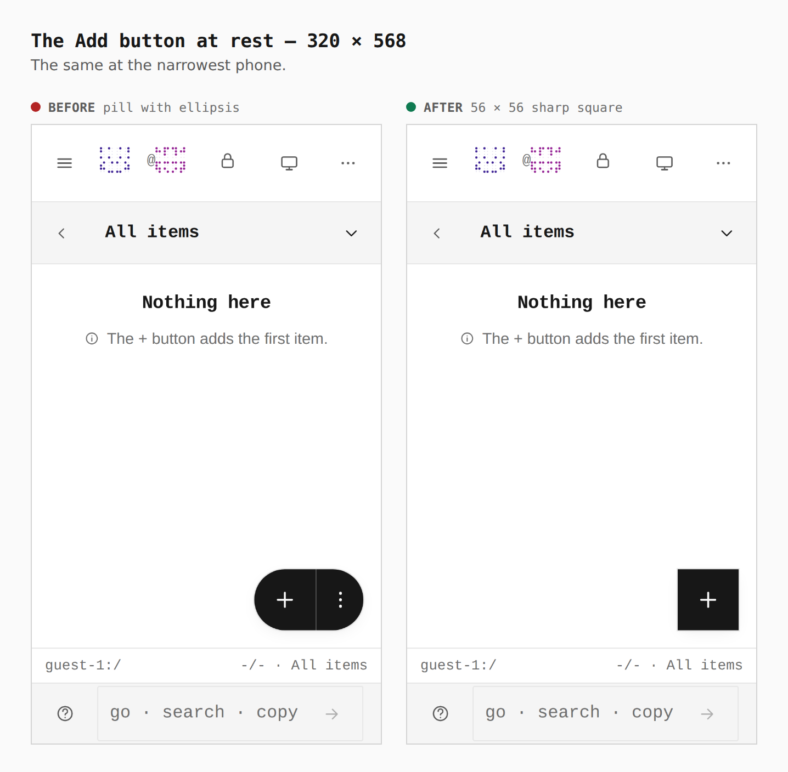
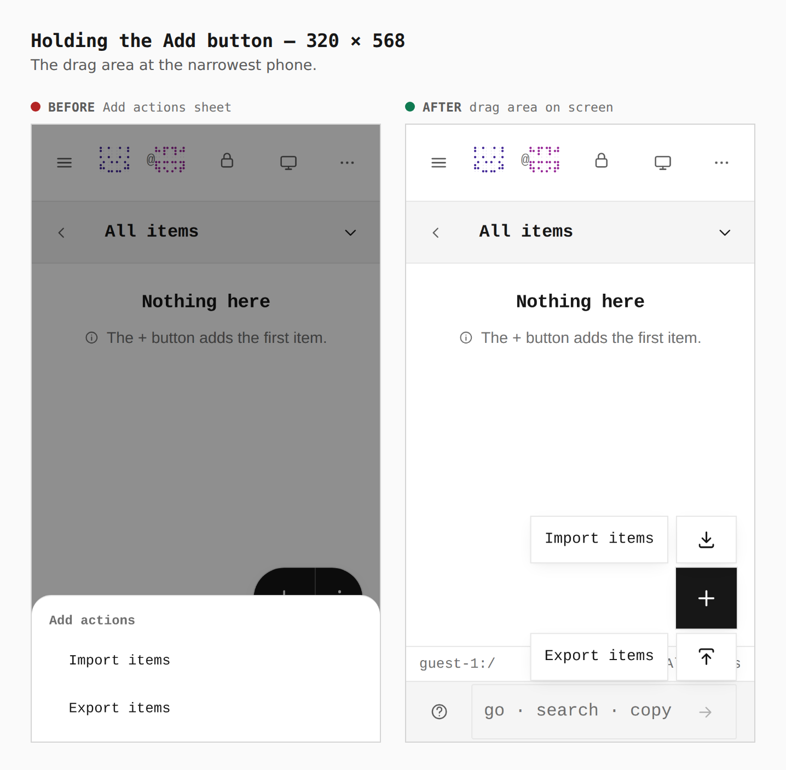
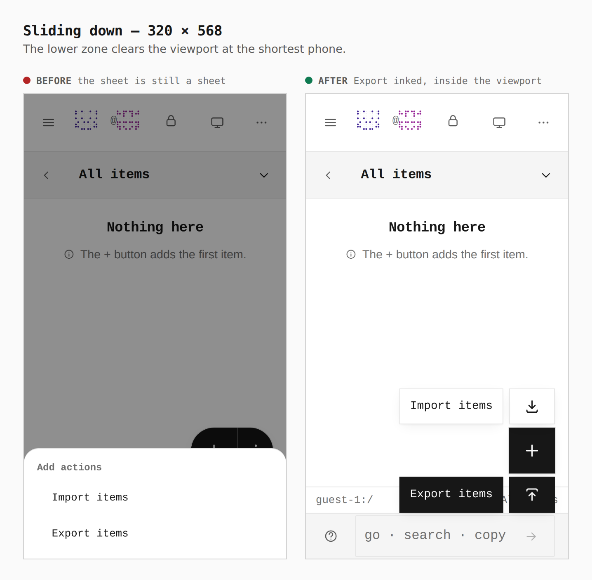

# The Add button: a sharp square, held and slid

The phone's Add button lost its ellipsis and its bottom sheet. It is one sharp
56 × 56 square with a plus. Holding it draws a drag area around it: slide up to
**Import**, slide down to **Export**, and let go on the zone. Letting go
anywhere else chooses nothing.

Before is the commit before this change; after is this branch. Both are real
builds, walked the same way as a guest on the list, with a real touch (raw
touch events through the browser's input pipeline). The journey is
[`journey.json`](journey.json). Measurements are read from the browser.

| screen | before → after |
|---|---|
| Add button at rest, 390 | `fab 100x56, radius 28px (56 + 44px ellipsis, two targets) → fab 56x56, radius 0px, one target` |
| Add button at rest, 320 | `fab 100x56, radius 28px → fab 56x56, radius 0px` |
| Hold, 390 | `Add actions sheet from the bottom edge → .add-slide__zone 56x44 ×2 (labels 127x44), radius 0px, both in the viewport` |
| Hold, 320 | `Add actions sheet → .add-slide__zone 56x44 ×2, both in the viewport` |

## At rest, 390 × 844

## Held, 390 × 844

## Slid up (Import), 390 × 844

## Slid down (Export), 390 × 844

## At rest, 320 × 568

## Held, 320 × 568

## Slid down (Export), 320 × 568

## Not captured

Desktop width: the Add button is the phone's, and a wide window draws the
command row's icon keys, which this change does not touch. The old build's slid
shots repeat its sheet, because a slide did nothing there.
