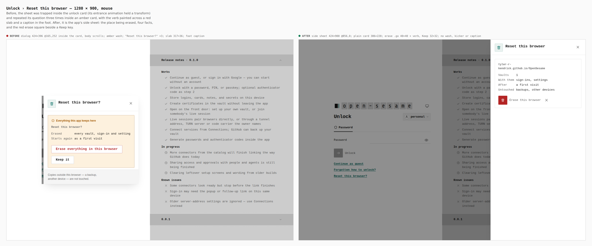
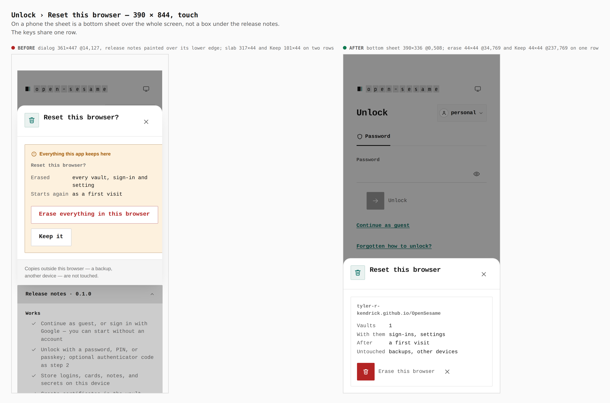
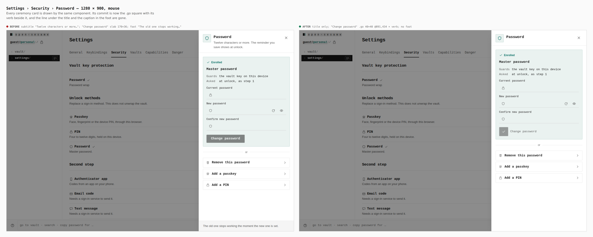
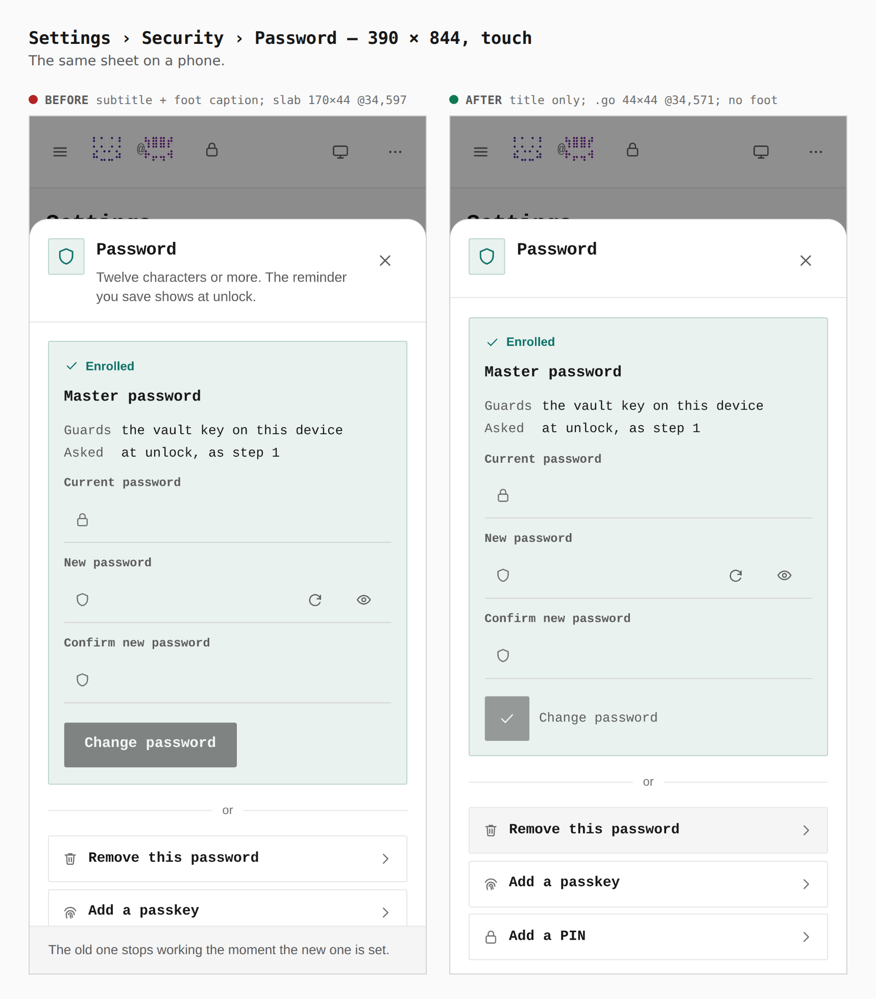

# Confirmation sheets: the shape the design contract asks for, enforced

Before/after captures from two real builds, `main` (3f788ae7) and this
branch, walked the same way with `apps/pages/scripts/capture-evidence.mjs`
and [`journey.json`](journey.json). Each walk seals a vault with a password.
The reset walk reloads onto the unlock form and presses "Reset this
browser?". The password walk opens Settings › Security and presses Change on
the Password row. Every measurement was read from the browser during the
capture.

"Reset this browser?" passed every design check on `main` and still broke the
contract:

- it sat in an amber warning card;
- it said its title three times;
- it painted "Erase everything in this browser" across a red slab;
- it explained itself in a foot caption;
- it was trapped inside the unlock card, under the release notes, with a
  scrollbar of its own.

None of it was visible to `pnpm lint:design`. The new rules
(`scripts/quality/design-lint-sheets.mjs`, plus `animation-lets-go` in
`design-lint.mjs`) fail every one of those shapes, and
`apps/pages/src/screens/setup/sheet-contract.test.ts` watches each rule fail
on the piece of the sheet that shipped. The fixes landed in the shared
components (`CeremonyShell`, `CeremonySheet`, `SheetFrame`), so every
ceremony changed with it. The password sheet below is one of them.

## Reset this browser — 1280 × 900

- **Before:**
  - a dialog `424×396 @165,252` inside the unlock card, with a scrolling body;
  - an amber wash and a kicker, and "Reset this browser?" three times;
  - the slab `317×36`, Keep below it;
  - a foot caption.
- **After:**
  - the app's side sheet `424×900 @856,0`;
  - a plain card `386×220` naming the place it erases
    (`tyler-r-kendrick.github.io/OpenSesame`), with Vaults, With them, After
    and Untouched as facts;
  - the red erase `.go` square `40×40` with its verb beside it, and Keep
    `32×32` on the same row.

## Reset this browser — 390 × 844, touch

- **Before:** a dialog `361×447 @14,127` with the release notes painted over
  its lower edge, and the slab `317×44` and Keep `101×44` on two rows.
- **After:** a bottom sheet `390×336 @0,508` over the whole screen, with
  erase `44×44 @34,769` and Keep `44×44 @237,769` on one row.

## Settings › Security › Password — 1280 × 900

- **Before:**
  - a subtitle under the title ("Twelve characters or more…");
  - a "Change password" slab `170×36`;
  - a foot caption ("The old one stops working the moment the new one is
    set.").
- **After:** the title alone, "Change password" as the `.go` square `40×40
  @891,434` with its verb beside it, and no foot.

## Settings › Security › Password — 390 × 844, touch

- **Before:** a subtitle and a foot caption, and the slab `170×44 @34,597`.
- **After:** the title alone, the `.go` square `44×44 @34,571`, and no foot.
