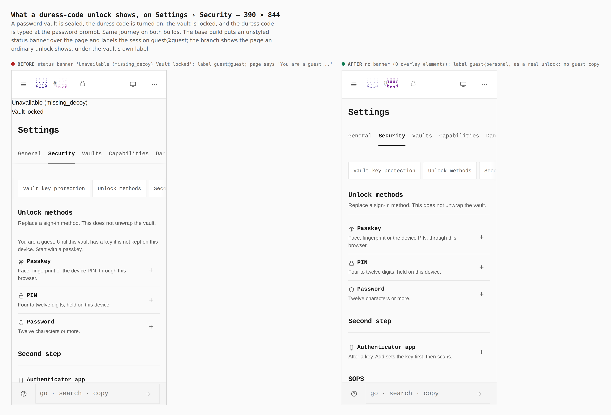
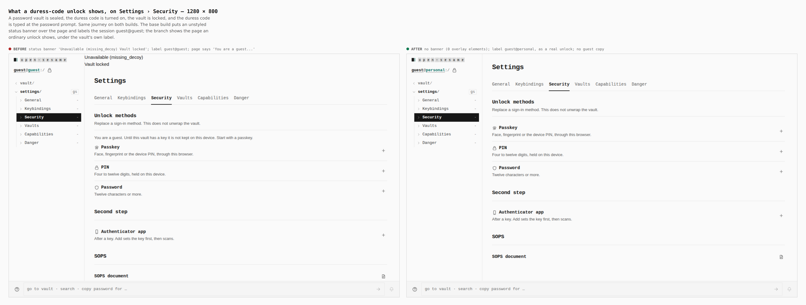

# A duress-code unlock reads like an ordinary unlock — visual evidence

Change: typing the device's duress code at the password prompt opens a decoy
session ([ADR 0155](../../adr/0155-the-device-duress-code.md)). A decoy exists
so that a person who is compelled to unlock cannot be told apart from a normal
unlock. The shipped decoy announced itself.

Two real builds, walked the same way by `apps/pages/scripts/capture-evidence.mjs`
with [`journey.json`](journey.json):

- **before**: `origin/main` (`apps/pages/src` and `packages/app-core/src` as main has them; files only the branch adds removed for the base build)
- **after**: branch `claude/duress-modes-1-foundation`

A password vault is sealed on an empty device, the duress code `246813579` is
turned on in Settings › Security, the vault is locked, the code is typed at the
password prompt, and Settings › Security is read.

## Settings › Security after typing the duress code — 390 × 844 and 1280 × 800

Measured in the browser, identical at both widths:

| | before | after |
|---|---|---|
| `.duress-presentation-overlay` elements | 1 | 0 |
| status text drawn over the page | `Unavailable (missing_decoy)` `Vault locked` | none |
| identity label (`.rail__prompt`) | `guest@guest:/` | `guest@personal:/` |
| page copy | `You are a guest. Until this vault has a key it is not kept on this device. Start with a passkey.` | none |

`guest@personal` is the label an ordinary unlock of this vault shows.

## What the pictures do not show

- Locking the decoy now returns to the vault's own password prompt, and
  Settings › Vaults lists the personal vault as open and sealed. Both are
  asserted by the `J-DURESS` journey in
  `apps/pages/scripts/verify-experience-journeys.mjs`, which CI runs, along with
  the absence of every string in the table above.
- **A difference that remains.** The decoy's Security page lists Passkey, PIN
  and Password as unenrolled ("+"), because the decoy is an empty scratch
  vault; a real vault shows its own enrolled methods. A person who knows what
  their real Security page looks like could notice. Closing it would mean
  showing enrolled methods the decoy cannot honour, so it is left and recorded
  here rather than faked.
