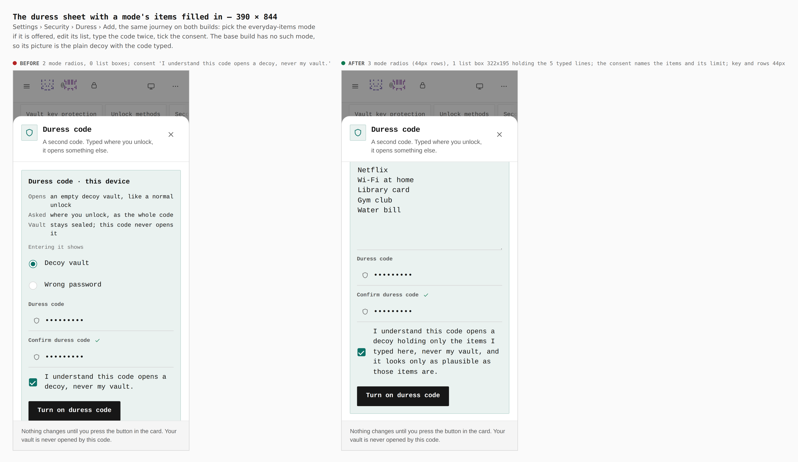
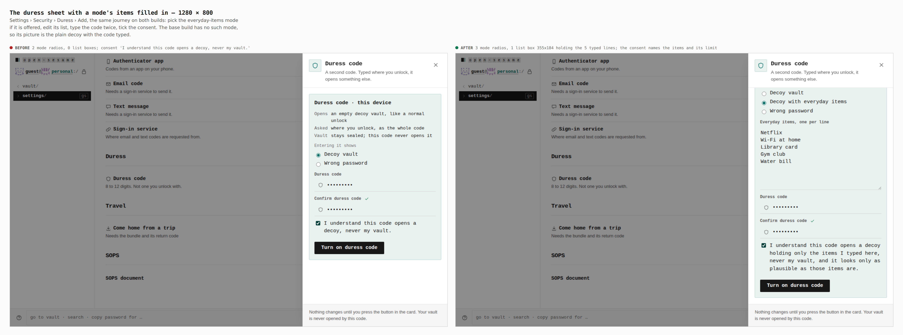
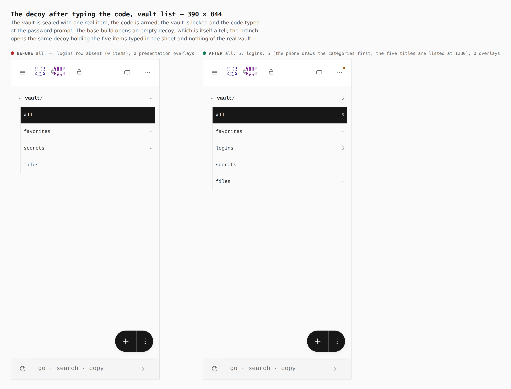
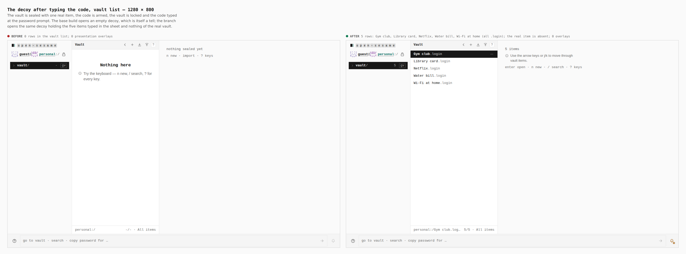

# Decoy with everyday items — visual evidence

Change: a third duress mode, **Decoy with everyday items**
([ADR 0167](../../adr/0167-duress-modes-from-scenarios.md)). An empty decoy is
itself a tell. This mode opens the same decoy, holding a short list of ordinary
items the owner typed in the sheet, each with a random password drawn when the
code was armed.

Two real builds, walked the same way by `apps/pages/scripts/capture-evidence.mjs`
with [`journey.json`](journey.json):

- **before**: branch `claude/duress-modes-2-seam` (`6dff574a`, the seam this mode
  builds on; the files this branch adds under `apps/pages/src` and
  `packages/app-core/src` were removed for the base build, and the build was
  checked to succeed and to contain no trace of the mode)
- **after**: branch `claude/duress-modes-3-decoy-items`

A password vault is sealed with one real item (`Real bank login`), Settings ›
Security › Duress › Add is opened, the everyday-items mode is picked where it is
offered and its list replaced by five lines, the code `246813579` is typed twice
and the consent ticked, the vault is locked and the code is typed at the password
prompt. The base build has no such mode, so its walk arms the plain decoy.

## The sheet with the mode picked

| | before | after |
|---|---|---|
| mode radios in the sheet | 2 | 3 |
| list boxes | 0 | 1 (322x195 at 390, 355x184 at 1280) |
| consent sentence | `I understand this code opens a decoy, never my vault.` | names the items typed here, the vault, and the limit: `... and it looks only as plausible as those items are.` |

## The decoy after typing the code

| | before | after |
|---|---|---|
| rows in the decoy's vault list (`.vtree` items, 1280) | 0 | 5: Gym club, Library card, Netflix, Water bill, Wi-Fi at home (all `.login`) |
| category counts at 390 | all `-` | all 5, logins 5 |
| the real item `Real bank login` in the decoy | absent | absent |
| `.duress-presentation-overlay` elements | 0 | 0 |

## Touch contract, measured in a coarse-pointer context with the mode picked

Read from the browser at 320, 390 and 430 px, with the dialog open and the mode
picked: every radio row, the three radios, both code fields, the consent
checkbox, the close key and the arming key are 44 px tall or more; the list box
and the code fields compute to 16 px, so iOS does not zoom on focus; the page
and the dialog have no horizontal overflow. `verify:mobile` passes at 320, 390,
430, 844, 1024 and 1366 px.

## What the pictures do not show

- That the armed code survives a reload, that the real vault's own password
  still opens the real vault with its real item and none of the decoy's, and
  that the decoy carries none of the tells (`guest`, `decoy`, `duress`,
  `Unavailable`, `Vault locked`): the `J-DURESS-ITEMS` journey in
  `apps/pages/scripts/verify-experience-journeys.mjs` walks that in the built
  app. It fails against a build whose runner does nothing (the decoy list is
  empty) and passes with it.
- **A difference that remains.** The items are logins with no username, so the
  list draws them as `name.login` and a login's subtitle reads "No username".
  The decoy looks only as plausible as the items the owner types. Nothing is
  derived from the vault: the starter titles are ours, and the passwords are
  random values drawn at arming.
