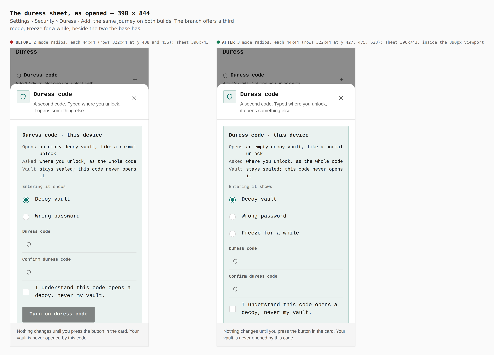
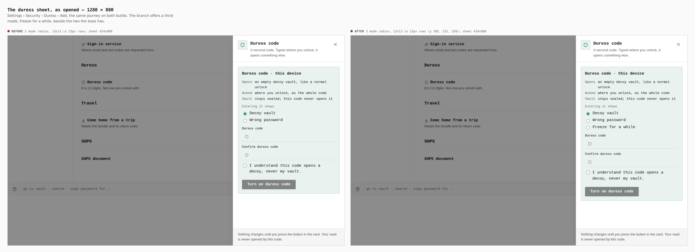
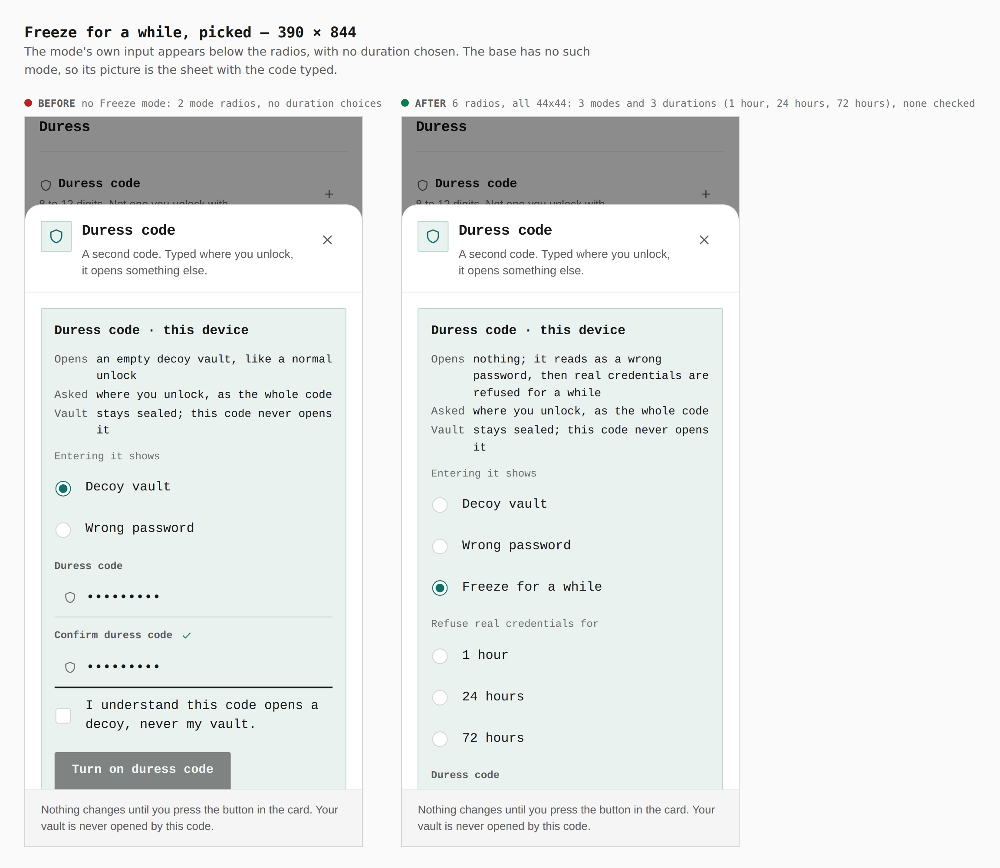
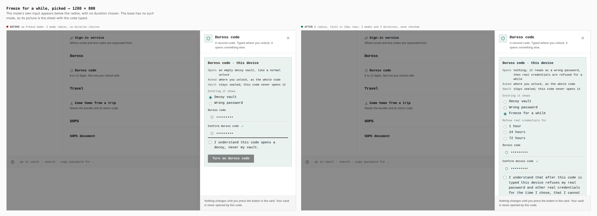
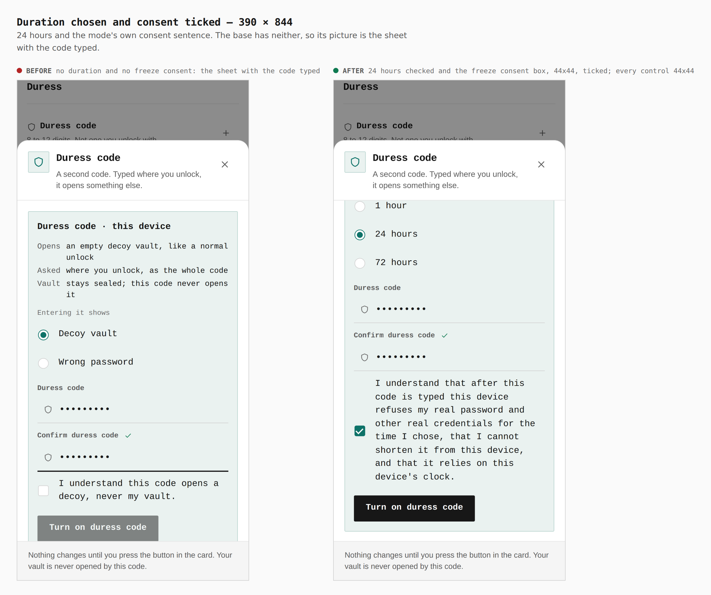

# Duress mode: Freeze for a while — visual evidence

Change: the duress sheet (Settings › Security › Duress › Add) offers a third
mode, **Freeze for a while** (ADR 0167). Typed at the unlock screen it is
refused like a wrong password, and for the chosen 1, 24 or 72 hours this device
refuses the vault's real credentials as a wrong secret is refused.

Two real builds, walked the same way by `apps/pages/scripts/capture-evidence.mjs`
with [`journey.json`](journey.json):

- **before**: `6dff574a`, the seam branch (`claude/duress-modes-2-seam`), with
  `apps/pages/src` and `packages/app-core/src` at that commit and the files this
  branch added removed
- **after**: branch `claude/duress-modes-4-freeze`

A password vault is sealed on an empty device, `settings/security` is opened,
Add is pressed on the Duress row, the code is typed twice, and the sheet is
captured as opened, with Freeze picked, and with 24 hours and the mode's own
consent chosen. The base has no such mode, so for it those steps are skipped and
its pictures are the sheet it has.

## As opened — 390 × 844 and 1280 × 800

| | before | after |
|---|---|---|
| 390 mode radios | 2, each 44×44 (rows 322×44) | 3, each 44×44 (rows 322×44) |
| 390 sheet | 390×743 | 390×743, inside the 390px viewport |
| 1280 mode radios | 2, 13×13 in 23px rows | 3, 13×13 in 23px rows |
| 1280 sheet | 424×800 | 424×800 |

## Freeze picked

| | before | after |
|---|---|---|
| 390 radios | 2 (modes only) | 6, all 44×44: 3 modes and 3 durations (1 hour, 24 hours, 72 hours) |
| duration chosen | n/a | none: the choice is explicit, there is no default |
| 1280 radios | 2 | 6, 13×13 in 23px rows |

## Duration chosen and consent ticked

| | before | after |
|---|---|---|
| 390 | decoy consent box 44×44, unticked | 24 hours checked; freeze consent box 44×44, ticked; every control 44×44 |

The key stays off until a duration is chosen and the consent is ticked; both are
taken back when the mode changes (`DuressPanel.freeze.test.tsx`, and
`j-duress-mode-freeze-journey.mjs` in a real browser).

## What a still cannot show: the refusal

`apps/pages/scripts/lib/j-duress-mode-freeze-journey.mjs` (registered in
`verify-experience-journeys.mjs`) walks the behaviour in the built app, with the
page reloaded between steps so the hold has to come back from disk. Texts read
from the browser:

| step | alert text |
|---|---|
| ordinary wrong password, nothing armed | `That password did not unlock the vault.` |
| the freeze code, after a reload | `That password did not unlock the vault.` (identical) |
| the vault's real password, frozen | `That password did not unlock the vault.` (identical), vault shut |
| the real password after another reload | still refused the same way, vault shut |
| the real password with the page clock 24 h 1 min ahead | opens the vault |

With the runner removed from `effects.ts` the journey fails: the real password
opens the vault right after the code, so the refusal the walk waits for never
appears. Before this change an ordinary wrong password at the unlock screen said
`That credential did not unlock the vault.` while a locked duress code said
`That password ...`; the two are now one text.
