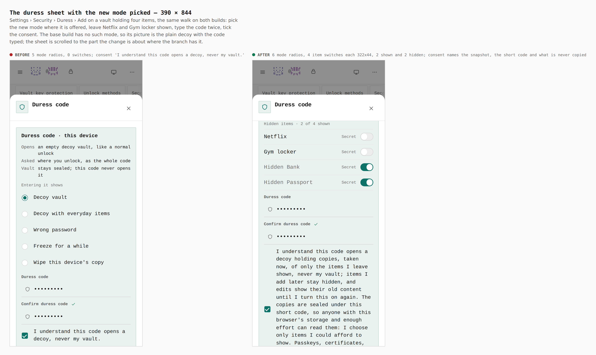
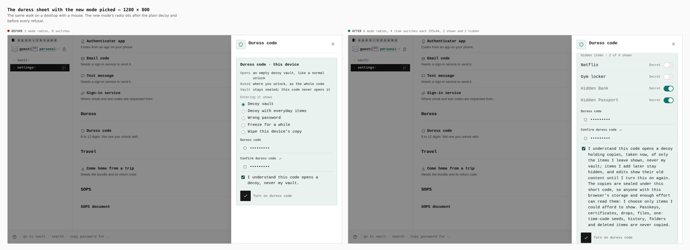
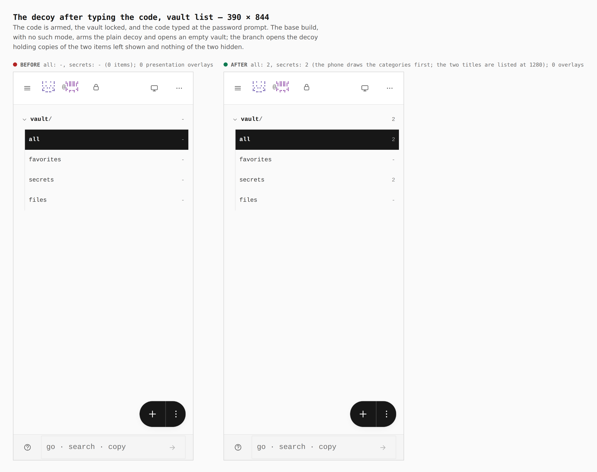
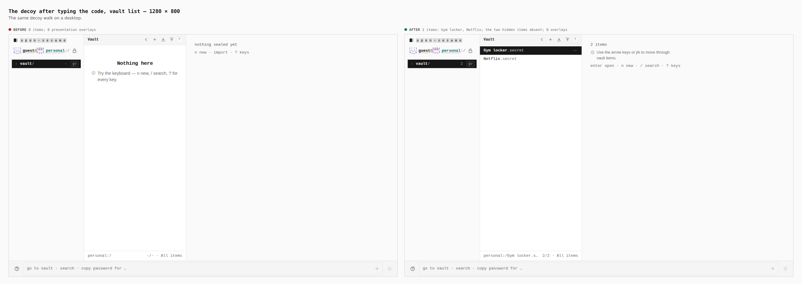

# Show my vault without the items I hide — visual evidence

Change: a sixth duress mode, **Show my vault without the items I hide**
([ADR 0168](../../adr/0168-duress-modes-from-scenarios.md)). The first five modes
leave a person who is made to unlock with a fiction or with nothing to show. This
mode opens the usual decoy holding sanitized *copies* of the items the owner chose
to leave shown, taken while the real vault was open and sealed under the duress
code. Every item starts hidden.

Two real builds, walked the same way by `apps/pages/scripts/capture-evidence.mjs`
with [`journey.json`](journey.json):

- **before**: the sources of `origin/main` (`eb81a0ad`) under `apps/pages/src`
  and `packages/app-core/src`, with the files this branch adds moved out of the
  tree, built with `VITE_BASE=/OpenSesame/` (the build was checked to succeed)
- **after**: this branch's head, built the same way

A password vault is sealed and four secrets are added (Netflix, Gym locker,
Hidden Bank, Hidden Passport). Settings › Security › Duress › Add is opened, the
new mode is picked where it is offered, Netflix and Gym locker are switched to
shown, the code `246813579` is typed twice and the consent ticked, the vault is
locked and the code is typed at the password prompt. The base build has no such
mode, so its walk arms the plain decoy.

## The sheet with the mode picked

| | before | after |
|---|---|---|
| mode radios in the sheet | 5 | 6 (the new one after the plain decoy, before every refusal) |
| item switches (`role=switch`) | 0 | 4, of which 2 shown (`aria-checked=false`) and 2 hidden |
| a switch row, measured in the browser | n/a | 322x44 at 390 (touch context), 355x44 at 1280 |
| arming key | 44x44 at 390, 40x40 at 1280 | unchanged |
| consent sentence | `I understand this code opens a decoy, never my vault.` | names the snapshot taken now, that items added later stay hidden and edits show their old content, that the copies are sealed under a short code, and what is never copied |

What I saw: at 390 the sheet is scrolled to the list. Each row is the item's name
and its kind (`Secret`) with a track at the right; Netflix and Gym locker are at
full ink with the track off, Hidden Bank and Hidden Passport are dimmed with the
track lit. The legend reads `Hidden items · 2 of 4 shown`. No secret value appears
anywhere in the sheet. At 1280 the same list sits under the radios inside the
dialog. The long consent sentence wraps to about a dozen lines on a phone.

## The decoy after typing the code

| | before | after |
|---|---|---|
| items in the decoy's vault list (`.vtree [role=treeitem]`, 1280) | 0 | 2: Gym locker, Netflix (both `.secret`) |
| category counts at 390 | all `-` | all 2, secrets 2 |
| Hidden Bank, Hidden Passport | not applicable | absent |
| `.duress-presentation-overlay` elements | 0 | 0 |

## Gates run for this change

- `J-DURESS-VISIBLE` in `apps/pages/scripts/verify-experience-journeys.mjs`
  walks the whole thing in the built app with nothing mocked: it arms with two of
  four items shown, **reloads**, types the code at the unlock screen, and asserts
  the decoy lists exactly the two shown items once each, that no hidden title or
  secret appears in the page text or anywhere in the document HTML, that the guest
  road is still on the unlock screen, that none of the tells appear, that a shown
  item opens with the value the owner kept, and that the vault's own password then
  opens the real vault with all four items. It fails when the runner is renamed
  in a rebuilt app (the shown rows never appear) and passes with it.
- The whole experience-journey set passes (`J-DURESS`, `-ITEMS`, `-VISIBLE`,
  `-MODE-WIPE`, `-FREEZE`, `J-TRAVEL` among them), as do `verify:static`,
  `verify:mobile` (320, 390, 430, 844, 1024, 1366) and `verify:keyboard`.
- Bundle budget: javascript 5626 → 5635 KiB (budget raised 5630 → 5640 with a
  reason line), gzip 1735 → 1738, css 164 → 166.

## What the pictures do not show

- **Text size on the switch rows was not measured in the browser.** The row's
  CSS sets `max(1rem, var(--field-min))`; I measured heights (44 px), not computed
  font size, and `verify:mobile` does not open this sheet.
- **A decoy is a scratch vault.** The status line in the decoy still reads
  `guest@personal` and the Security page lists unenrolled unlock methods; both
  predate this change. The Security-page one is recorded in ADR 0168; the
  status-line label is not recorded anywhere I found.
- **The copies rest under a short number.** Anyone with this browser's storage and
  effort can recover the shown items' secrets; the real vault is not weakened.
  Choose only items you could afford to show.
- **Items edited after arming show their old content** and items added after are
  hidden; arming again takes a new snapshot.
- None of this is protection from coercion. It changes what a forced unlock
  reveals on this device.
