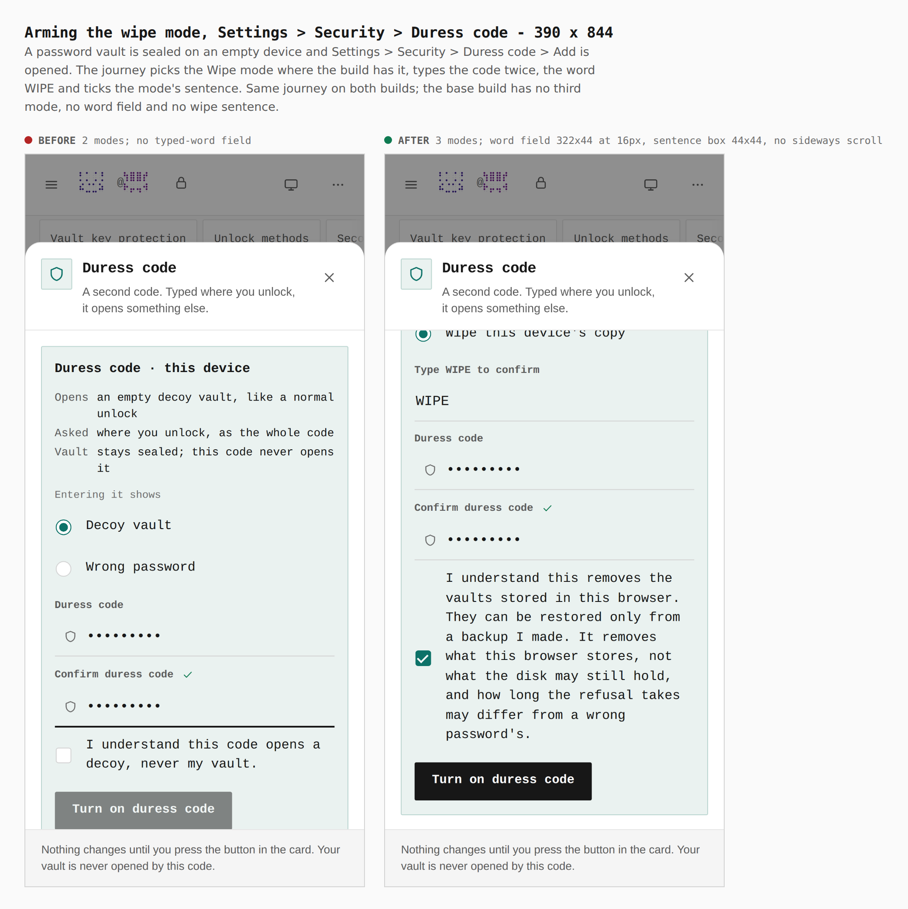
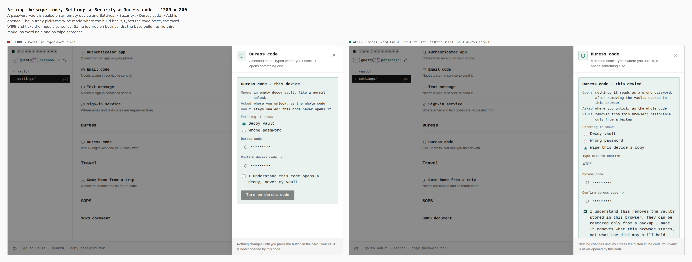
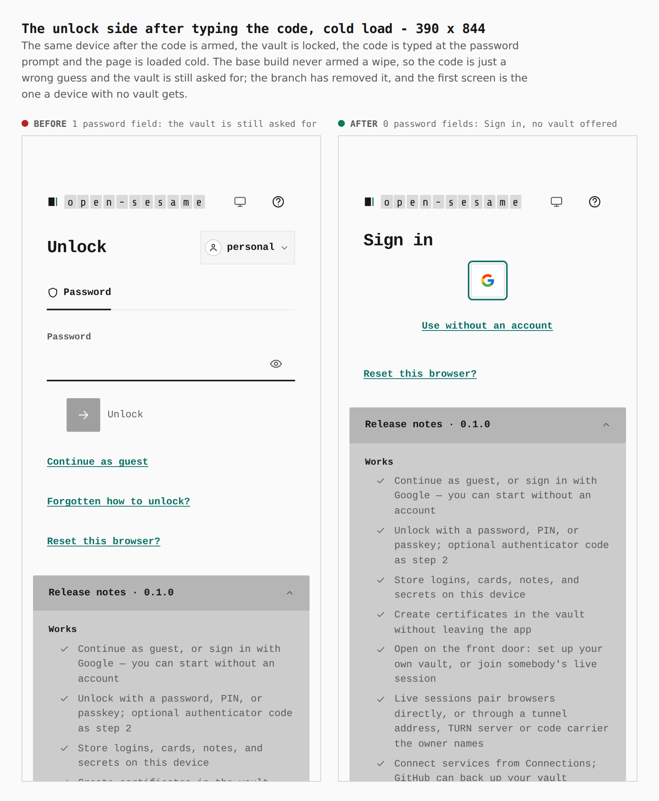
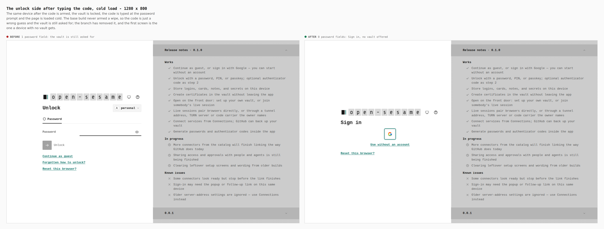

# Duress mode: wipe this device's copy — visual evidence

Change: the duress code can now be set to remove this browser's copy of the
vaults ([ADR 0167](../../adr/0167-duress-modes-from-scenarios.md)). The sheet
gains a third mode, a typed word and its own consent sentence; typing the code
at the unlock screen removes the vaults, and a cold load then shows a device
with no vault.

Two real builds, walked the same way by `apps/pages/scripts/capture-evidence.mjs`
with [`journey.json`](journey.json):

- **before**: `claude/duress-modes-2-seam` at `6dff574a` (`apps/pages/src` and `packages/app-core/src` as it has them; the files only this branch adds removed for the base build)
- **after**: branch `claude/duress-modes-5-wipe`

A password vault is sealed on an empty device and Settings › Security › Duress
code › Add is opened. Where the build has it the journey picks the wipe mode,
types the code `246813579` twice, types `WIPE` and ticks the mode's sentence;
it then arms, locks, types the code at the password prompt, and loads the page
cold. The base build has no such mode, so on it the same steps leave the sheet
at two modes, arm nothing, and the code is only a wrong guess.

## The sheet — 390 × 844 and 1280 × 800

Measured in the browser (`metrics`, `count` in the journey):

| | before | after |
|---|---|---|
| mode radios in the sheet | 2 | 3 |
| typed-word field | none | 322 × 44 at 390, type 16px; 355 × 34 at 1280, type 14px |
| consent checkbox (390) | 44 × 44 | 44 × 44 |
| mode radios (390) | 44 × 44 | 44 × 44 |
| horizontal overflow, 390 and 1280 | none | none |

The 44px and 16px floors are the phone's (`verify:mobile`); at 1280 the
desktop sizes apply, as for every field. The "Vault" fact on the card reads
"removed from this browser; restorable only from a backup" for this mode, not
the "stays sealed" the other modes show.

## The unlock side after the code — 390 × 844 and 1280 × 800

| | before | after |
|---|---|---|
| password fields on the cold-loaded first screen | 1 | 0 |
| first screen | Unlock (vault `personal`) | Sign in |
| refusal shown when the code is typed (password vault) | `That credential did not unlock the vault.` | `That password did not unlock the vault.` |

## What the pictures do not show, and what to read with them

- **The refusal text row is the base's, not this mode's.** On the password
  tab the seam's locked refusal said "password" where an ordinary wrong
  password says "credential"; that is a property of the seam the base was
  captured at (the freeze mode fixed it separately), and the existing Wrong
  password mode had it too. The PIN tab's two texts are identical, which is why
  the `J-DURESS-MODE-WIPE` journey runs on a PIN vault and asserts them equal.
- The cold-loaded "after" screen is Sign in because the device has answered
  setup; a device that had not would show the front door. It offers "Use
  without an account", not a guest button, as every vaultless device that has
  answered setup does.
- The journey `J-DURESS-MODE-WIPE` (`apps/pages/scripts/lib/j-duress-mode-wipe-journey.mjs`,
  run by `verify-experience-journeys.mjs`) also covers what a still picture
  cannot: a wipe the page dies in the middle of (headers gone, bodies still on
  disk, intent on disk, the next boot finishes it), the refusal staying on
  screen while the vaults are removed, the duress code still working
  afterwards, and the owner's recovery: a new vault sealed on the held device,
  the Duress row marked used, Clear lifting it, and a new code arming. The
  restore of a backup made before the wipe is proved in
  `packages/app-core/src/lib/duress/wipe/wipe-recovery.test.ts`.
