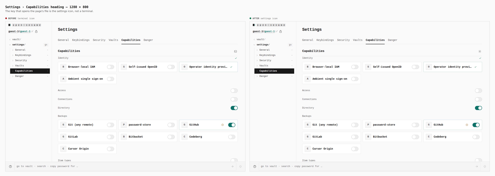
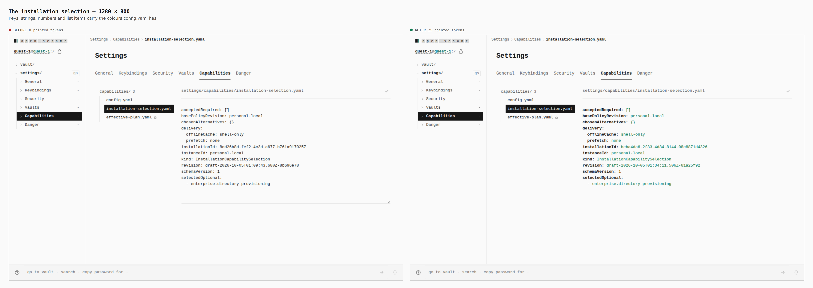
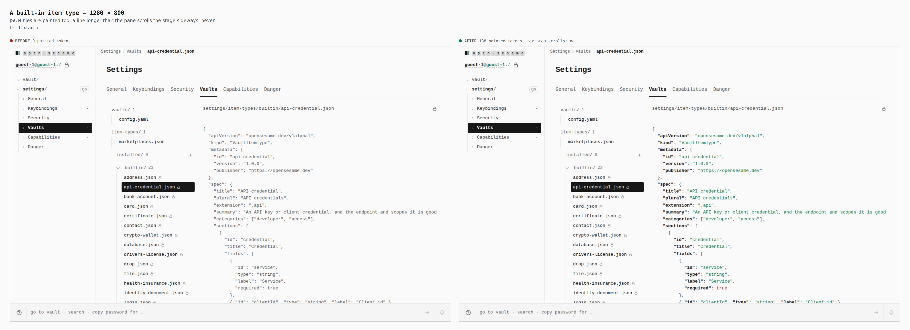
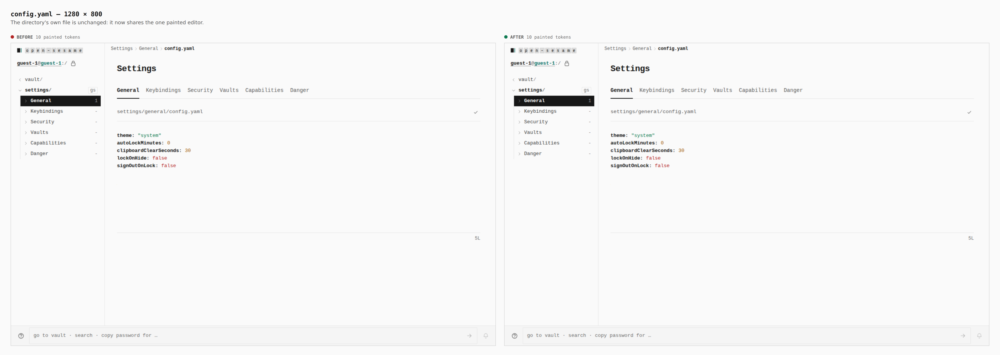
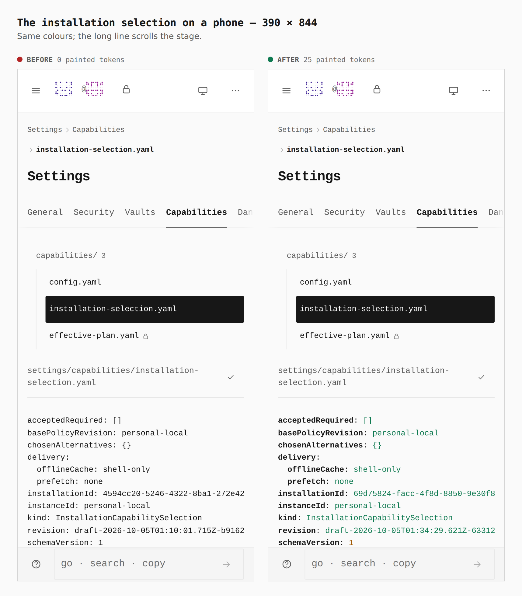
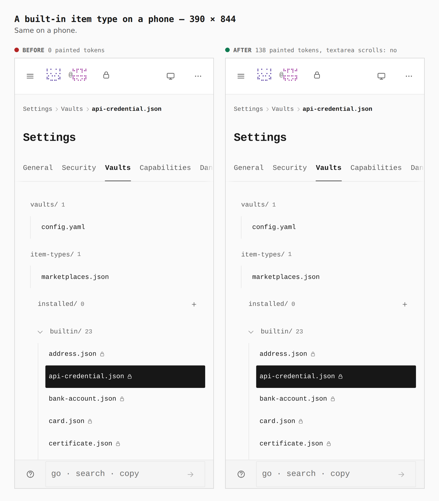

# The file viewer paints its files, and the open key is the settings icon

Before/after from two real builds (`main` at `3f788ae` and this branch), walked by
`apps/pages/scripts/capture-evidence.mjs` with [`journey.json`](journey.json). The numbers are
what the browser measured (the `facts` step).

The viewer drew every file it opens (capability documents, item types, routing files) in a
bare textarea, so they read as plain text beside `config.yaml`'s coloured keys, strings,
numbers and booleans. All of them now share one painted editor. A line longer than the pane
scrolls the stage sideways; the textarea itself never scrolls (`inputScrolls: false` in every
capture), so the caret stays on the text drawn under it. The viewer's two layout rules
(stacked list on a phone, 44px rows) are held by `settings-files.css.test.ts`, because no
browser gate opens a settings file.

## 1. The heading key — 1280 × 800

`terminal icon → settings icon`

## 2. The installation selection — 1280 × 800

`0 painted tokens → 25`

## 3. A built-in item type (JSON) — 1280 × 800

`0 painted tokens → 138; a long line scrolls the stage, not the textarea`

## 4. config.yaml — 1280 × 800

`10 painted tokens → 10` (unchanged; it shares the editor now)

## 5. The installation selection on a phone — 390 × 844

`0 → 25 painted tokens`

## 6. A built-in item type on a phone — 390 × 844

`0 → 138 painted tokens`

`api-credential.json` was a built-in when these were captured; it has since become an optional
pack (off by default, so it has no file until switched on). A re-run of the journey would open
`secret.json`, which is part of the embedded core, and the gates do.
