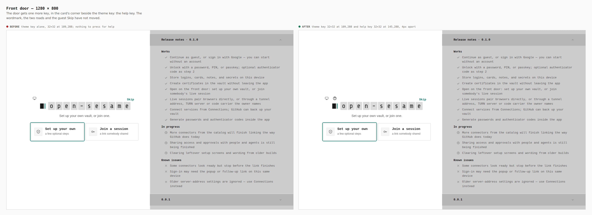
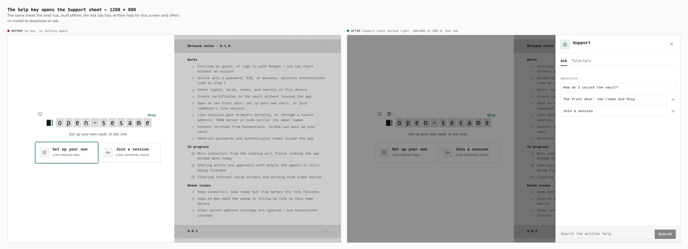
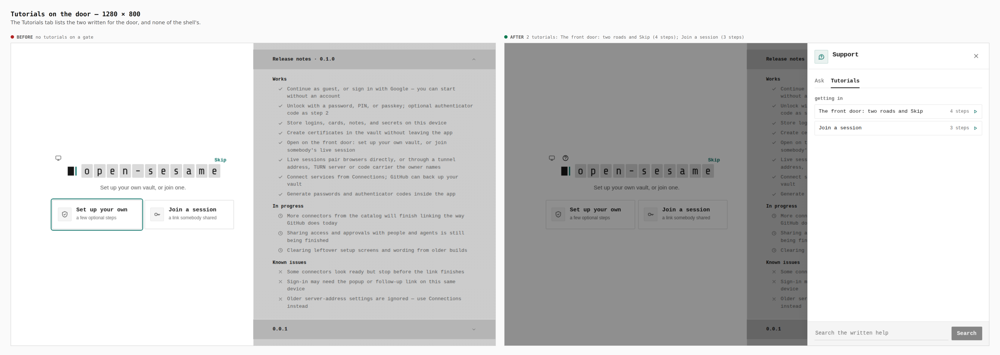
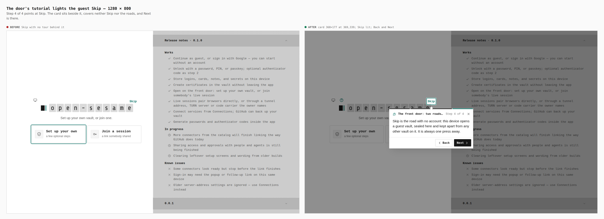
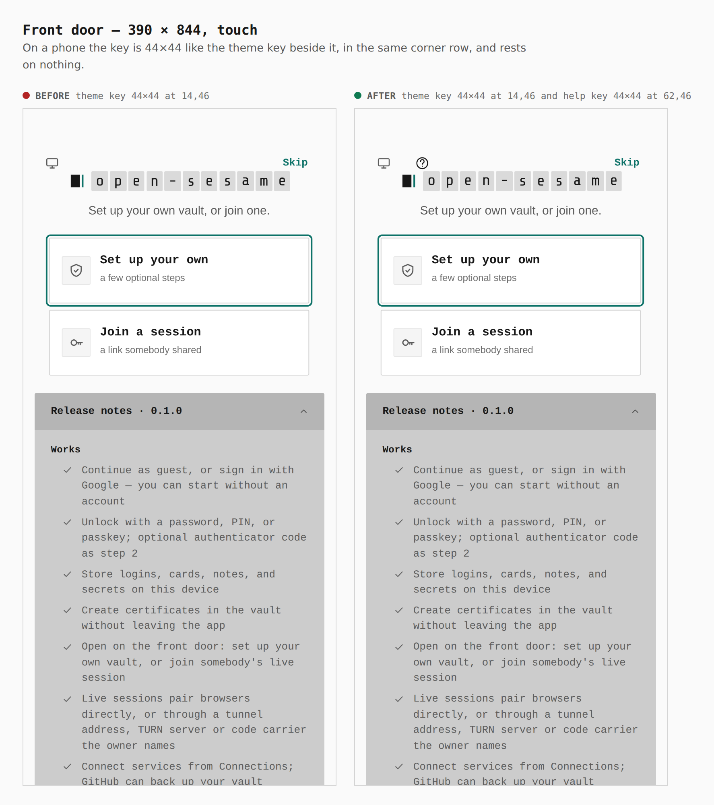
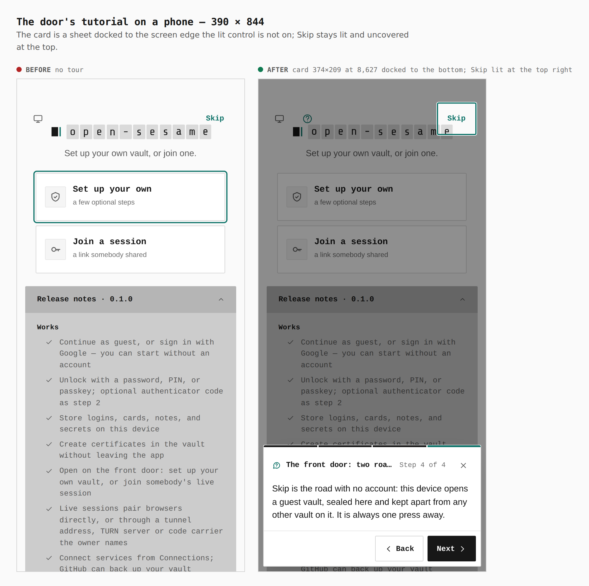
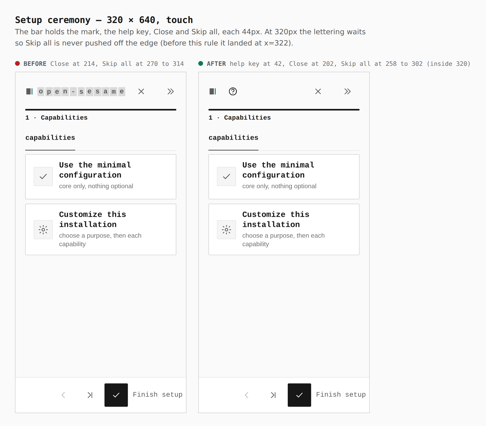
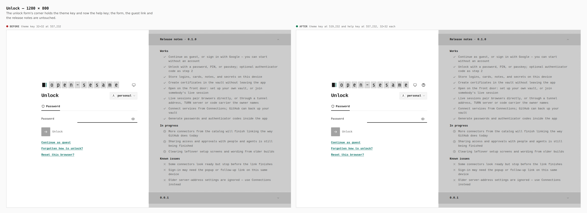
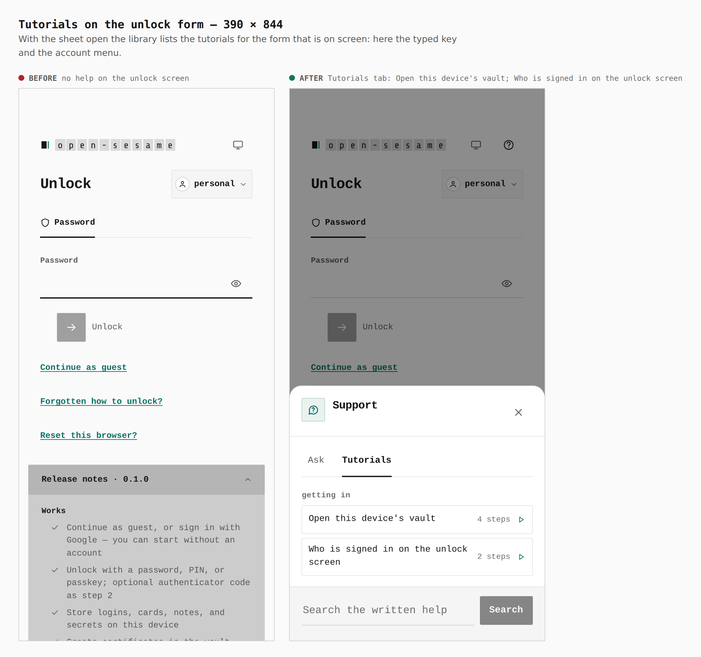
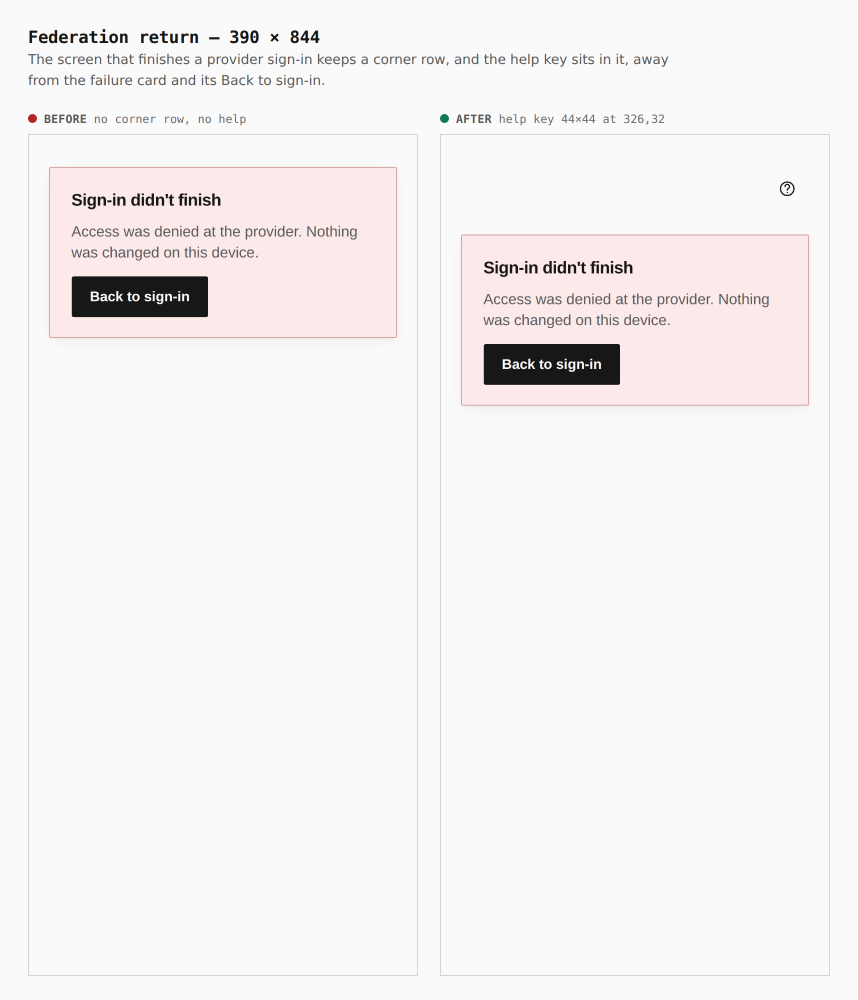

# A help key on the gates — before / after

Two real builds walked the same way: the base (`76d0e90e`, the tutorial coverage gate on top of `origin/main`) and this branch (ADR 0165). Desktop is 1280×800 with a mouse, phone is 390×844 (and one 320×640) with touch. Every number below is a box read from the browser (`measure` in the journey), and the interaction contract is checked by `pnpm --filter @opensesame/pages verify:tutorials` (59 shell tutorials plus the 10 gate tutorials a default installation reaches (the identity, connectors and keep-it tours need an optional tab or an installable browser, and are covered by the registry tests instead), both widths, 9640 checks, 0 failed), `verify:keyboard`, `verify:mobile` (99 checks, 0 failed), `verify:static` (638) and `verify:auth` (71).

Reproduce: `journey.json` here with `apps/pages/scripts/capture-evidence.mjs` (`EVIDENCE_DIST` for the base build).

## Front door — 1280 × 800

The door gets one more key in the card's corner beside the theme key. The wordmark, the two roads and the guest Skip have not moved.

- before: theme key alone, 32×32 at 109,288
- after: theme key 32×32 at 109,288 and help key 32×32 at 145,288

## The help key opens the Support sheet — 1280 × 800

The same sheet the shell has, built offline: written help for this screen, no model to download or ask.

- before: no key, so nothing opens
- after: sheet 480×800 docked right

## Tutorials on the door — 1280 × 800

- before: no tutorials on a gate
- after: two (The front door: two roads and Skip, 4 steps; Join a session, 3 steps), none of the shell's

## The door's tutorial lights the guest Skip — 1280 × 800

- before: Skip with no tour behind it
- after: card 368×177 at 369,339 beside the lit Skip; covers neither Skip nor the roads

## Front door — 390 × 844, touch

- before: theme key 44×44 at 14,46
- after: theme key 44×44 at 14,46 and help key 44×44 at 62,46

## The door's tutorial on a phone — 390 × 844

- before: no tour
- after: card 374×209 at 8,627 docked to the bottom; Skip lit at the top right

## Setup ceremony — 320 × 640, touch

With the key in the bar beside Close and Skip all the lettering no longer fits at 320px; before the rule below, Skip all landed at x=322 on a 320px screen. Below 360px the mark stays and the lettering is hidden (the name is still announced). `verify:mobile` audits the ceremony at every width now and fails (`320-setup-ceremony`) without the rule.

- before: Close at 214, Skip all at 270 to 314
- after: help key at 42, Close at 202, Skip all at 258 to 302

## Unlock — 1280 × 800

- before: theme key 32×32 at 557,232
- after: theme key at 519,232 and help key at 557,232, 32×32 each; the form, the guest link and the release notes are untouched

## Tutorials on the unlock form — 390 × 844

- before: no help on the unlock screen (theme key 44×44 at 313,64)
- after: help key 44×44 at 313,64 beside the theme key at 264,64; the library lists the tutorials for the form on screen

## Federation return — 390 × 844

- before: no corner row, no help
- after: help key 44×44 at 326,32, away from the failure card

Not captured: the broker popup. It needs the Site broker capability switched on, which the evidence journey does not do; its seat, the tutorial and the walk are covered by `verify:tutorials` (the popup pass), by `BrokerAuthorize.test.tsx`, and the geometry is the federation screen's (same `.broker__bar`).
