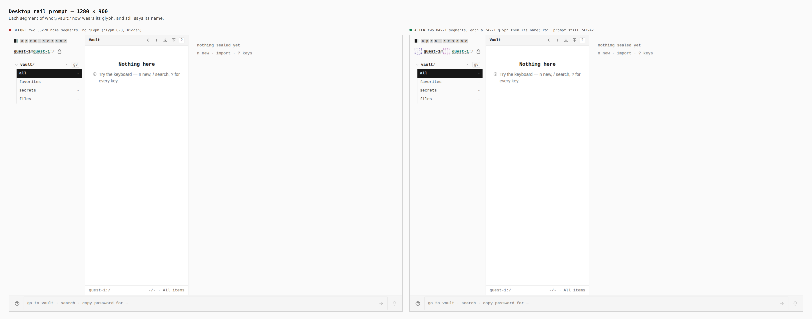
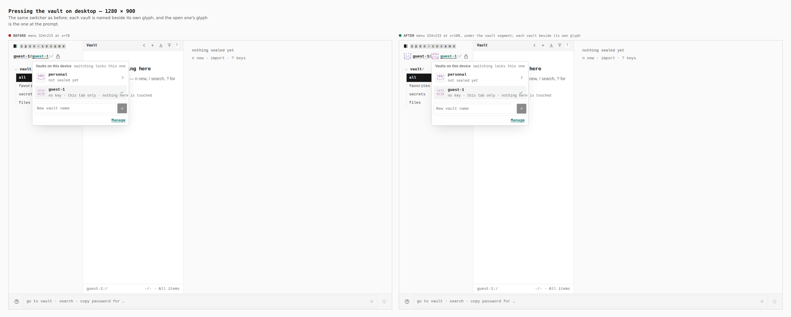
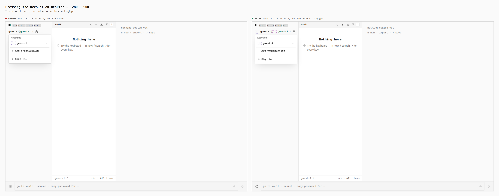
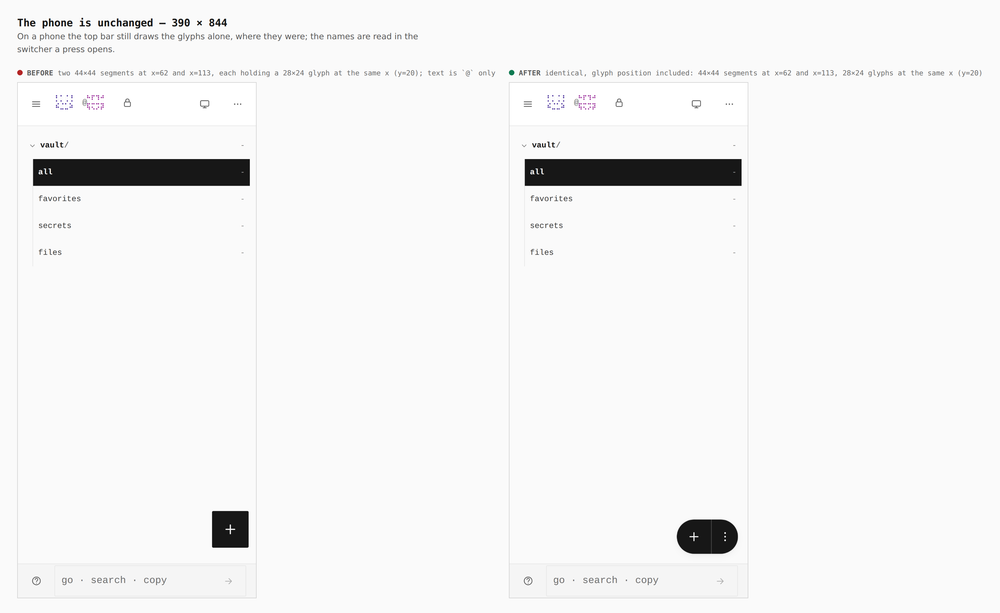

# The glyph beside the name on desktop (ADR 0164)

Before/after from two real builds — `main` and this branch — walked the same
way (a guest in the vault), measured in the browser. The base build is on the
left of each sheet, this branch on the right.

## Desktop rail prompt — 1280 × 900

Each segment of `who@vault:/` now wears its glyph, then says its name: two
55×20 name segments → two 84×21 segments, each a 24×21 glyph and its name. The
rail prompt keeps its 247×42 box.

## Pressing the vault on desktop — 1280 × 900

The same switcher; the menu hangs from the vault segment (324×215, x=78 →
x=108) with each vault named beside its own glyph.

## Pressing the account on desktop — 1280 × 900

The profile named beside its glyph; the menu is unchanged at 224×154.

## The phone is unchanged — 390 × 844

The top bar still draws the glyphs alone (two 44×44 segments at x=62 and
x=113, and the 28×24 glyphs themselves at the same x, y=20, measured on both
builds); the names are read in the switcher a press opens. A first version of
this change moved those glyphs 8px inside their keys, because the rail's new
flex rule also matched the top bar's prompt; review caught it, the rule is now
scoped to the rail, and the glyph position is part of the measurement.
