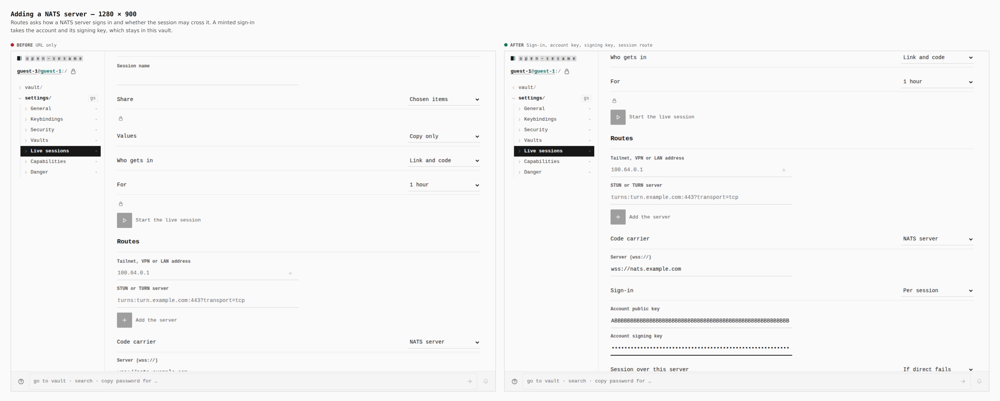
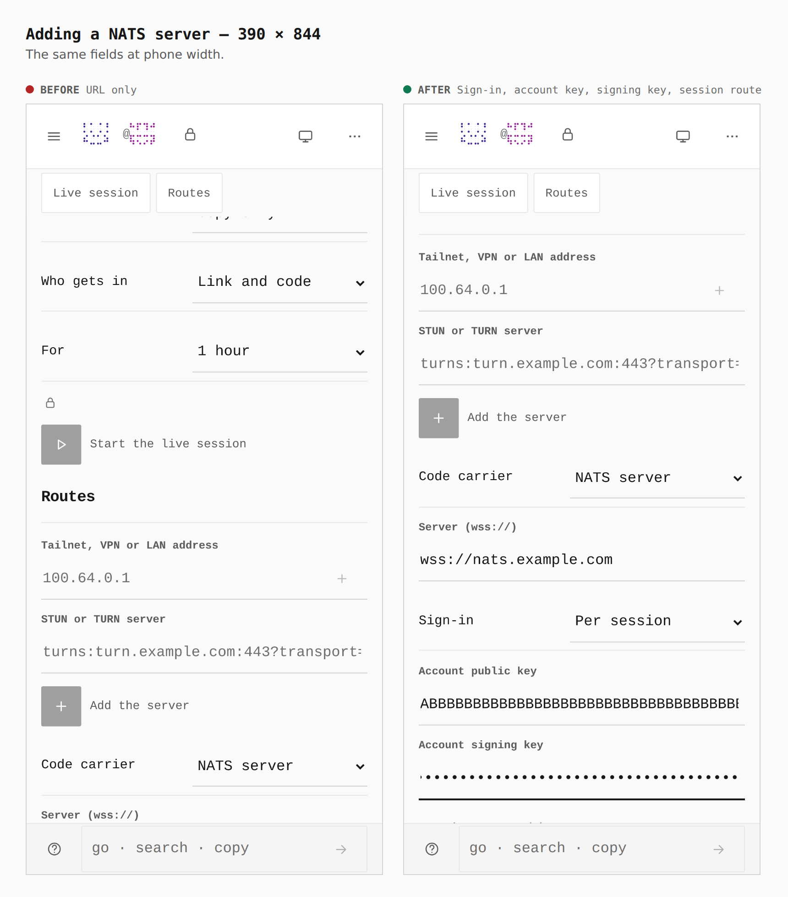
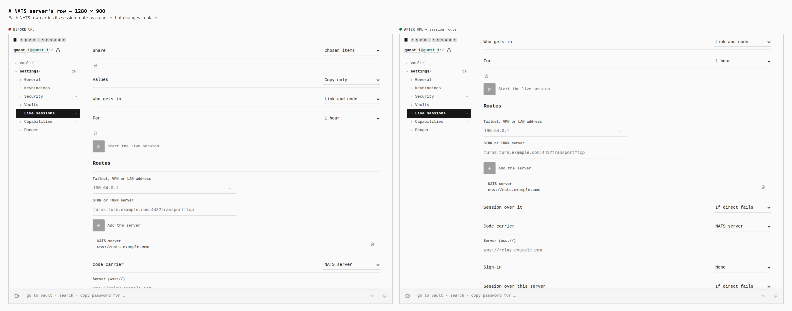
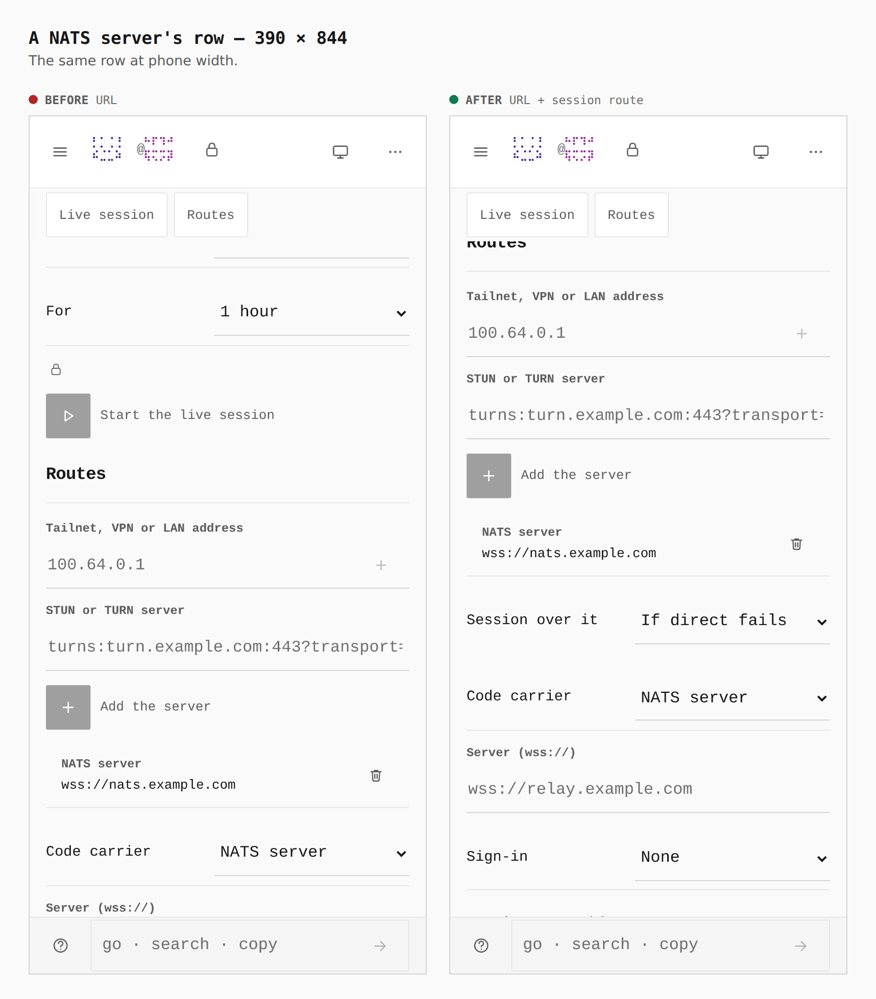

# A NATS server as a live session's route — Settings › Live sessions › Routes

Before/after from two real builds of `apps/pages`: `main` at `5019dd09` and
this branch, walked the same way by `journey.json` (guest, Live sessions on,
Routes, Code carrier → NATS server, `wss://nats.example.com`, Sign-in → Per
session, an account key and a signing key, then Add the carrier). Numbers are
read from the browser (`capture-evidence.mjs` `count` / `measure`).
[ADR 0166](../../adr/0166-nats-live-session-route.md).

## Adding a NATS server — 1280 × 900

- NATS fields drawn (`#live-nats-sign-in`, `-account`, `-signing-key`,
  `-session`): **0 → 4**
- Routes panel `960x431 → 960x704`

## Adding a NATS server — 390 × 844

- NATS fields drawn: **0 → 4**; every select reads in full ("Per session",
  "If direct fails")
- Routes panel `358x478 → 358x793`

## A NATS server's row — 1280 × 900

- Session-route choices on a NATS row (`[id^=live-nats-session-]`):
  **0 → 1**, a full-width row of its own under the server's

## A NATS server's row — 390 × 844

- Session-route choices: **0 → 1**. Drawn first inside the server's row, it
  overran the right edge under the remove key at 390; it is now its own row,
  `Session over it` · `If direct fails`, named `Session over
  wss://nats.example.com` for assistive technology.
