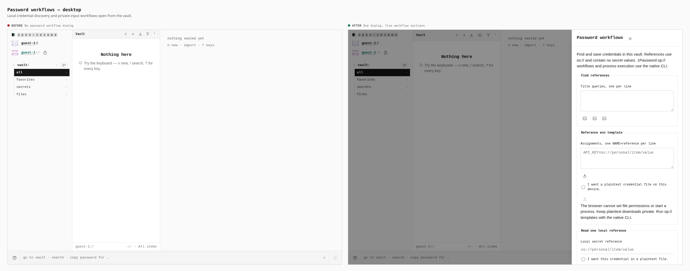
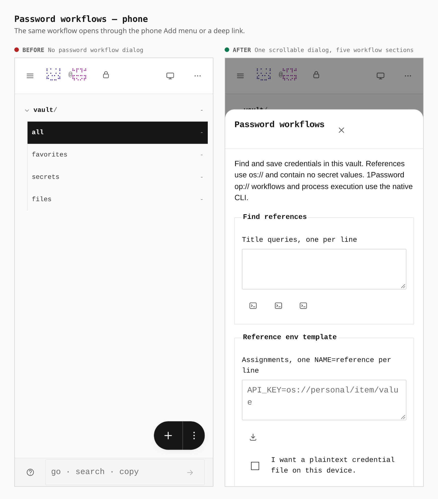
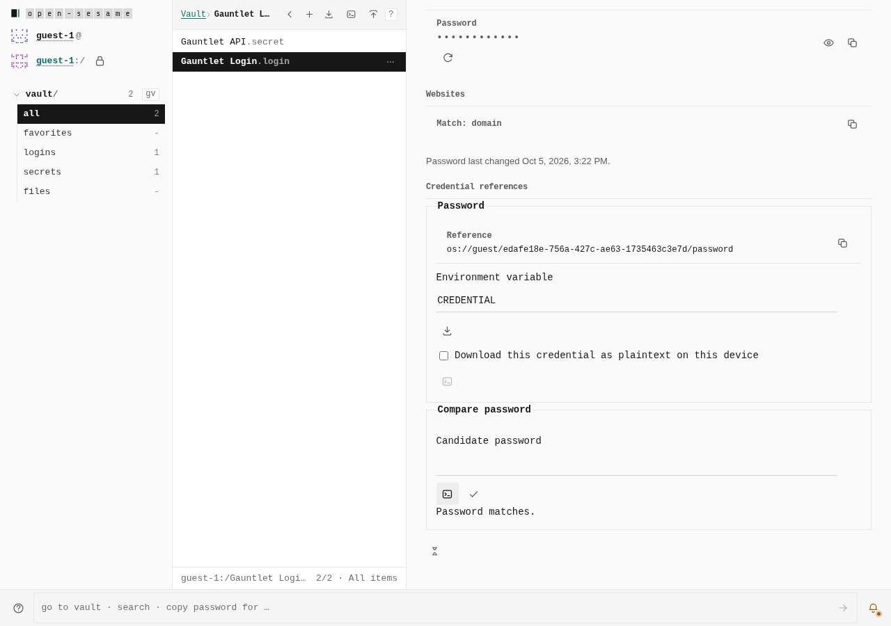
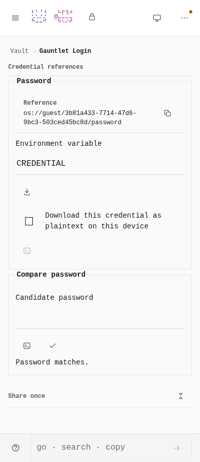
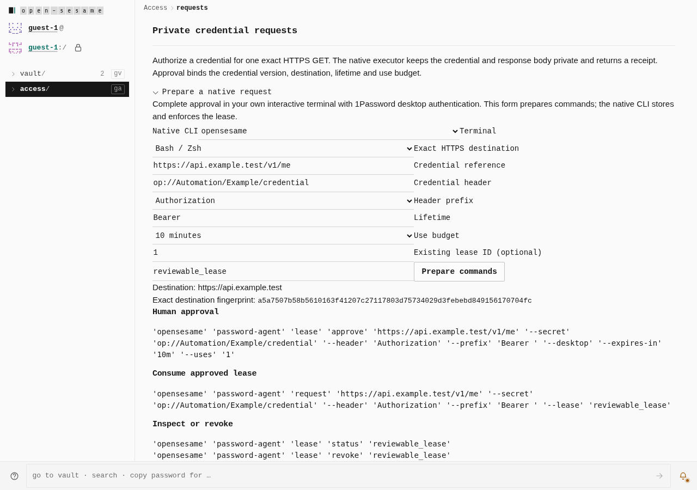
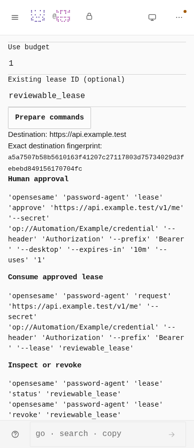

# Password workflows

> **Superseded 2026-10-07.** The standalone "Password workflows" dialog pictured
> here, its toolbar and phone Add entries, the Access request-command form and
> the extension popup links were a misreading of the request for workflows in
> the natural item-detail and organization-health contexts. They were removed;
> see [`2026-10-07-password-workflows-in-place/`](../2026-10-07-password-workflows-in-place/README.md).
> This gallery is kept as the record of what shipped.

Two real production builds, the unchanged base and this branch, at 1280 × 900
and 390 × 844. The same guest journey opens the vault workflow deep link.

| Surface | Before | After |
| --- | --- | --- |
| Desktop | No password workflow dialog | One dialog with discovery, reference templates, explicit read, private credential creation and password comparison |
| Phone | No password workflow dialog | The same scrollable sheet, reachable from Add and the workflow deep link |

## Desktop

## Phone

The browser verifier separately exercises reference discovery, inventory,
organization audit, template download, explicit plaintext downloads and verified
private writes. Local references use `os://`; remote 1Password execution and
service-account administration remain native CLI operations. No screenshot
contains a secret value.

## Item details and native request handoff

The production browser gauntlet also exercises item search, copying the selected
item's exact reference, reference and explicit plaintext downloads, password
comparison and verified update, and Health's linked organization findings.
Private inputs are cleared before these screenshots at 1280 × 900 and 390 × 900.

The same journey enables Access authority through Settings, opens Requests and
verifies the exact native approval, use, status and revoke commands. Preparing
these commands does not approve a lease or execute a credential-bearing request.

The five affected tutorials were walked on this final build at both widths:
both password workflow guides, item credentials, Health review and native
requests. All 876 checks passed, including Next, keyboard navigation, Back,
Replay, Done, focus and target visibility. The fixture enables Access authority
through Settings and the Login pack through Vaults before creating real items.
The four vault guides also passed all 778 checks under the default capability
plan at both widths, enabling only the Login pack to create the item fixture.
