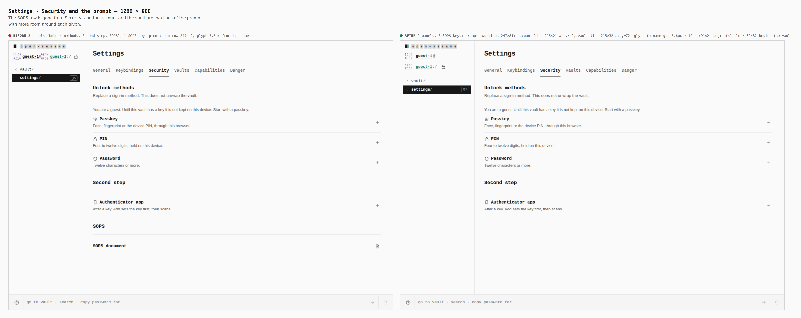
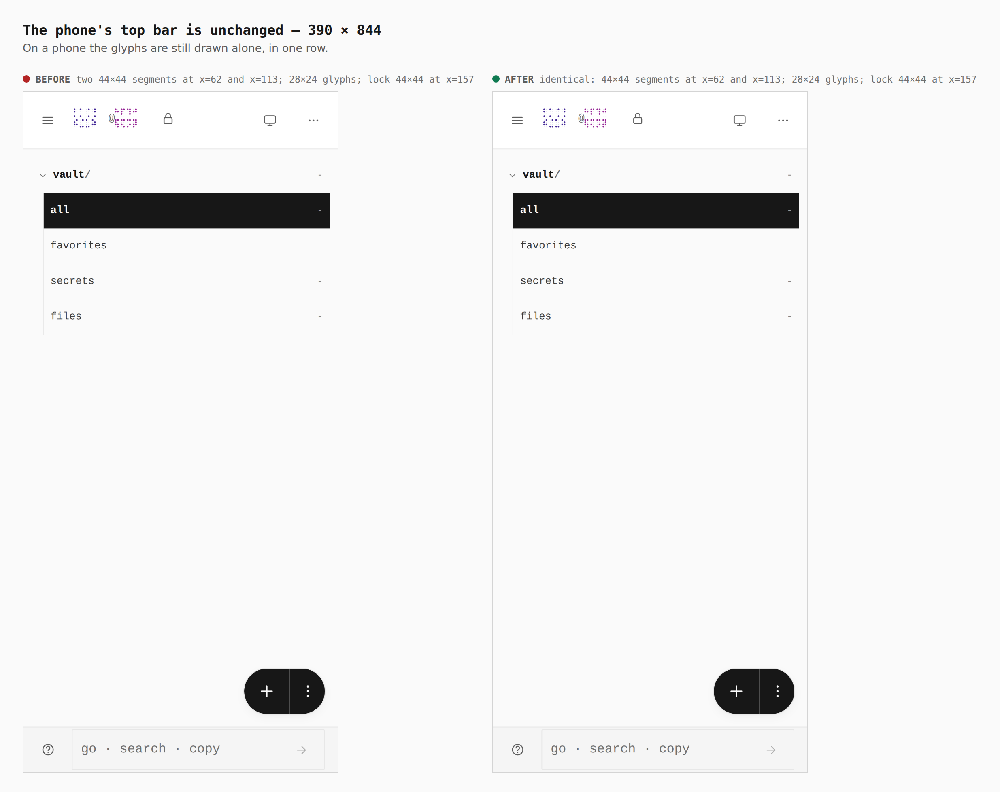

# SOPS row removed from Security; the prompt's two identities on two lines

Before/after from two real builds — the base branch and this one — walked the
same way (a guest in the vault), measured in the browser. Base on the left of
each sheet, this branch on the right.

## Settings › Security and the prompt — 1280 × 900

- Security: 3 panels (Unlock methods, Second step, SOPS) with 1 SOPS key →
  2 panels, 0 SOPS keys.
- Prompt: one row 247×42 → two lines 247×81. The account line is 215×21 at
  y=42, the vault line 215×32 at y=72 with the lock 32×32 beside the vault.
  The gap between a glyph and its name goes 5.6px → 12px.

## The phone's top bar is unchanged — 390 × 844

Identical on both builds: 44×44 segments at x=62 and x=113, 28×24 glyphs, lock
44×44 at x=157. The two lines are `display: contents` there.
