# Identity › Devices manages the real tailnet (ADR 0168)

These images come from real builds walked the same way:

- the base is `main` at `a23dcb2c`;
- the branch is this pull request;
- both are dedicated-origin builds (`build:live-dedicated`) served under
  `https://opensesame.example.test/OpenSesame/`.

The walk itself:

1. An owner seals a vault with a password.
2. They switch Identity and Networking on.
3. They open Identity › Devices.
4. They press the panel's add key.

On the branch build, the page is also paired with a real `opensesame` daemon
by the link `opensesame daemon tailnet pair` prints. That daemon is
connected to a stand-in for api.tailscale.com, which answers in Tailscale's
own shapes (`apps/pages/scripts/lib/tailscale-stub.mjs`). The base build has
nothing to pair with.

The counts under each pair come from the browser
(`capture-tailnet-devices-evidence.mjs` writes them to
`measurements-before.json` and `measurements-after.json`).

## The Devices tab, desktop

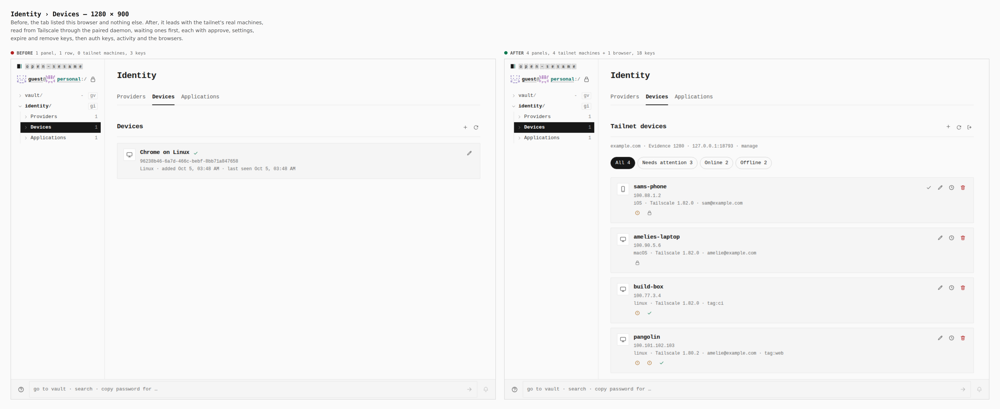

**Before:** one panel, 1 row (this browser), 0 tailnet machines, 3 keys.

**After:** four panels: Tailnet devices, Tailnet auth keys, Tailnet activity
and This vault's browsers. They hold 4 tailnet machines and 1 browser, with
18 keys. Each machine has approve (only while it waits), settings, expire and
remove keys.

## The add key, desktop

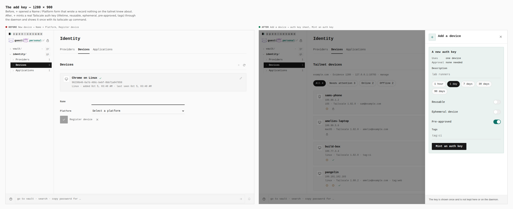

**Before:** *New device* opened a Name and Platform form. *Register device*
wrote a record that nothing on the tailnet knew about.

**After:** *Add a device* opens a sheet that mints a real Tailscale auth key
through the daemon. The sheet sets its lifetime, whether it is reusable,
ephemeral or pre-approved, and its tags, then shows the key once with its
`tailscale up` command.

## The Devices tab, phone

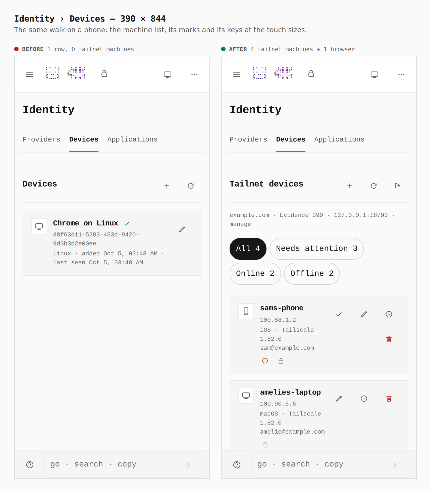

**Before:** 1 row, 0 tailnet machines. **After:** 4 tailnet machines and
1 browser.

## The add key, phone

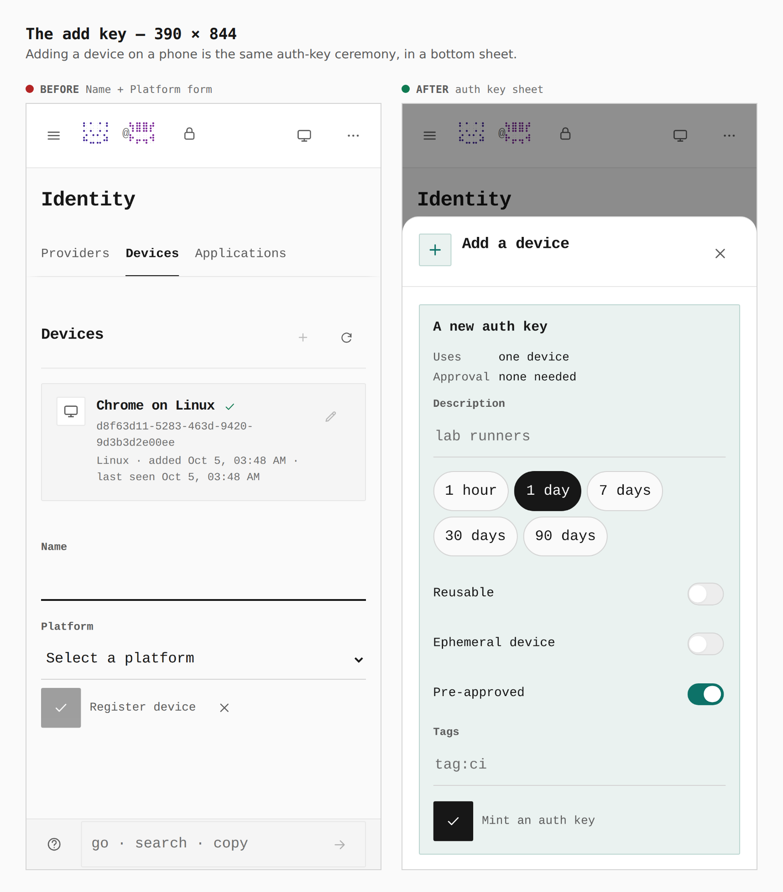

**Before:** the Name and Platform form. **After:** the auth-key sheet,
as a bottom sheet.

## The rest of the flow (branch only)

Each screen below is from `pnpm --filter @opensesame/pages
verify:tailnet-devices`. Every change it makes is also checked against what
the Tailscale stand-in received.

| Screen | What it shows |
| --- | --- |
| 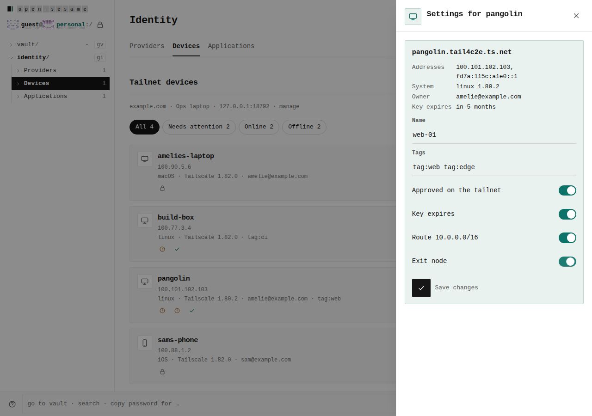 | One device's settings. Renaming it `web-01`, adding `tag:edge` and turning on the exit node reach Tailscale as three calls: `name`, `tags` and `routes`. |
| 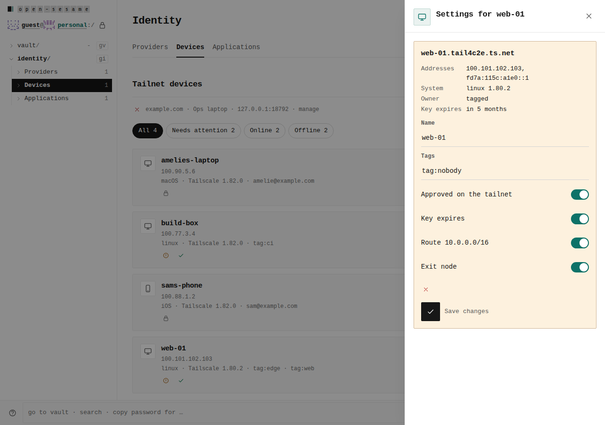 | A tag the tailnet policy does not own. Tailscale's own words come back as a mark in the sheet. |
| 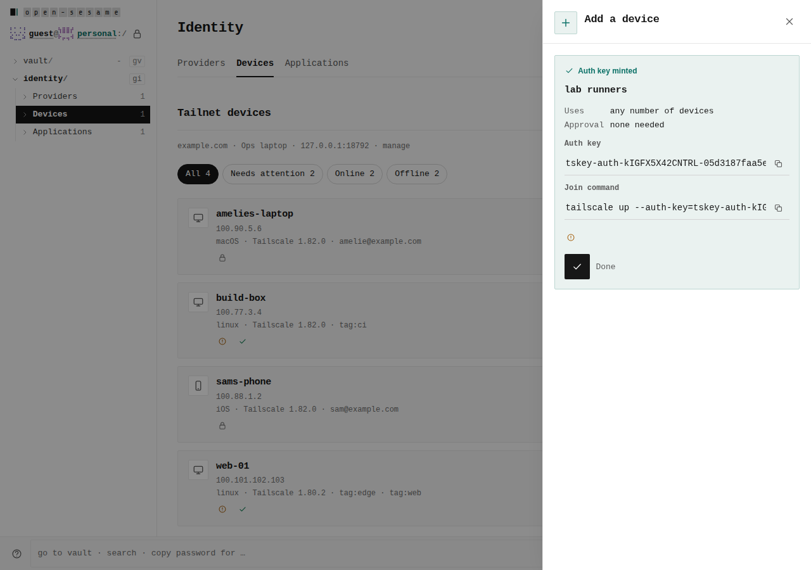 | The minted key and its join command, shown once, each with a copy key. |
| 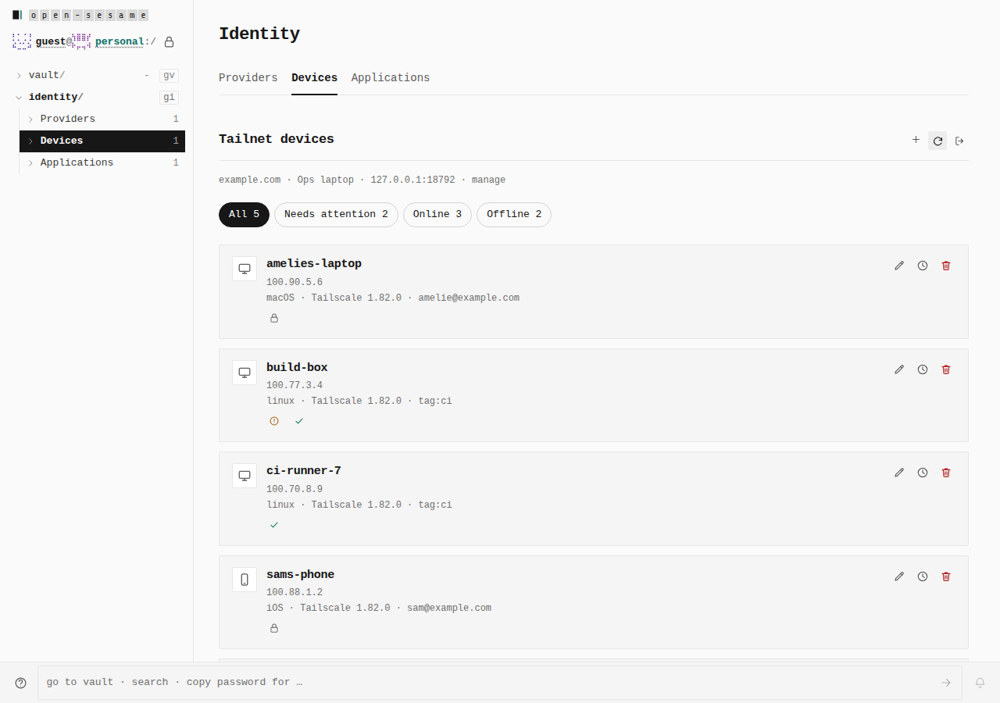 | A machine joins with that key and is listed as `ci-runner-7`: tagged `tag:ci` and already approved. |
| 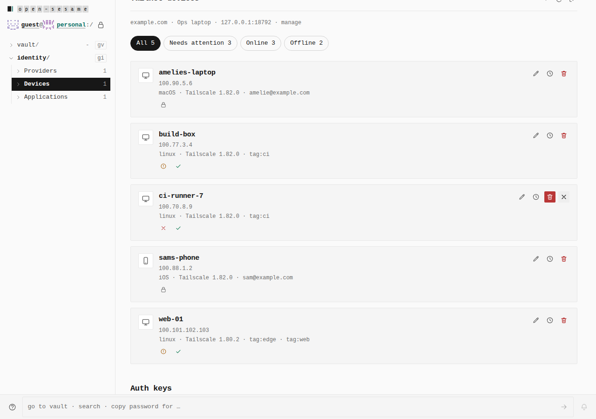 | Remove is armed by the first press, with a keep key beside it. Nothing has reached Tailscale yet. |
| 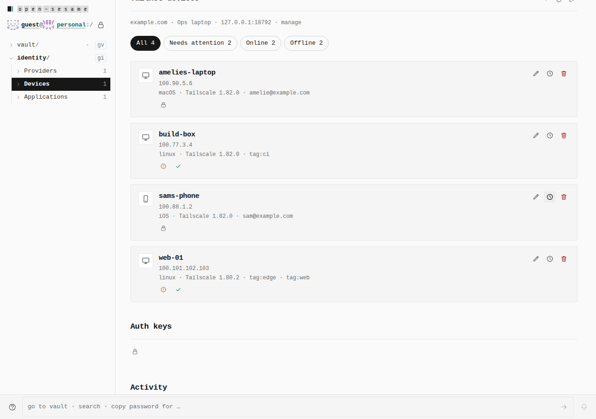 | Activity: each change, the pairing that made it, and whether Tailscale accepted it. |
| 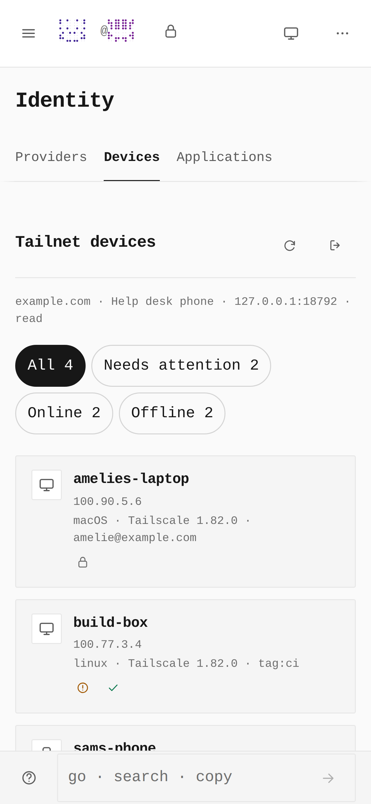 | A phone paired with the `read` role sees the same tailnet, with no key that changes it. |
| 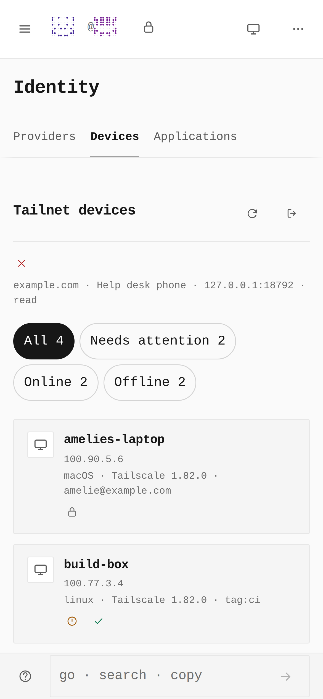 | After `opensesame daemon tailnet unpair --all`, the phone's next reload says the daemon no longer knows its key. |
