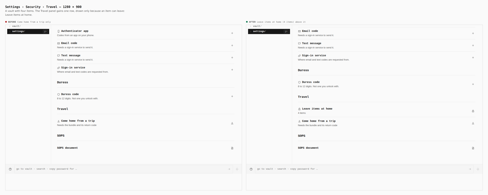
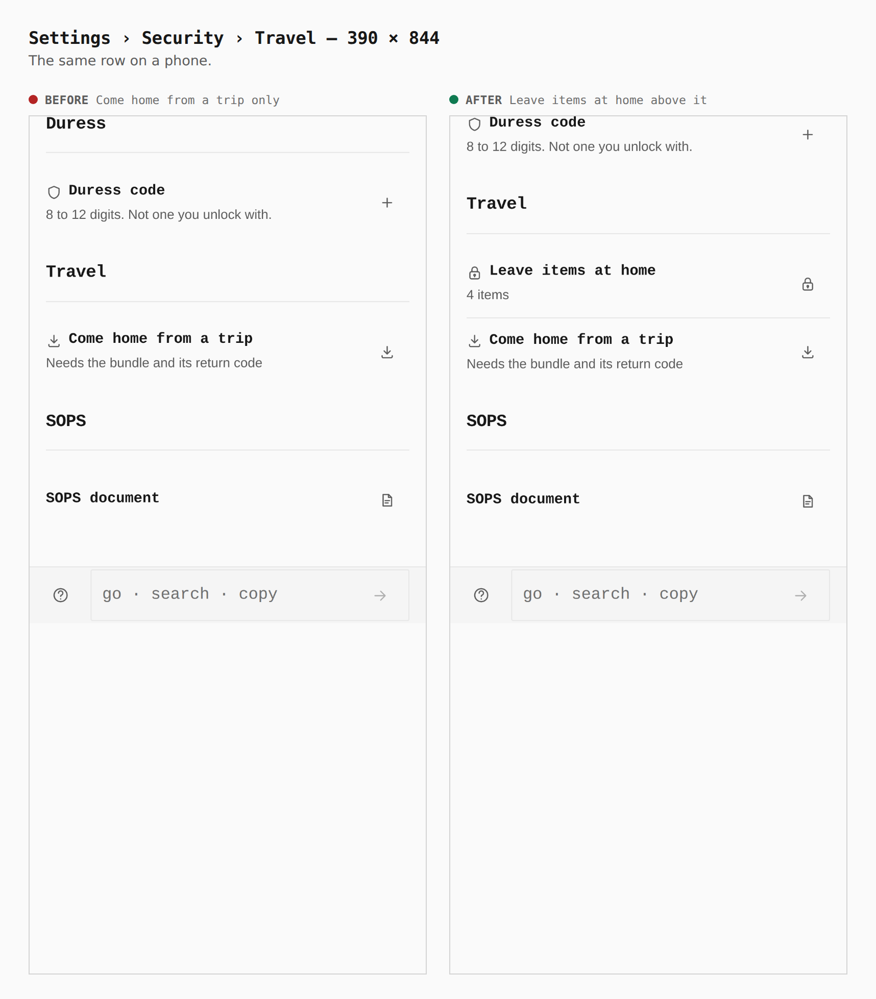
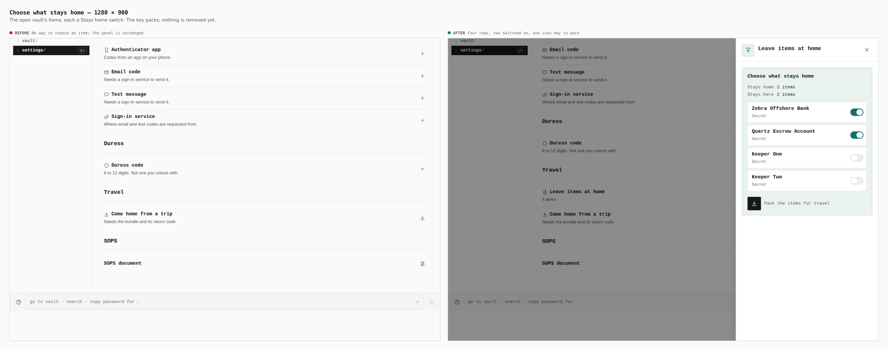
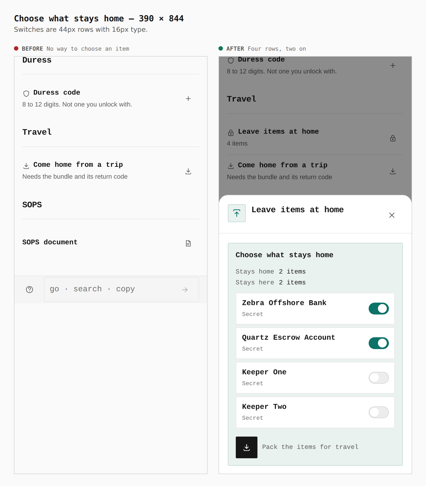
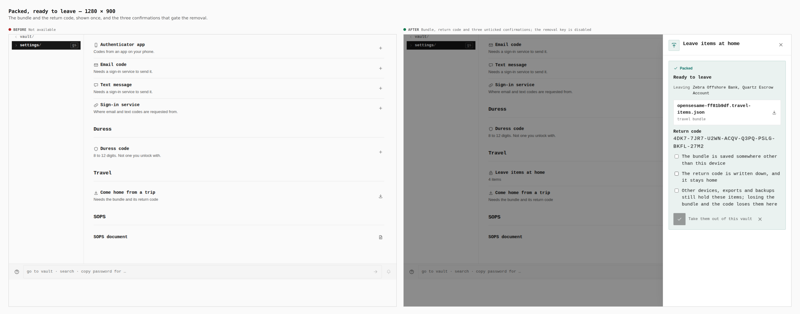
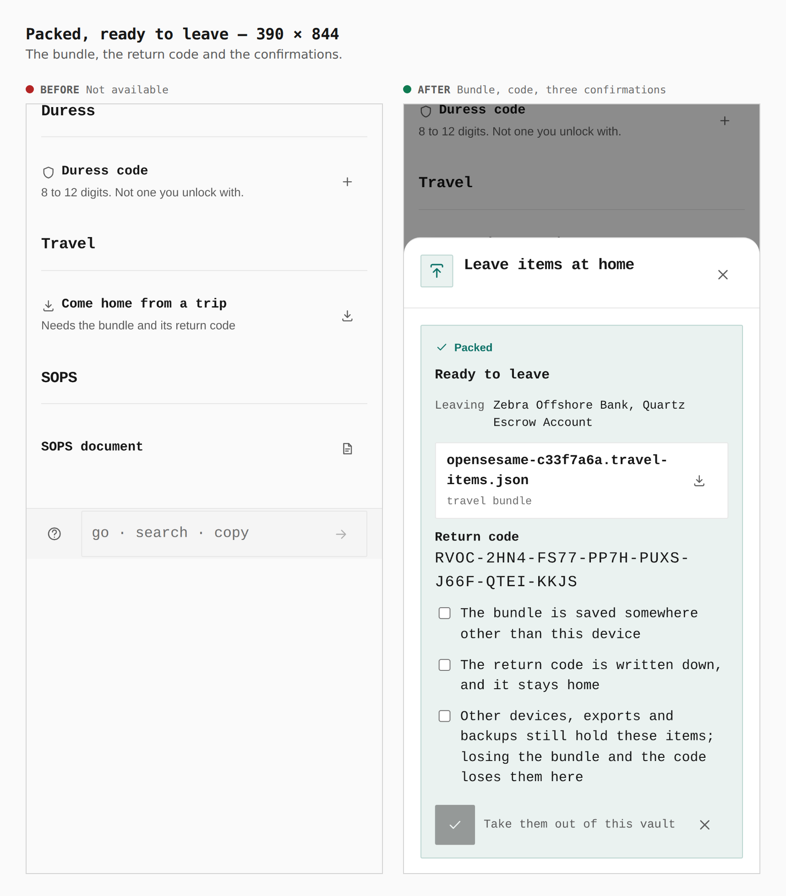
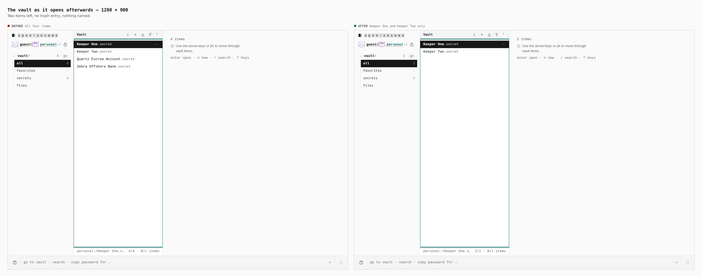
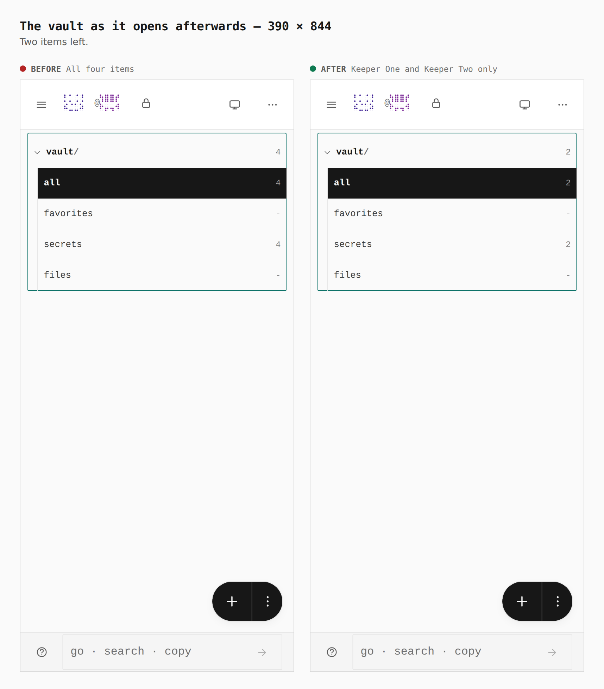

# Leave items at home — before and after

Before/after sheets from two real builds of `apps/pages` (base: `origin/main` at
`eb81a0ad`, built in its own worktree and captured with `EVIDENCE_DIST`; after:
this branch), walked by `journey.json` with
`apps/pages/scripts/capture-evidence.mjs` at 1280 × 900 and 390 × 844. Every
number below was printed by the capture from the browser (`report`, `measure`).
[ADR 0171](../../adr/0171-hide-items-while-traveling.md) records the decision;
[the audit](../../research/travel-hidden-items.md) says what an item leaves
behind.

A password-sealed vault with four secrets (`Zebra Offshore Bank`, `Quartz
Escrow Account`, `Keeper One`, `Keeper Two`). After captures: the two named
first are chosen, packed, the three confirmations ticked and the items taken
out. The base build has none of the keys, so the optional steps skip there and
its sheets show the unchanged page; that is the honest "before".

## The Travel panel

| | Before | After |
|---|---|---|
| Rows (`#travel .sw__name`) | `Come home from a trip` | `Leave items at home`, `Come home from a trip` |
| Row boxes, 1280 | 960×65 | 960×66, 960×65 |
| Row boxes, 390 | 358×66 | 358×67, 358×66 |
| Icon key, 390 | 44×44 | 44×44, 44×44 |

## Choose what stays home

| | Before | After |
|---|---|---|
| Item rows in the sheet | none | 4 (title and kind) |
| Switches, 1280 | none | 4 × 38×22 |
| Switches, 390 | none | 4 × 44×44, rows 322×64 |

## Packed

| | Before | After |
|---|---|---|
| Confirmations, 1280 | none | 3 (355×45, 355×45, 355×68) |
| Confirmations, 390 | none | 3 (322×45, 322×45, 322×90) |
| Removal key | none | disabled until all three are ticked |

## The vault afterwards

| | Before | After |
|---|---|---|
| Items listed | 4 | 2 (`Keeper One`, `Keeper Two`) |
| `secrets` count in the tree | 4 | 2 |

## What the sheets do not show

The return half (a wrong code refused, the right one preview and bring the items
back) and what no screen carries afterwards (search, trash, activity, markup)
are walked as text assertions by `J-TRAVEL-ITEMS`
(`apps/pages/scripts/lib/j-travel-items-journey.mjs`), not drawn here.
The desktop switch is the app's existing 38×22 control; on a phone it is 44×44.
