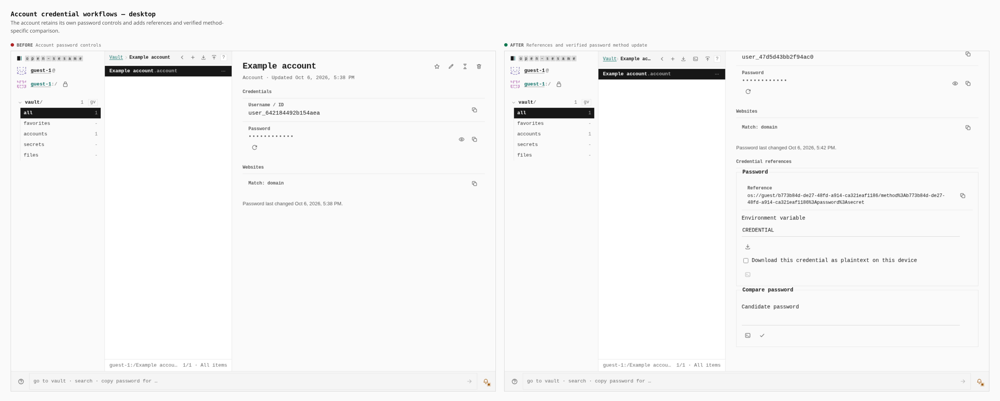
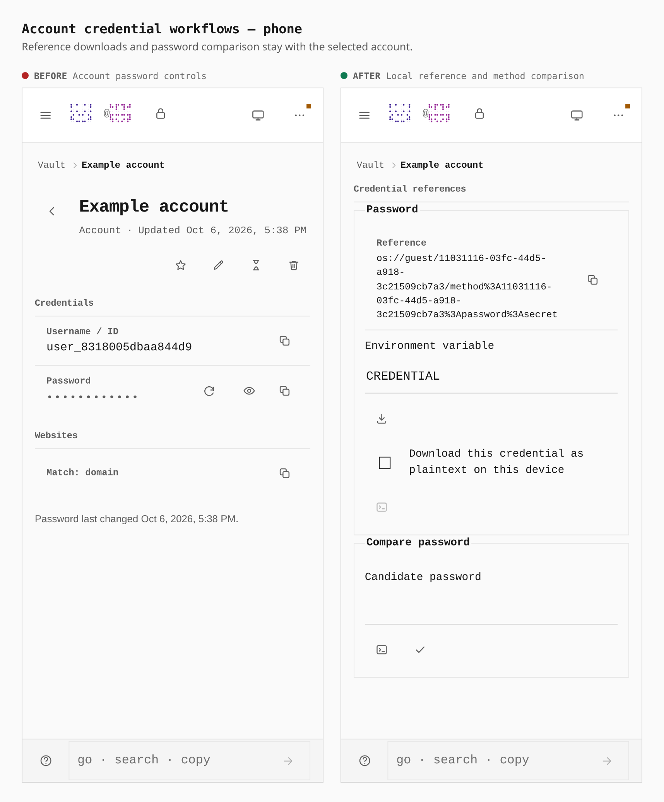

# Account credential workflows

Two real builds follow the same guest journey at 1280 × 900 and 390 × 900:
main `4cde2ee5a` and the parity implementation integrated with that same main.
Both include the latest one-line Account editor credential controls. Each journey
creates an account through its editor, opens Password options, selects My own, enters a
harmless fixture password, and turns Include pepper off. Protected passwords
retain their separate private-input boundary.

The existing account controls remain above the added reference and comparison
section. The after image brings that section into view. Stored passwords are
concealed, plaintext-download confirmation is unchecked, and candidate inputs
are empty.

| Measurement | Main | Parity implementation |
| --- | --- | --- |
| Credential reference section | 0 | 1 |
| Reference and comparison fieldsets | 0 | 2 |
| Desktop action buttons | Absent | 32 × 32 px |
| Phone action buttons | Absent | 44 × 44 px |

References identify the account method, and comparison updates only the chosen
password method. Pepper-slotted and legacy passwords use the Account's existing
controls; metadata operations never return an algorithmic generator root.
Failure regression tests verify safe tray notices and refusal to recreate an
account withdrawn while its private password editor remains open.

The before artifact has index SHA-256
`4d23d5e52d58ef011335620479ea2cc4115f6418330b79d3b6a98f0811cba893`.
The after artifact has index SHA-256
`a4c9825cb02ba9dd1973e7e06a749a13c9efaca23c1488453688405f644bdbc8`.
The journey records the actual browser measurements and captured artifact
identities. The pull request identifies the implementation revision separately.
