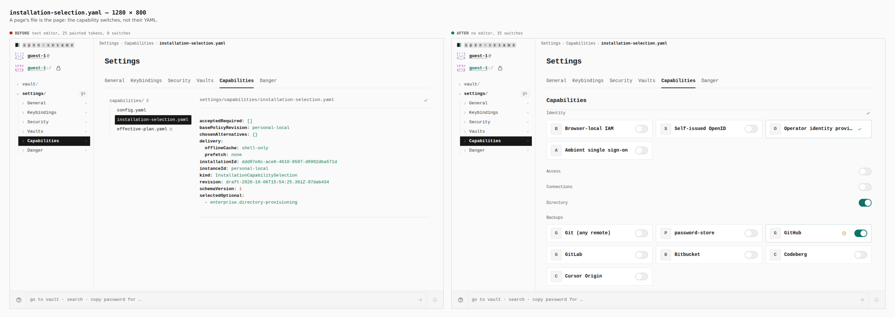
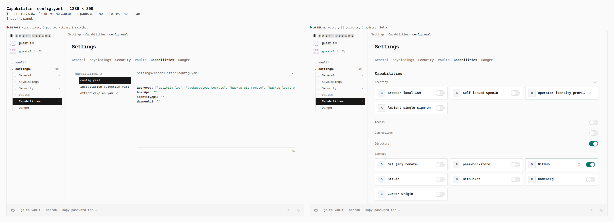
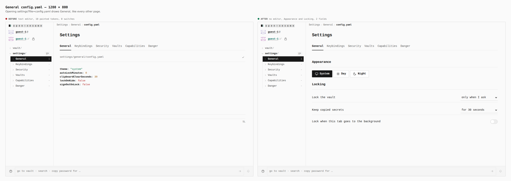
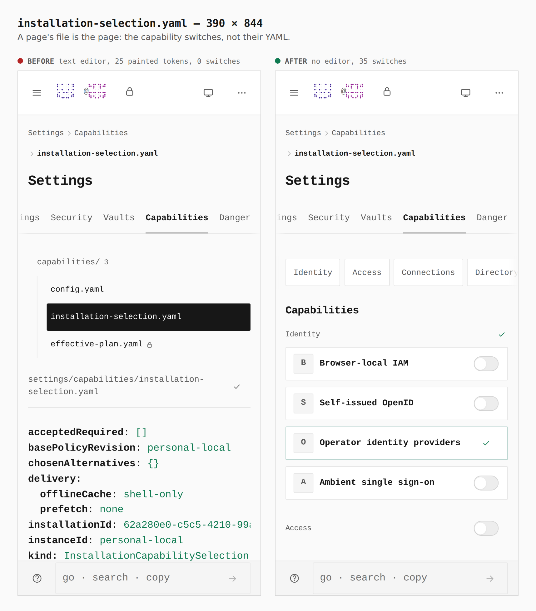
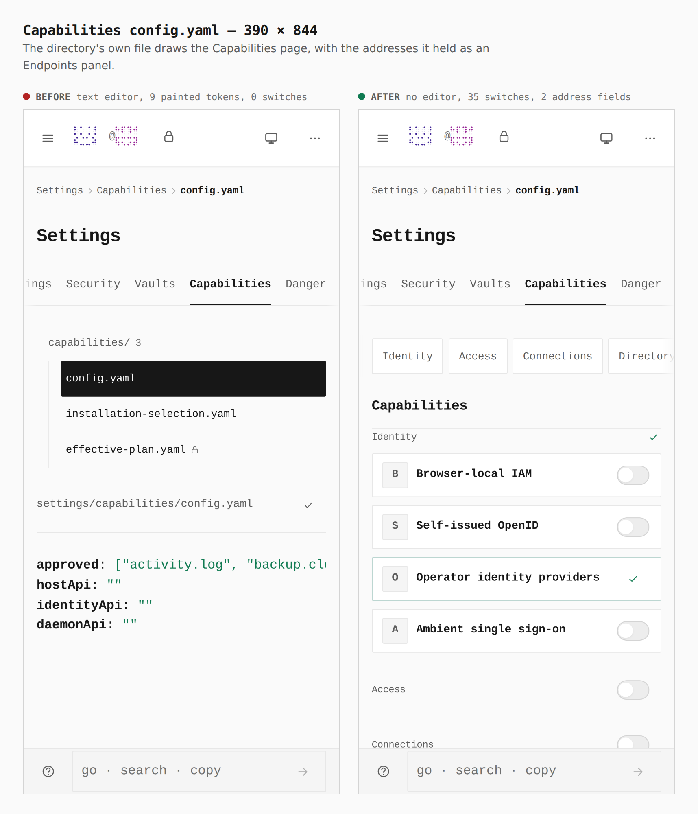
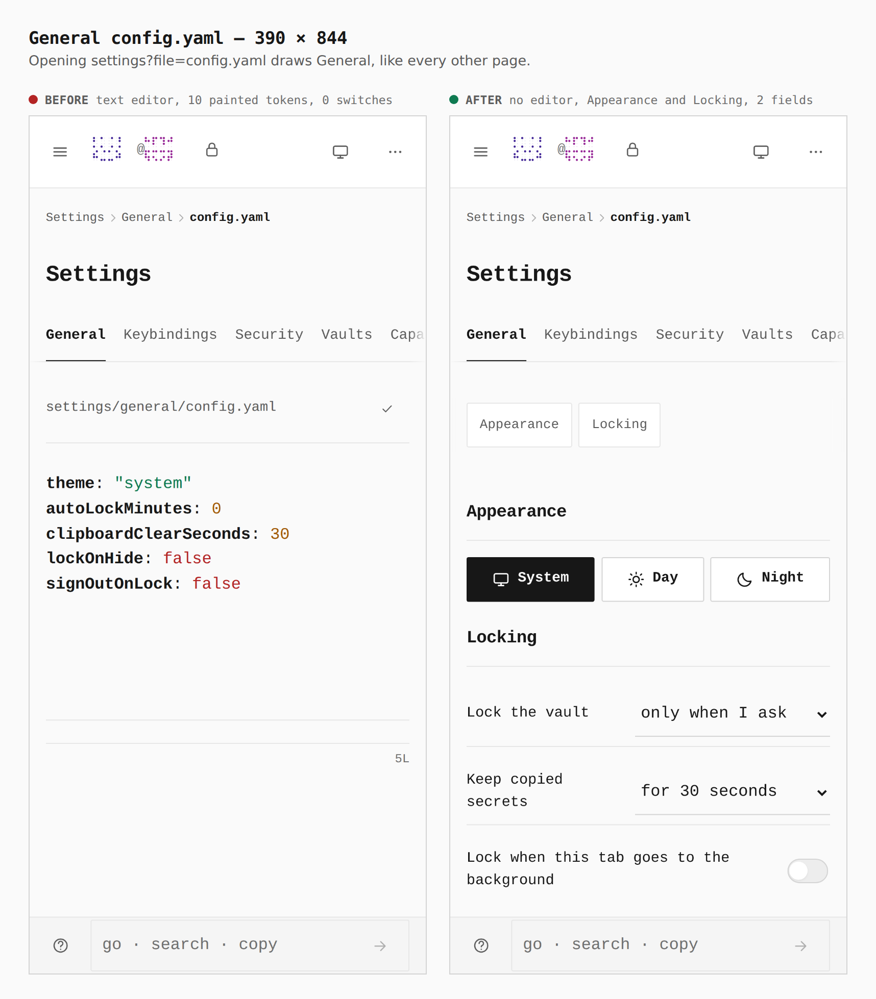

# A page's own files are the page

Before/after from two real builds (`main` at `2b2deb0` and this branch), walked by
`apps/pages/scripts/capture-evidence.mjs` with [`journey.json`](journey.json), same steps at 1280 × 800
and 390 × 844. The numbers are what the browser measured (the `facts` step).

`config.yaml` and the capability documents opened a text editor, so the Capabilities and General
files read as YAML on a page where every other screen is designed. Opening one now draws the page
that writes it, with the rail row (and the address) still on the file. The YAML editor, its Write key
and the keys that opened it are gone; the file viewer keeps only the files a provider keeps for
authoring (item types, `marketplaces.json`, routing).

## 1. installation-selection.yaml — 1280 × 800

`text editor, 25 painted tokens, 0 switches → no editor, 35 switches`

## 2. Capabilities config.yaml — 1280 × 800

`text editor, 9 painted tokens → no editor, 35 switches, 2 address fields`. The two fields are the
connections and local-agent addresses that only the YAML could set; they are an Endpoints panel.

## 3. General config.yaml — 1280 × 800

`text editor, 10 painted tokens → no editor; Appearance and Locking, 2 fields`

## 4–6. The same three on a phone — 390 × 844

