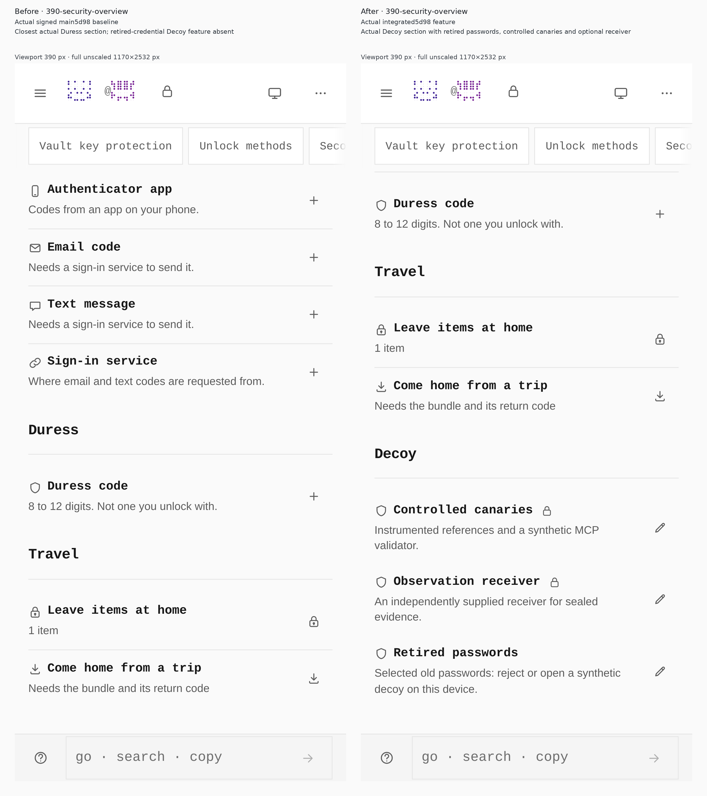
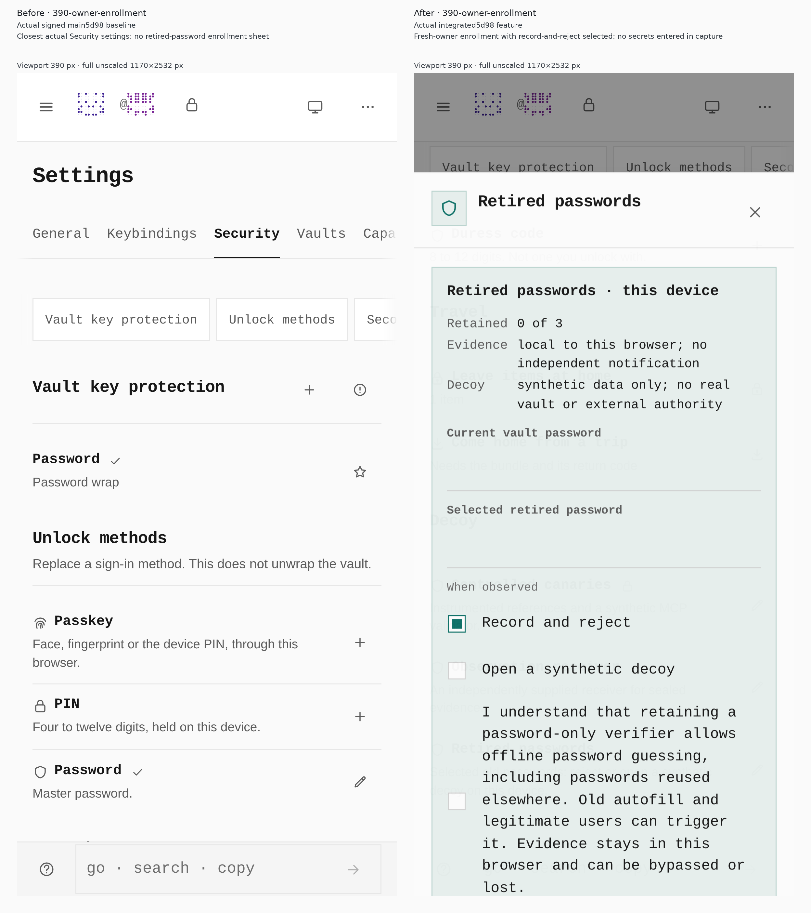
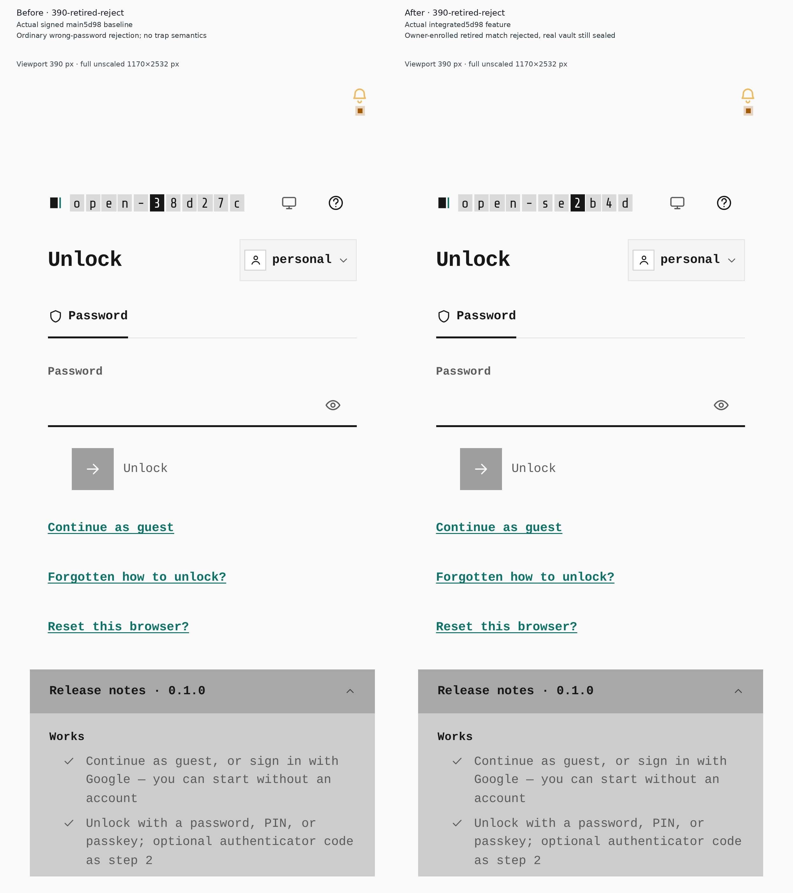
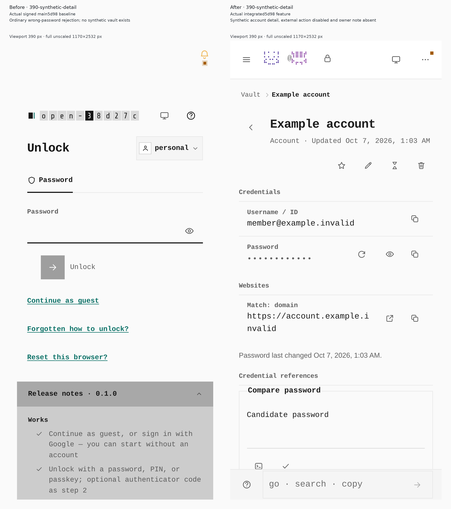
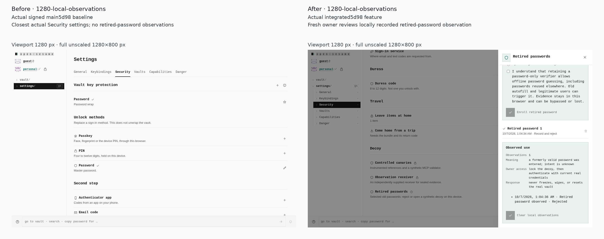
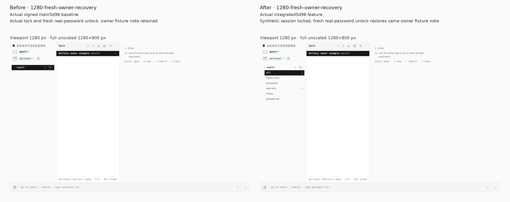
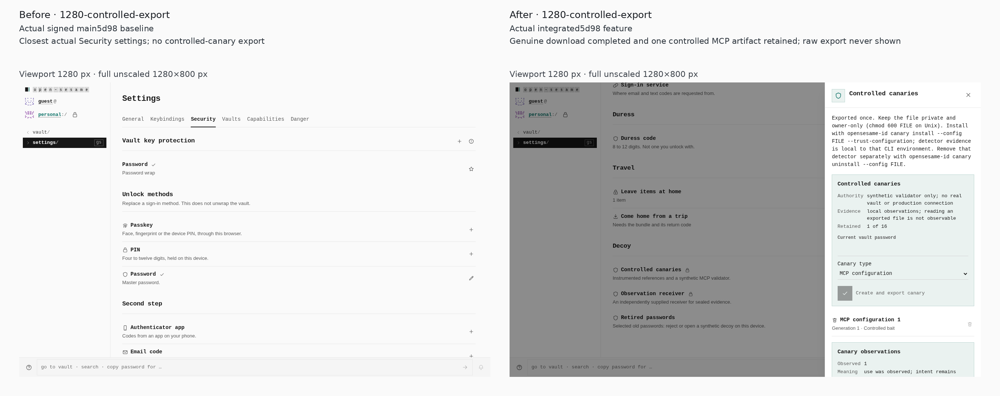
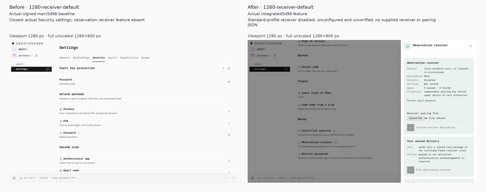
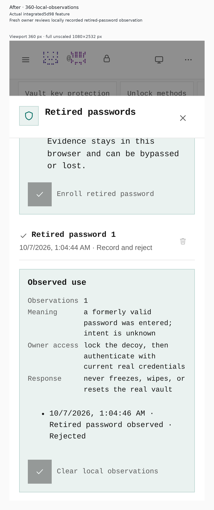

# Retired-credential gallery: signed 5d98 / locally staged V9

Fresh before and after journeys against the actual clean signed-main 5d98 baseline and actual V9 build of the locally staged implementation. Root inspected and approved all eight full-pixel pair sheets and the feature-only 360 view. Source publication was not executed.

The phone screenshots use 390 × 844 CSS viewports and retain 1170 × 2532 PNG pixels; desktop views use 1280 × 800 CSS/PNG pixels. Labels and spacing are outside the screenshots. No resizing or cropping was applied. Both builds use the standard profile, light theme and `/OpenSesame/`.

[Actual executed journey](journey.json) · [Capture and pixel provenance](gallery.json) · [Execution results](execution.json) · [Baseline build](../../before-5d98-build.json) · [V9 feature build](../../pwa-build-5d98-v9.json) · [V9 build validation](../../production-build-5d98-v9.json)

## 390 security overview

**Before:** Closest actual Duress section; retired-credential Decoy feature absent.

**After:** Actual Decoy section with retired passwords, controlled canaries and optional receiver.

The actual Decoy heading and Manage retired passwords control were visible within the captured phone viewport. Actual viewport/document widths: 390/390 CSS pixels.

## 390 owner enrollment

**Before:** Closest actual Security settings; no retired-password enrollment sheet.

**After:** Fresh-owner enrollment with record-and-reject selected; no secrets entered in capture.

Record and reject was selected by default. This capture precedes entering an owner password or selected retired password. Actual viewport/document widths: 390/390 CSS pixels. Actual dialog bounds: 390×742.71875 CSS pixels.

## 390 retired reject

**Before:** Ordinary wrong-password rejection; no trap semantics.

**After:** Owner-enrolled retired match rejected, real vault still sealed.

The enrolled retired password was rejected; Password remained visible and empty, Unlock finished without remaining busy, and the actual rejection notice was observed. Actual viewport/document widths: 390/390 CSS pixels.

## 390 synthetic detail

**Before:** Ordinary wrong-password rejection; no synthetic vault exists.

**After:** Synthetic account detail, external action disabled and owner note absent.

The synthetic account was present, the owner fixture name was absent, and its external action had aria-disabled=true and no href. Actual viewport/document widths: 390/390 CSS pixels.

## 1280 local observations

**Before:** Closest actual Security settings; no retired-password observations.

**After:** Fresh owner reviews locally recorded retired-password observation.

A rejected retired-password observation, Observed use metadata, and intent-is-unknown explanation were visible within the captured viewport after fresh real-owner authentication. Actual viewport/document widths: 1280/1280 CSS pixels. Actual dialog bounds: 424×800 CSS pixels.

## 1280 fresh owner recovery

**Before:** Actual lock and fresh real-password unlock, owner fixture note retained.

**After:** Synthetic session locked, fresh real-password unlock restores same owner fixture note.

After entering the synthetic vault, locking it and authenticating with the current owner password restored the same real-owner fixture item. Actual viewport/document widths: 1280/1280 CSS pixels.

## 1280 controlled export

**Before:** Closest actual Security settings; no controlled-canary export.

**After:** Genuine download completed and one controlled MCP artifact retained; raw export never shown.

A genuine opensesame-canary.json download completed without a download error; the canary count reached 1 of 16 and the owner-password field was cleared. Actual viewport/document widths: 1280/1280 CSS pixels. Actual dialog bounds: 424×800 CSS pixels.

## 1280 receiver default

**Before:** Closest actual Security settings; observation receiver feature absent.

**After:** Standard-profile receiver disabled, unconfigured and unverified; no supplied receiver or pairing JSON.

The receiver remained unprovisioned, untested and disabled; no pairing file was supplied. Actual viewport/document widths: 1280/1280 CSS pixels. Actual dialog bounds: 424×800 CSS pixels.

## Feature-only observation at 360 CSS pixels

This is an additional real rejected-observation capture at 360 × 844 CSS pixels, retaining 1080 × 2532 PNG pixels. It has no paired baseline. The event, Observed use metadata and intent-is-unknown explanation were asserted visible within the captured viewport.

Fixtures contain synthetic example data. Submitted passwords, downloaded canary material and receiver pairing data remain private. These are finite UI/flow and visual results; they are not installed-extension, native/signing/physical-device, formal security or production-readiness proof.
