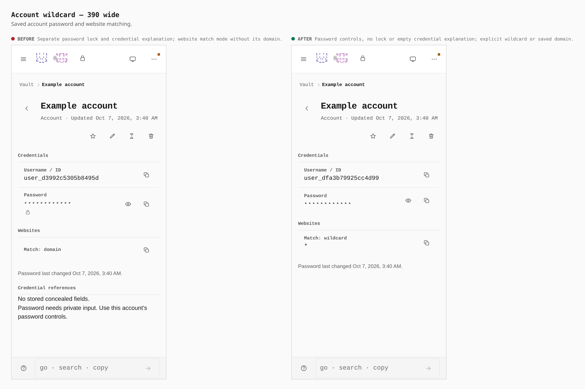
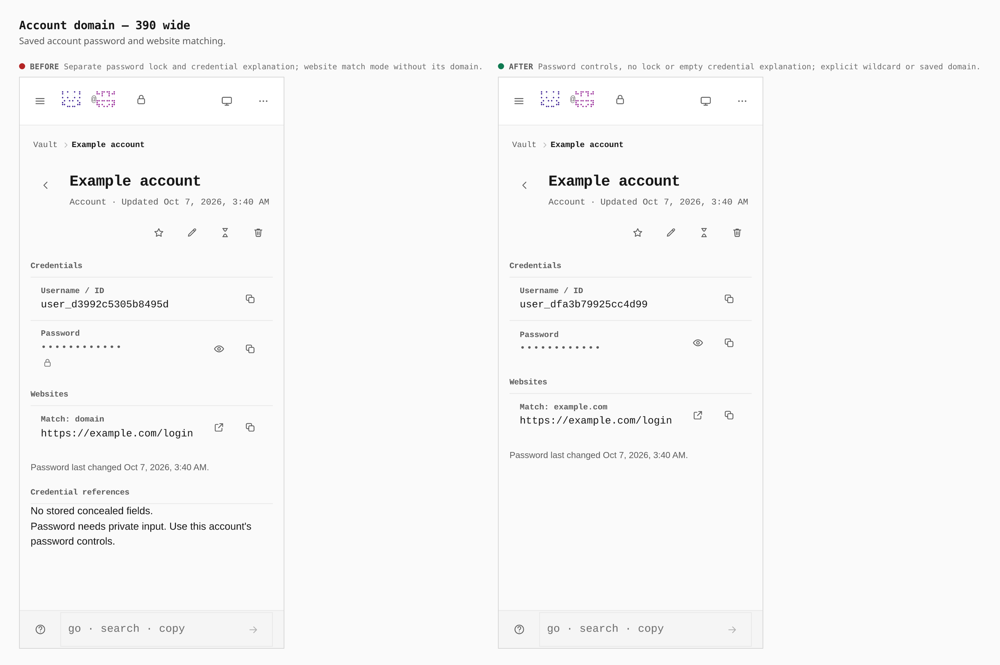
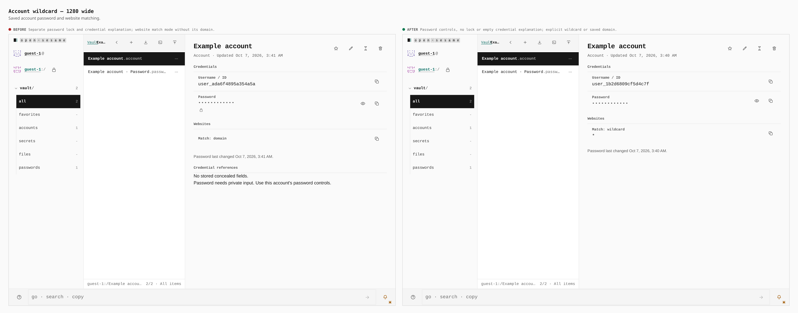

# Account password and website rows

Before and after from two production builds of `5d98d1e906f8547cd369e15d8125bb28a1c79fdf` and this change. Both runs create and save an account through the editor, then edit its website to `https://example.com/login` with domain matching. The account type is enabled through Settings first. Generated usernames and timestamps differ between runs.

| Browser measurement | Before | After |
| --- | --- | --- |
| Password row height, 390px and 1280px widths | 81px | 63px |
| Password lock marker, 390px and 1280px widths | 44 × 44px | Absent |
| Empty credential explanation, 390px width | 94px high | Absent |
| Empty credential explanation, 1280px width | 71px high | Absent |
| New account website | Empty, domain mode | `*`, wildcard mode |
| Saved domain match label | `Match: domain` | `Match: example.com` |

The wildcard is saved as a real website rule. Existing saved website rules are retained. Removing the pepper marker leaves reveal and both password-part copy controls working. Credential reference and comparison controls still appear when usable; the empty-field and private-input explanatory paragraphs are removed.

## Phone, default wildcard

## Phone, saved domain

## Desktop, default wildcard

## Desktop, saved domain

Replay with `apps/pages/scripts/capture-evidence.mjs` and [journey.json](journey.json). Geometry was printed by the capture harness from the browser at each saved-account stop.

## Verification

The 130 related Pages tests and 106 related app-core tests pass, along with the editor suites and website-pattern tests. Both package typechecks, changed-file Biome and Oxlint, design lint, and the structural quality gate pass.

The full keyboard gate reaches the live-session join and times out waiting for `Joined Team`. Running that same live-session contract against the unchanged production build reproduces the timeout. Earlier desktop keyboard flows pass; this does not establish a pass for the entire keyboard suite.

The full mobile gate passes at 320px, 390px, 430px, phone landscape, tablet portrait and tablet landscape, including the saved-account view.
