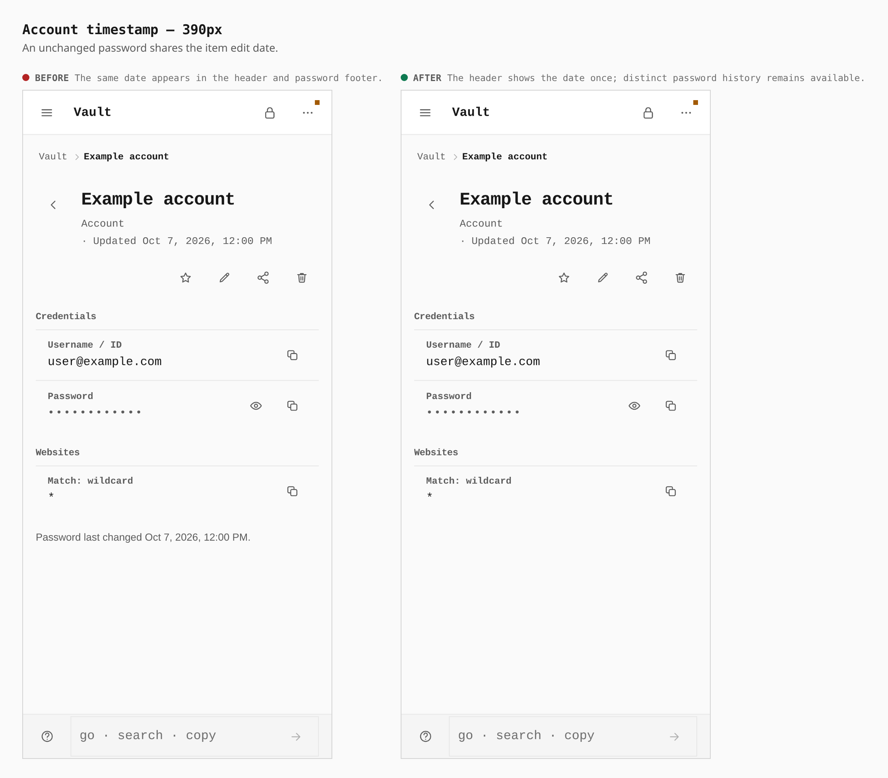
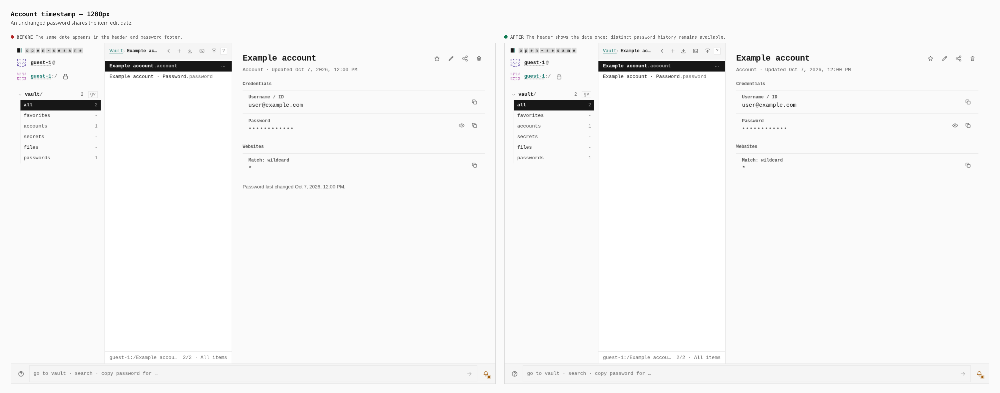

# Item timestamps

Before/after from two production builds: the previous mobile toolbar build
(`/tmp/opensesame-toolbar-final-v3`) and this timestamp change
(`/tmp/opensesame-timestamp-after`). Both follow the same guest account-creation
journey with a fixed clock and the app's normal generated password.
Both builds already create a separate bound Password item, visible in the
desktop listing. This change only removes the repeated date in account details.

The item header retains **Updated** once. **Password last changed** appears
only when its displayed date/time differs, retaining separate password history
when a later edit changes other item details. No stored timestamps are changed.

| Width | Repeated timestamp labels | Bottom date row |
| --- | --- | --- |
| 390px phone | 2 → 1 | 358 × 19px → absent |
| 1280px desktop | 2 → 1 | 640 × 19px → absent |

Measurements and text came from the real browser. The footer date is removed
at both widths, while the header date remains Oct 7, 2026, 12:00 PM.

## Phone

## Desktop

Validation: account/item detail suites pass (42 tests), including identical
instants, equivalent ISO offsets, differences below displayed minute precision,
distinct password history, and no-password accounts. Pages TypeScript,
scoped Biome/Oxlint, and diff whitespace checks pass.
