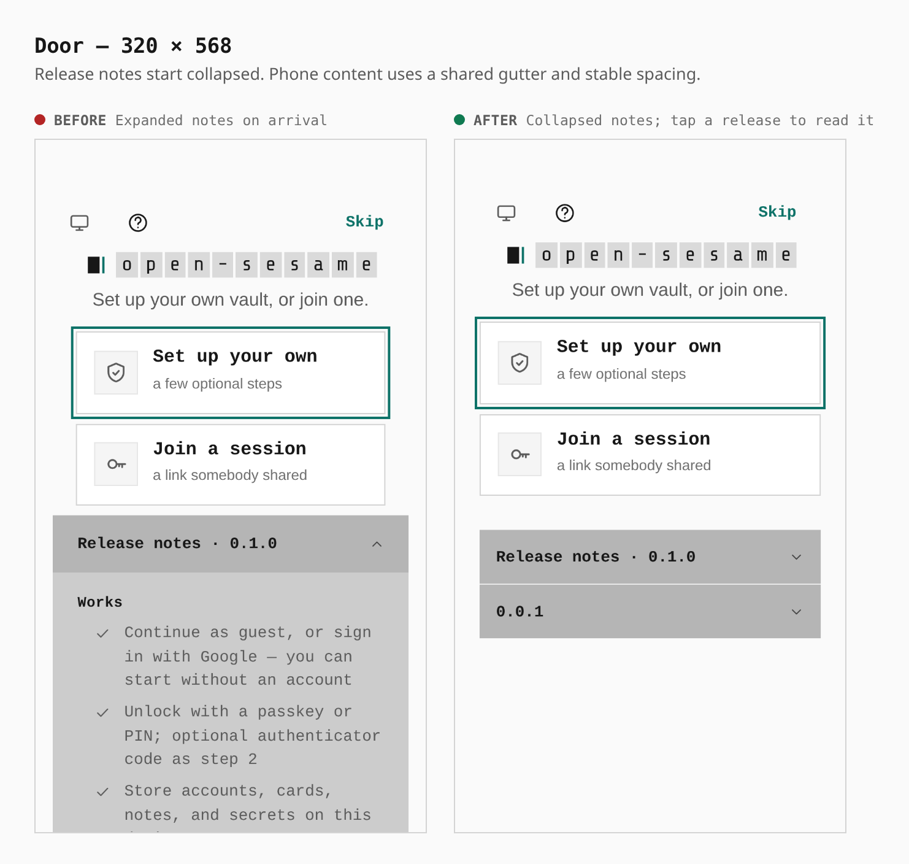
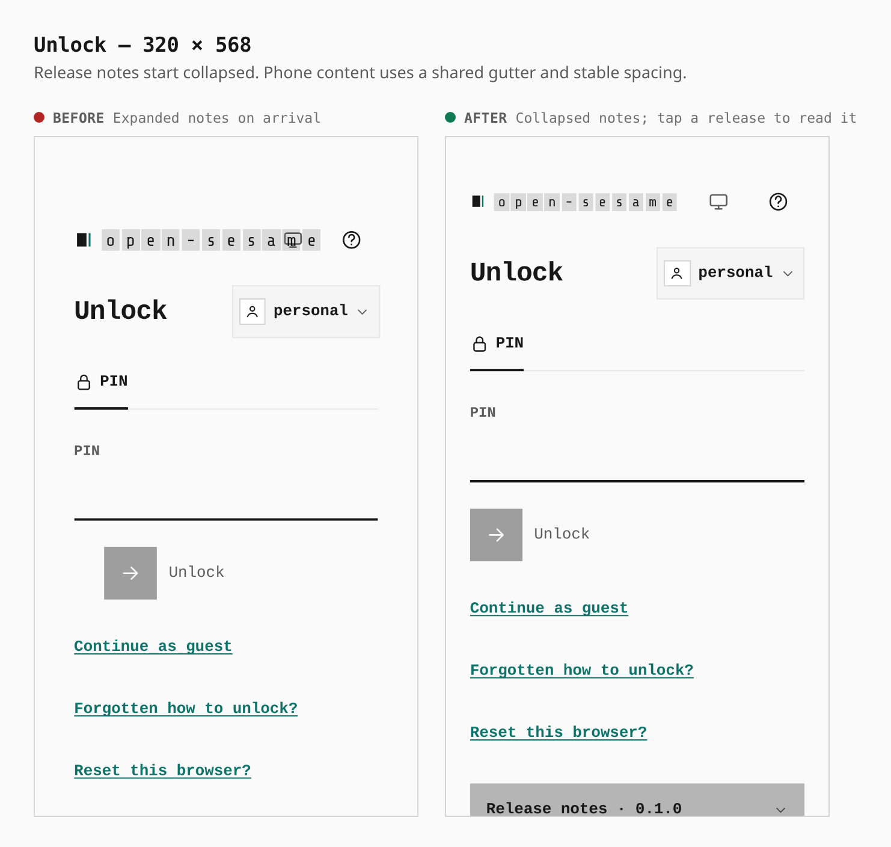
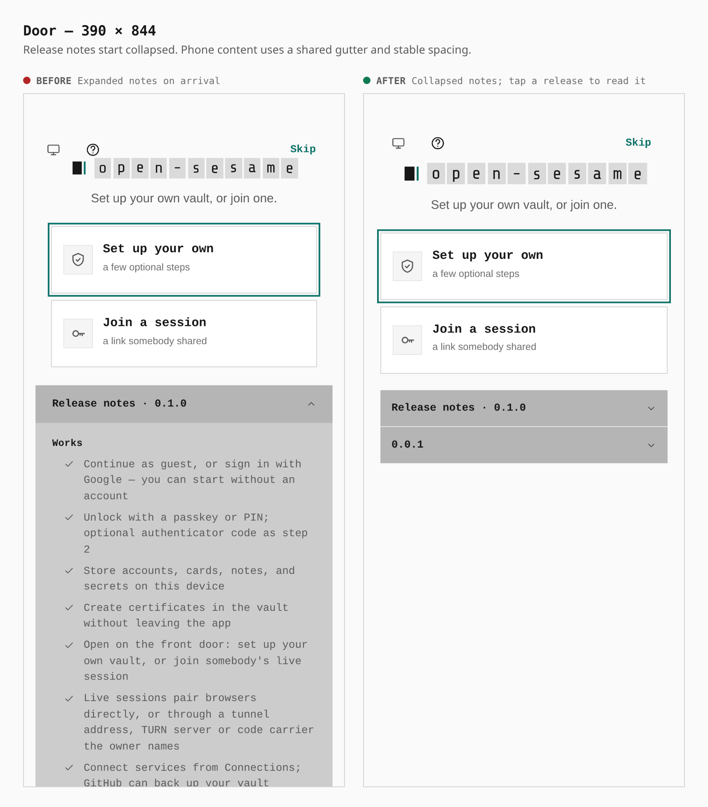
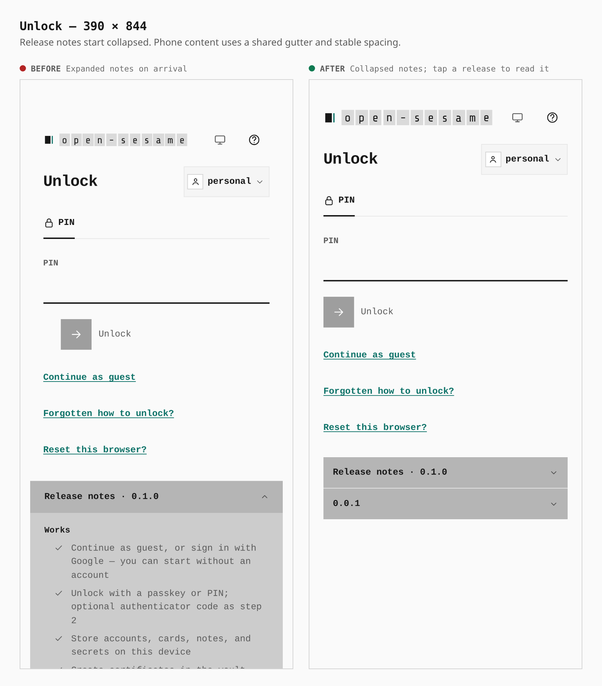
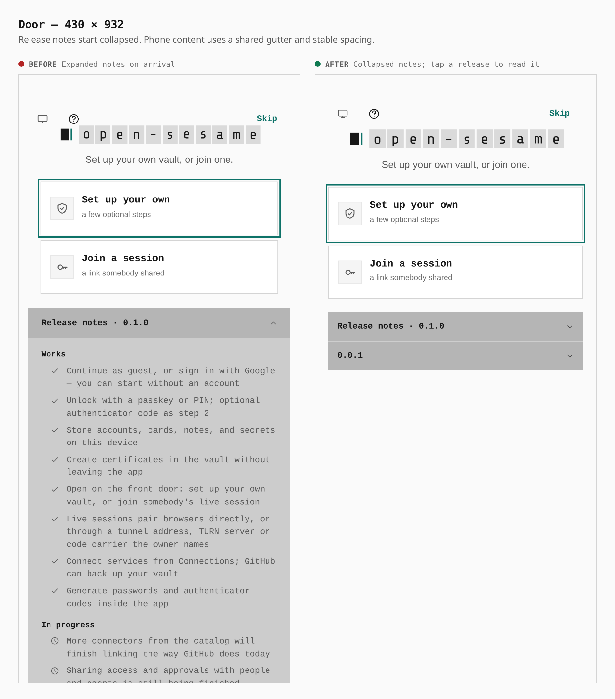
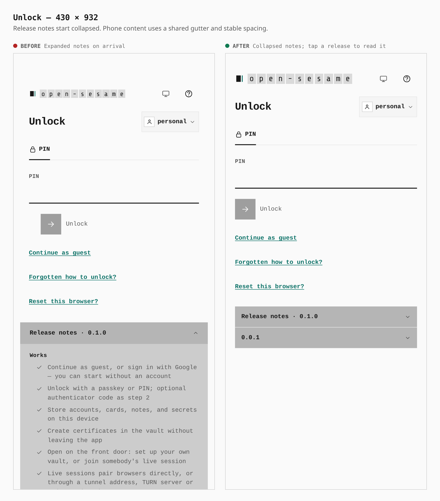
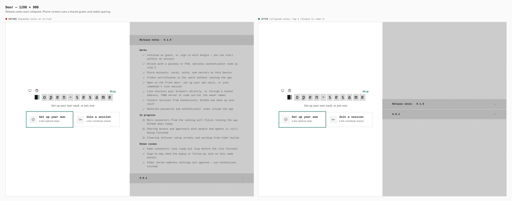
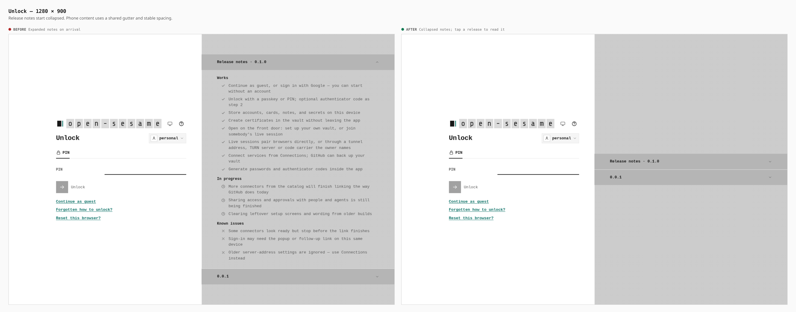

# Mobile lock screen and front door

Before and after from two production builds of `8b6499cb47521c33d3e6844c5da5448a06d15e23`, with this patch applied to the after build. The same journey visits the first-run front door, seals a PIN vault, and reloads to its lock screen at 320, 390, 430, and 1280 pixels. Phone captures use a real coarse-pointer touch context.

Release notes start collapsed. Pressing a release opens it, pressing it again closes it, and opening another closes the previous release. The lock form and release notes share a gutter; the Unlock key aligns with its field. The wordmark leaves room for the theme and help keys. Native controls explicitly reset their corners to zero.

## Browser measurements

| Phone width | Release notes height, before → after | Form and notes left edge, after | Release summary target, after |
| --- | --- | --- | --- |
| 320 | 1180 → 89 px | 20 px | 280 × 44 px |
| 390 | 985 → 89 px | 20 px | 350 × 44 px |
| 430 | 868 → 89 px | 20 px | 390 × 44 px |

The browser measured zero-radius corners on every visible button, no sideways document overflow, and a gap between the lock-screen wordmark and its tools at all four widths. Opening notes preserves the card's position, including on a short desktop viewport. The desktop retains its two-column layout, with expanded notes scrolling inside their own pane. Native Tab and Shift+Tab can reach both summaries. Additional review covers 901/1024-pixel fine-pointer tablets, 1100/1280 × 568 desktops, and a 1366 × 568 touch desktop.

## Front door — 320 pixels

## Lock screen — 320 pixels

## Front door — 390 pixels

## Lock screen — 390 pixels

## Front door — 430 pixels

## Lock screen — 430 pixels

## Front door — desktop

## Lock screen — desktop

## Validation

The production build, workspace typecheck, lint, quality, tests, static first-run/guest journey, and authentication browser journey pass. The full mobile contract passes at 320, 390, 430, landscape (844), tablet portrait (1024), and tablet landscape (1366) pixels. Browser checks of both gate screens at 320, 390, 430, and 1280 pixels pass for collapsed notes, open/close behavior, square buttons, gutters, and header spacing.

The complete keyboard journey passes at desktop and phone widths with cached Playwright Chrome. The system Chromium has a managed `WebRtcIPHandling=disable_non_proxied_udp` policy, which prevents the direct WebRTC session from gathering host candidates; the unmanaged browser preserves the real session assertions.
