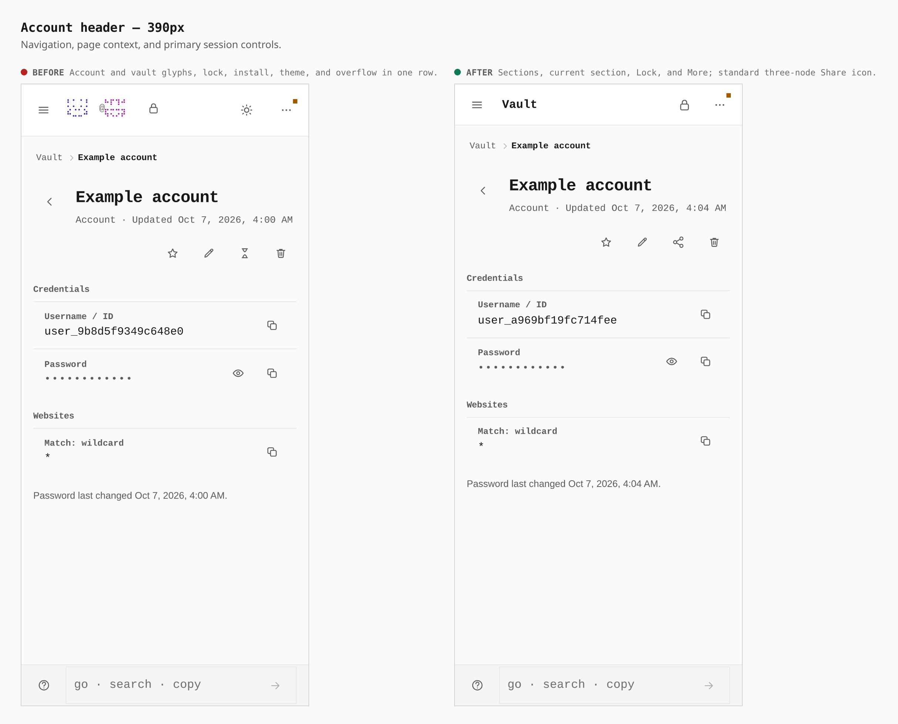
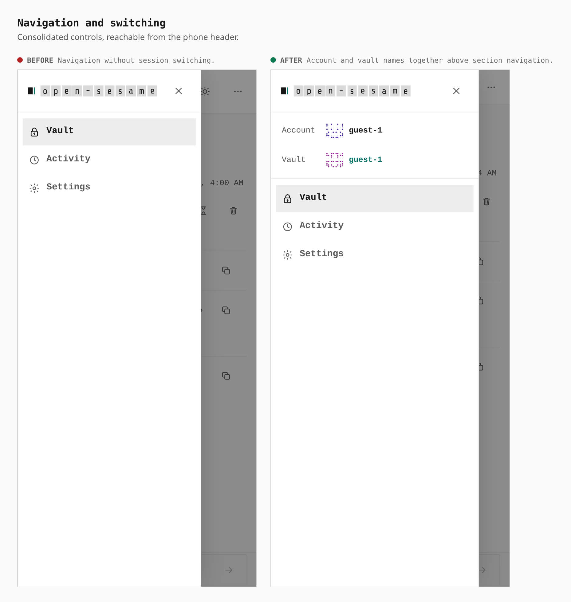
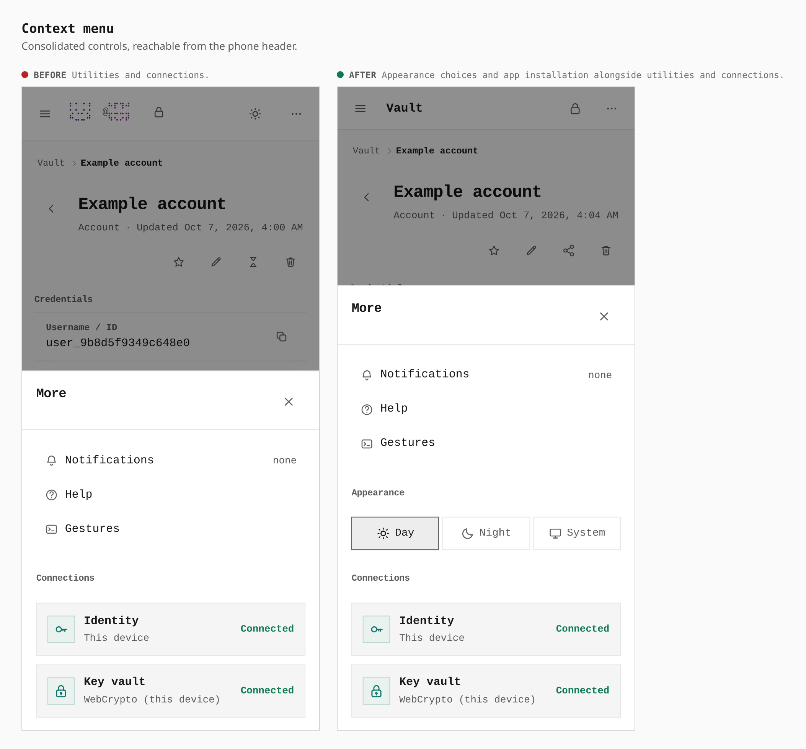
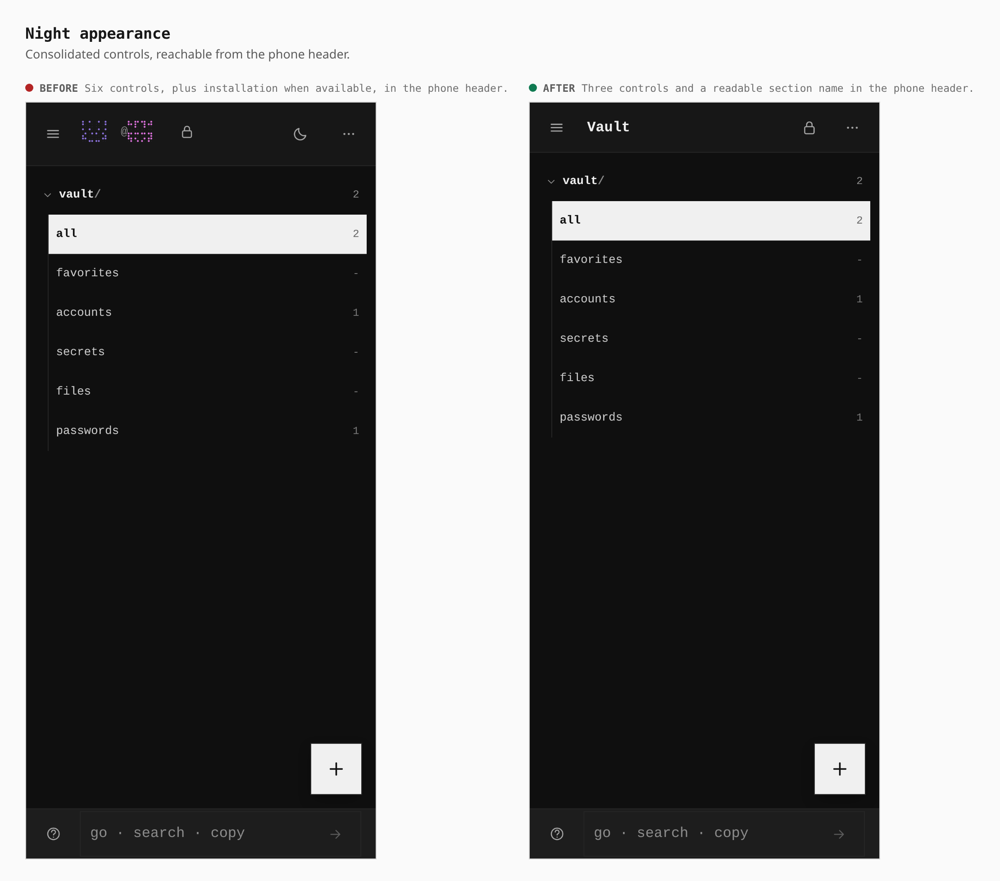
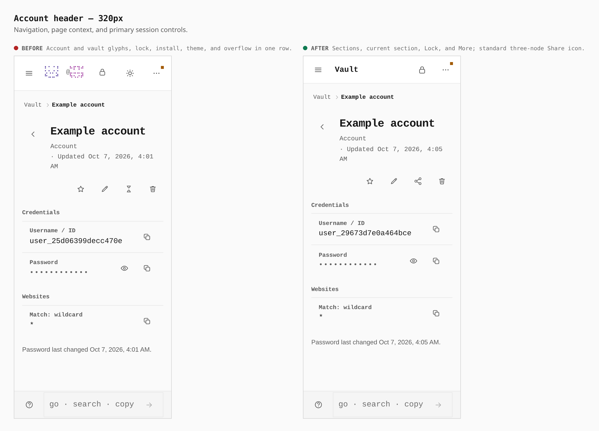
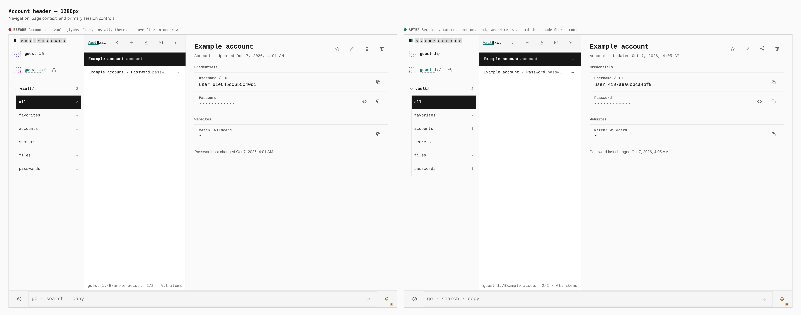

# Mobile toolbar and share icon

Before/after from two real production builds using the same guest account journey.
The before build includes the preceding account password and website fixes;
the after build adds the toolbar redesign and sharing glyph. Generated account
IDs and timestamps vary between runs.

The phone header now contains Sections, the current section name, Lock, and
More. Account and vault names sit together in the Sections drawer. More holds
Day, Night, System, installation when the browser offers it, and the existing
notifications, help, gestures, and connections. Sharing uses three connected
nodes; Safari installation instructions retain Safari's arrow-in-a-box glyph.

| Browser measurement | Before | After |
| --- | --- | --- |
| Header at 320px and 390px | 71.39px | 56px |
| Visible header buttons in the capture | 6 | 3 |
| Header button touch target | 44 × 44px | 44 × 44px |
| Account/vault controls in the 390px drawer | Absent | 241 × 44px each |
| Day/Night/System in More at 390px | Absent | 115 × 44px each |
| Share button, phone and desktop | 44 × 44px, hourglass | 44 × 44px, three nodes |
| Desktop phone header | Hidden | Hidden |

Installation adds another button to the old header when a browser prompt is
available; the captured browser does not offer that prompt. The new install
control appears as a named row in More under the same availability condition.

## Phone account and sharing

## Sections and session switching

## Context menu and appearance

## Night appearance

## Narrow phone

## Desktop

## Validation

- Shell, menu, installation, switching, and sharing component tests passed.
- Pages TypeScript, scoped Biome and Oxlint, design lint, quality regression
  checks, and production build passed. Pages bundle remains within budget.
- Complete touch journeys passed at 320px, 390px, 430px, 844px landscape,
  1024px tablet portrait, and 1366px tablet landscape on the final build.
- Real keyboard input reached both switchers and Day/Night/System at 320px,
  390px, and 844px landscape. Switcher popovers fit inside the viewport;
  Escape closes one layer and restores its trigger. Vault management closes
  the drawer and opens Settings.
- The complete keyboard suite passes its desktop navigation, local identity,
  WebAuthn, and item flows before timing out waiting for `Joined Team` in the
  live-session contract. The unchanged base build reproduced that same timeout
  during the preceding account fix. The isolated mobile toolbar checks pass.

Capture journey: [toolbar-journey.json](toolbar-journey.json).

Self-review also verified immediate Escape on each switcher opener and popup,
plus all four session guides with Sections closed, already open, and on desktop.
These fixes retain the captured geometry. Fresh browser checks pass at 320px,
390px and 844px landscape; both package typechecks, scoped lint and quality
checks pass after applying the changes to main `8b6499c`.

All capture accounts are synthetic entries created in fresh guest browser
contexts by the linked recipe. Passwords remain concealed in every screenshot.
