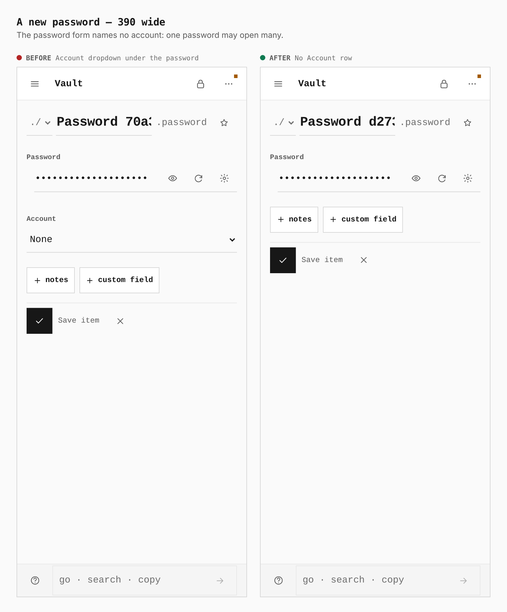
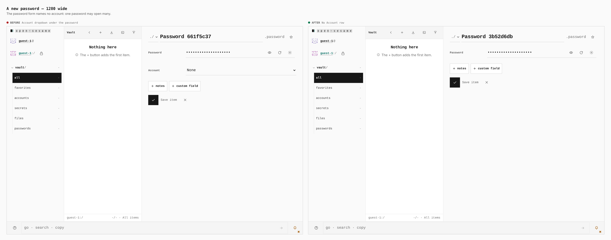
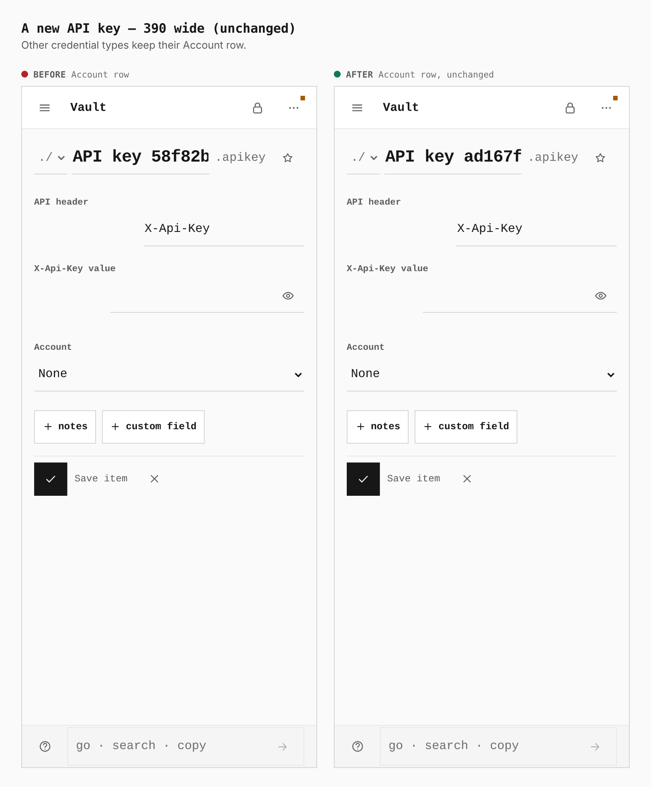
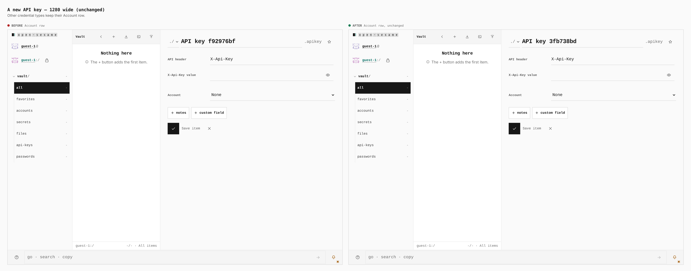

# A password's form names no account

Before and after from two production builds: `348811b4` (the parent of this change) and this change. Both runs open a guest vault, switch Accounts on (which switches Password on with it), and open `/vault/new/password`, then the same for a new API key. Generated names differ between runs. The captures were built with `vite build` and the workers step; the build's `tsc --noEmit` step was skipped because this container's install has duplicate `@types/react` copies that fail it identically without the change.

| Browser measurement | Before | After |
| --- | --- | --- |
| New password, `#credential-account`, 390px | 358 × 44px select | Absent |
| New password, `#credential-account`, 1280px | 478 × 44px select | Absent |
| New password, password method block, 390px / 1280px | 358 × 89px / 640 × 61px | 358 × 89px / 640 × 61px |
| New API key, `#credential-account`, 390px / 1280px | 358 × 44px / 478 × 44px | 358 × 44px / 478 × 44px |

Only the password form changes; other credential types keep their Account row. A password that is already bound to an account keeps that binding when saved, because the form no longer touches it.

## Phone, new password

## Desktop, new password

## Phone, new API key (unchanged)

## Desktop, new API key (unchanged)

Replay with `apps/pages/scripts/capture-evidence.mjs` and [journey.json](journey.json).
