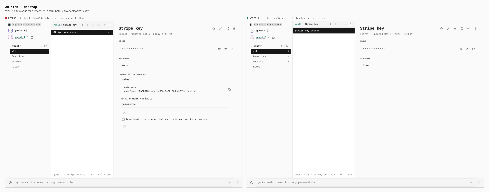
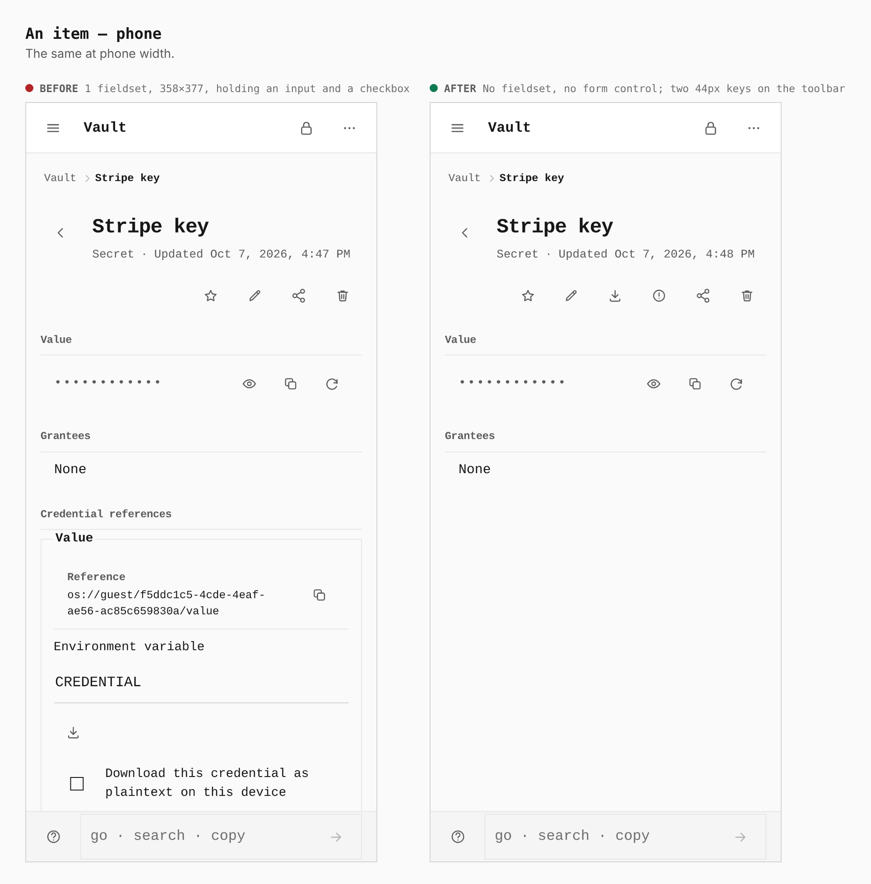
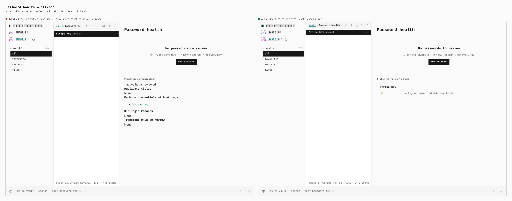
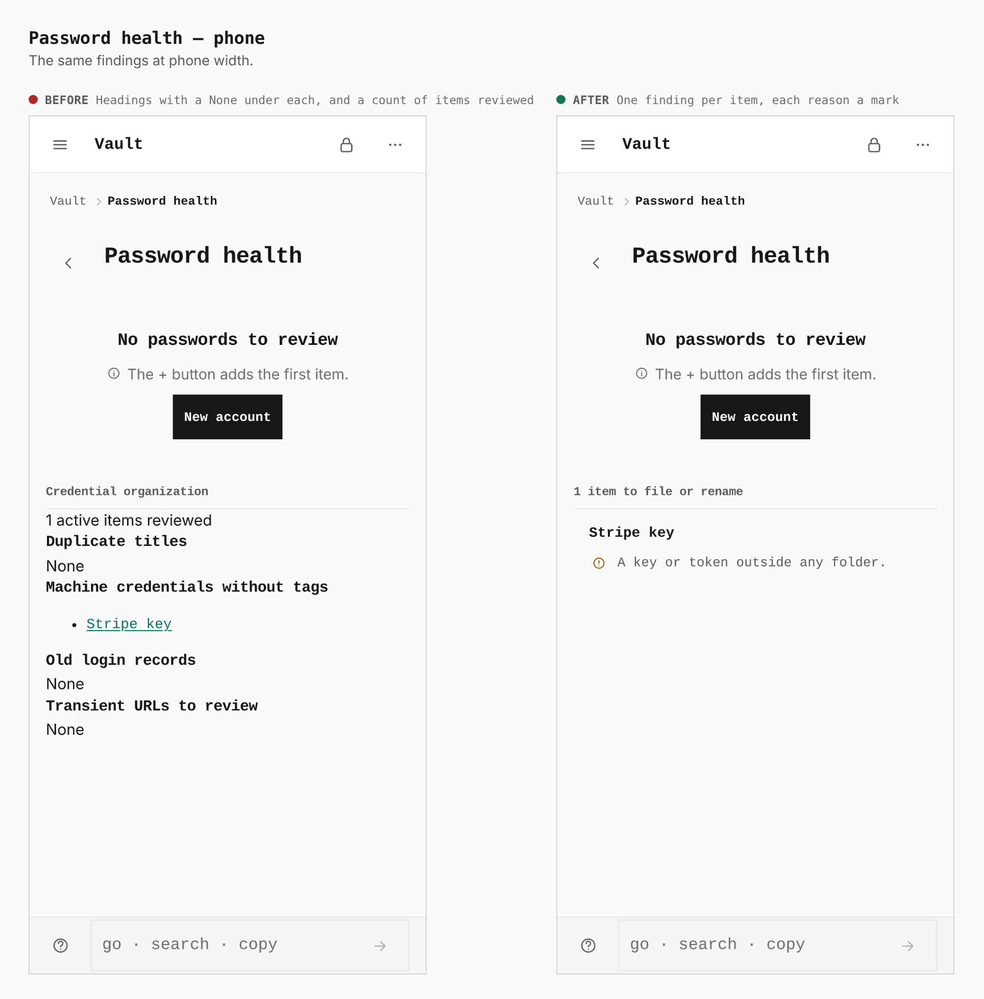
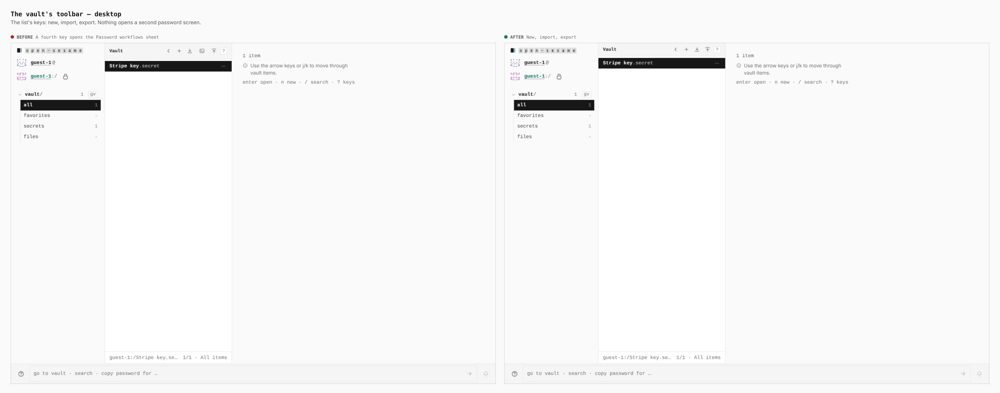

# Password workflows, in place

Two real production builds, the branch's parent (with the standalone "Password
workflows" dialog and its contextual fieldsets) and this branch, at 1280 × 900
and 390 × 844. The same guest journey seeds one secret ("Stripe key") and opens
its page, Password health and the vault list. Measurements are read from the
browser by the journey's `measure` and `report` steps.

| Surface | Before | After |
| --- | --- | --- |
| Item page, desktop | 1 fieldset, 640 × 293, holding an input and a checkbox | No fieldset, no form control; two keys on the toolbar |
| Item page, phone | 1 fieldset, 358 × 377, holding an input (329 × 44) and a checkbox (44 × 44) | No fieldset, no form control; two 44px keys on the toolbar |
| Password health | Headings with a "None" under each, and a count of items reviewed | One finding per item, each reason a mark, linked to the item |
| Vault list toolbar | New, import, export and a fourth key that opens the dialog | New, import, export |

The journey does not open an account's update editor (its compare key and mark
exist only after the branch); `verify:password-agent` walks that at both widths
and writes its screenshots.

## An item

## Password health

## The vault list

No screenshot contains a secret value.
