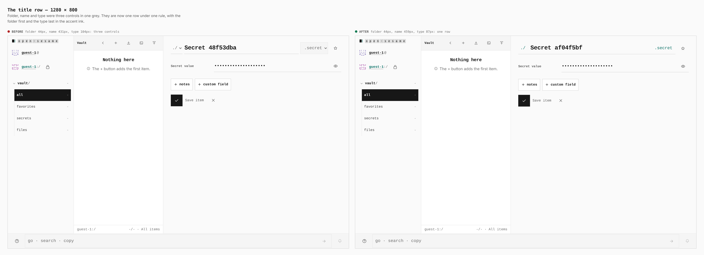
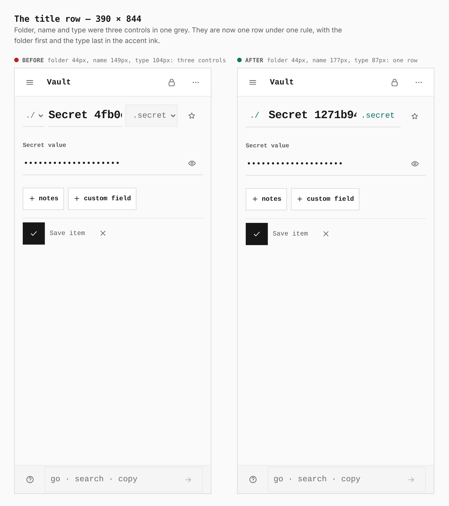
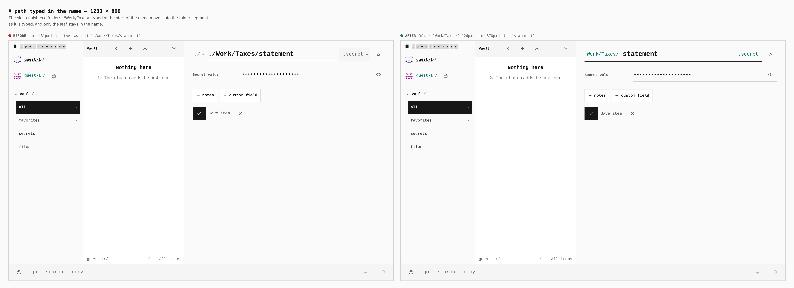
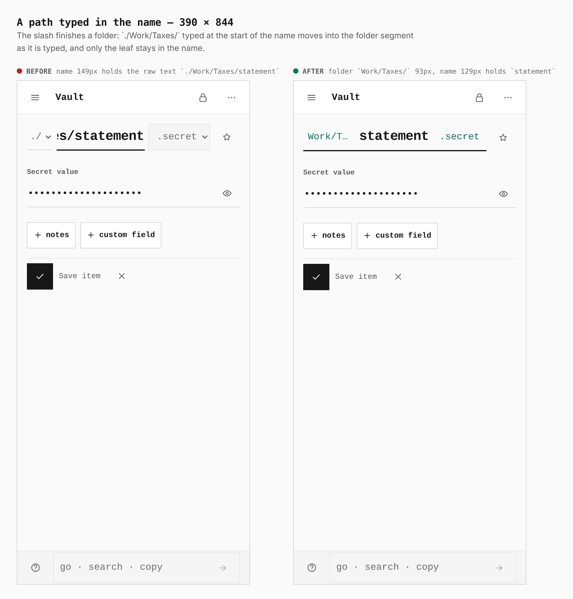
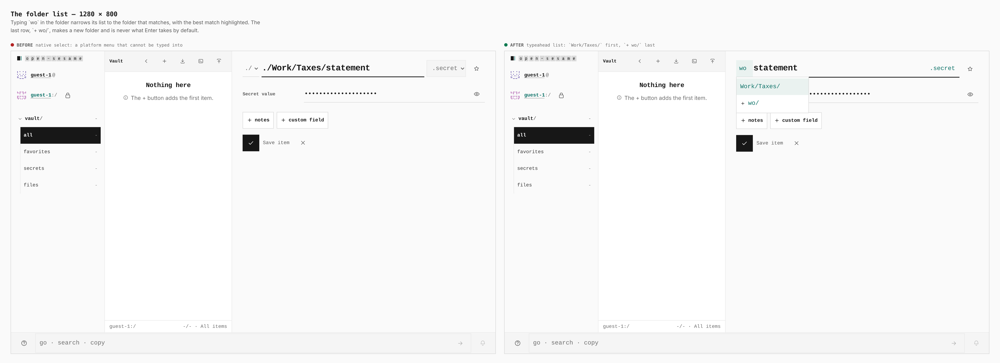
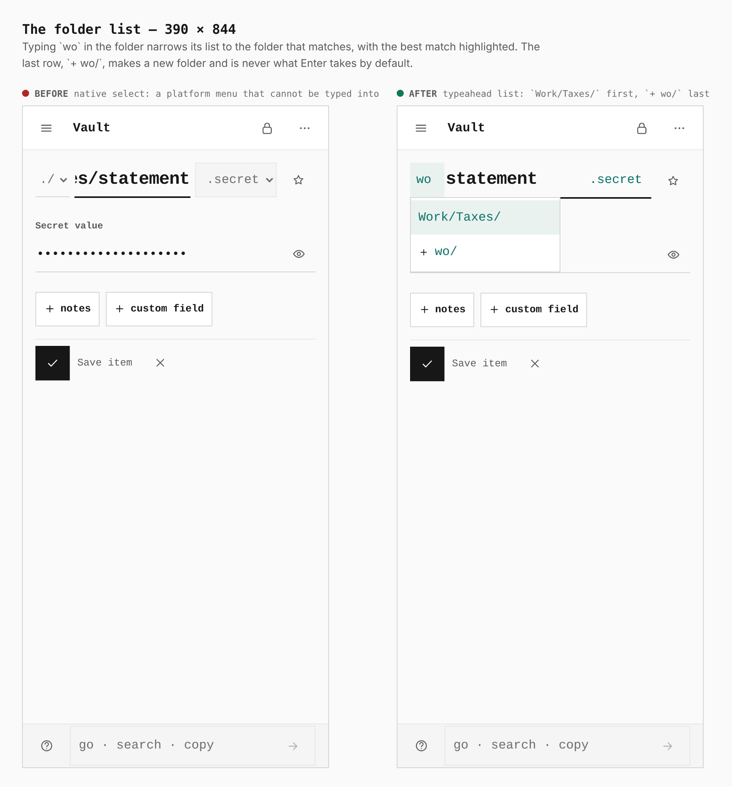
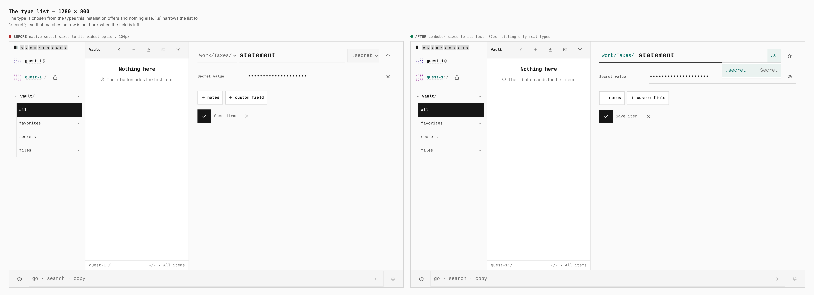
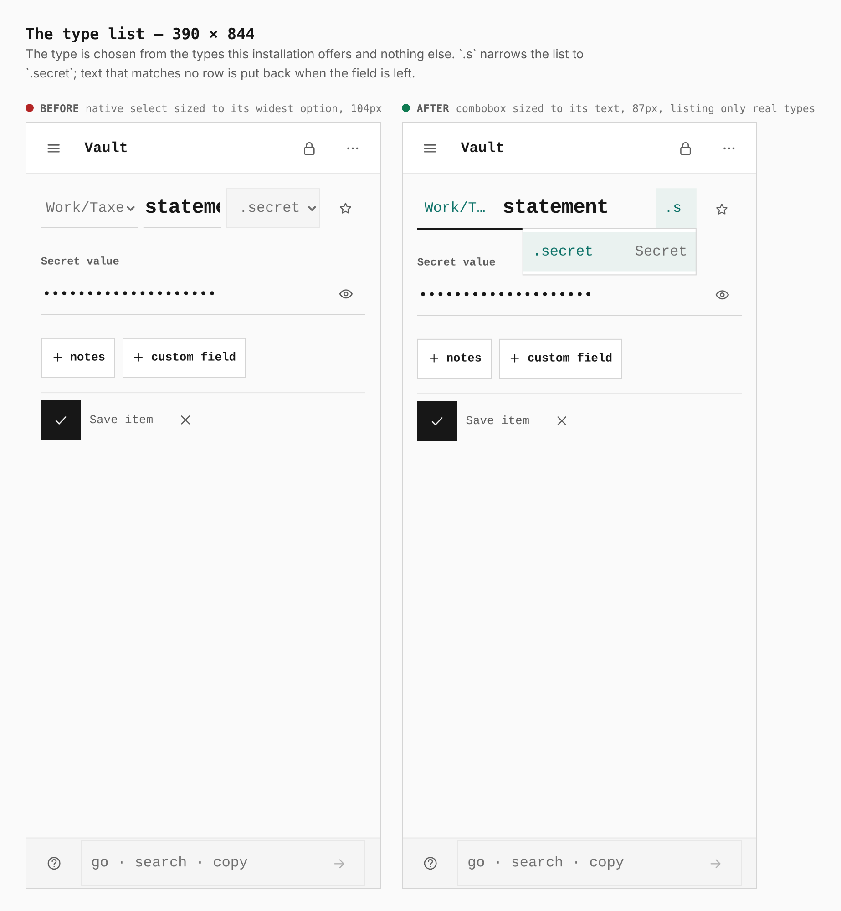

# The editor's title row is one path control

Before/after from two real builds: `main` and this branch, the same journey
(`journey.json`) at 1280 × 800 and 390 × 844, measured in the browser. The
before is the base build in its own worktree, never memory. The folder and type
lists are native `<select>` menus in the base, which a headless browser cannot
draw open, so their "before" is the closed row.

Decision: [ADR 0181](../../adr/0181-the-title-row-is-one-path-control.md).

## The title row

| 1280 × 800 | 390 × 844 |
|---|---|
|  |  |

Desktop: folder 44px, name 431px, type 104px as three controls → folder 44px,
name 459px, type 87px as one row. Phone: 44 / 149 / 104px → 44 / 177 / 87px.

## A path typed in the name

| 1280 × 800 | 390 × 844 |
|---|---|
|  |  |

`./Work/Taxes/statement` stayed raw in the name field until it lost focus. Now
the slash finishes the folder as it is typed: desktop folder `Work/Taxes/` 126px
and name 378px holding `statement`; phone folder 93px, name 129px.

On a phone a long folder is cut to a third of the row (`Work/T…`, the full path
is the field's title) so the name keeps the rest; at 40% the name was left 98px.

## The folder list

| 1280 × 800 | 390 × 844 |
|---|---|
|  |  |

`wo` narrows the list to `Work/Taxes/`, highlighted; the last row, `+ wo/`, makes
a new folder and is never what Enter takes by default.

## The type list

| 1280 × 800 | 390 × 844 |
|---|---|
|  |  |

`.s` narrows the list to `.secret`. Only listed types are ever held.

## Also checked in a real browser

`verify:static`, `verify:keyboard` and the full `verify:mobile` (320, 390, 430,
landscape and tablet sizes) pass on the control. `verify:mobile` caught the
folder key at 27px wide when it read `./`; it is 44px.
