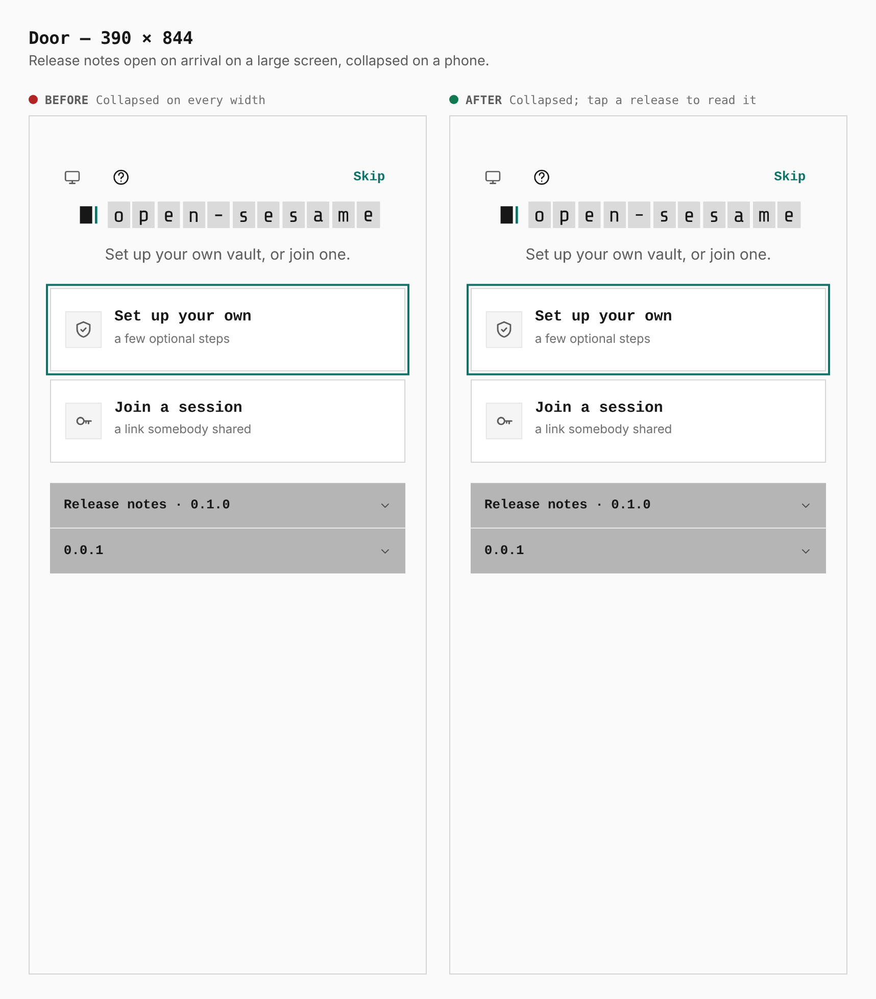
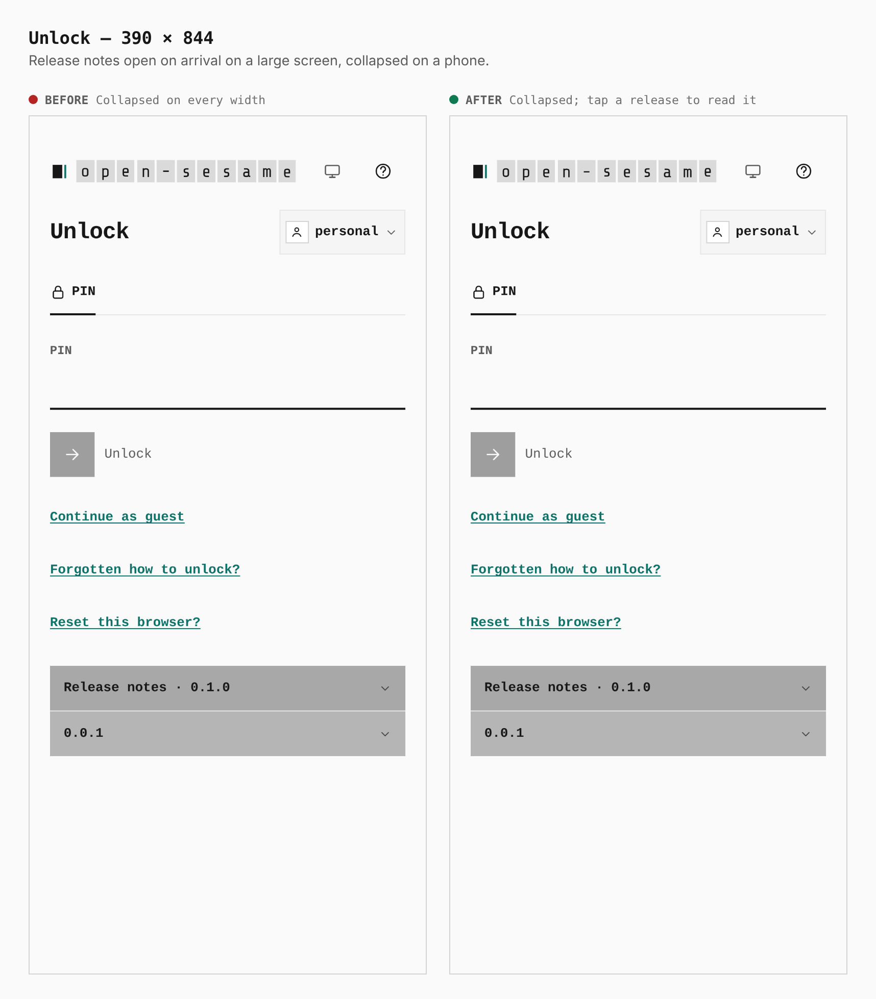
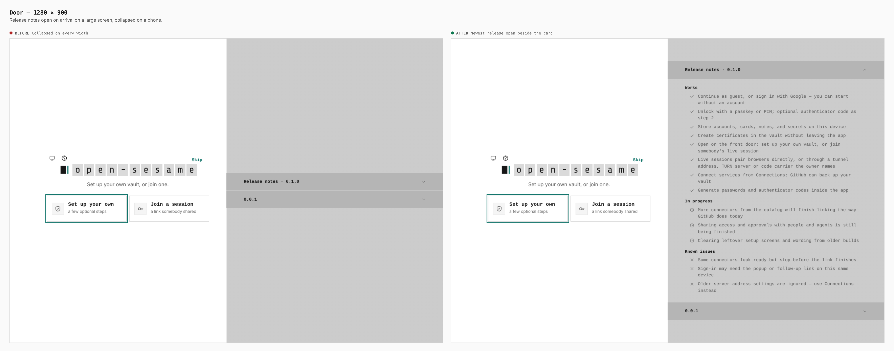
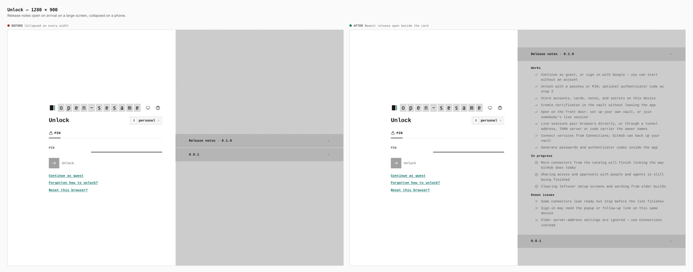

# Release notes default state

Before and after from two production builds (the base is `8f70cf43`, the after build adds this patch). The same journey visits the first-run front door, seals a PIN vault, and reloads to its lock screen at 390 pixels (touch) and 1280 pixels.

The release notes are collapsed only when the gate is stacked under the card (below 1100 px, the width at which `unlock.css` stacks it). On the two-column layout at 1100 px and wider, the newest release is open on arrival. Pressing a row still toggles it and collapses the others.

## Browser measurements

| Width | Release notes, before | Release notes, after |
| --- | --- | --- |
| 390 (stacked) | 350 × 89 px, both rows collapsed | 350 × 89 px, both rows collapsed (unchanged) |
| 1280 (two columns) | 640 × 900 pane, both rows collapsed | 640 × 900 pane, `Release notes · 0.1.0` open with Works, In progress and Known issues; `0.0.1` collapsed |

## Front door — 390 pixels

## Lock screen — 390 pixels

## Front door — 1280 pixels

## Lock screen — 1280 pixels

