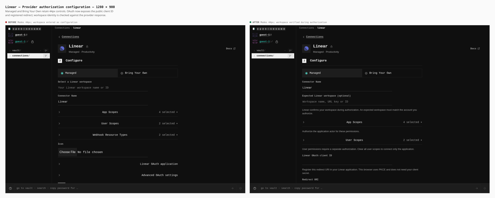
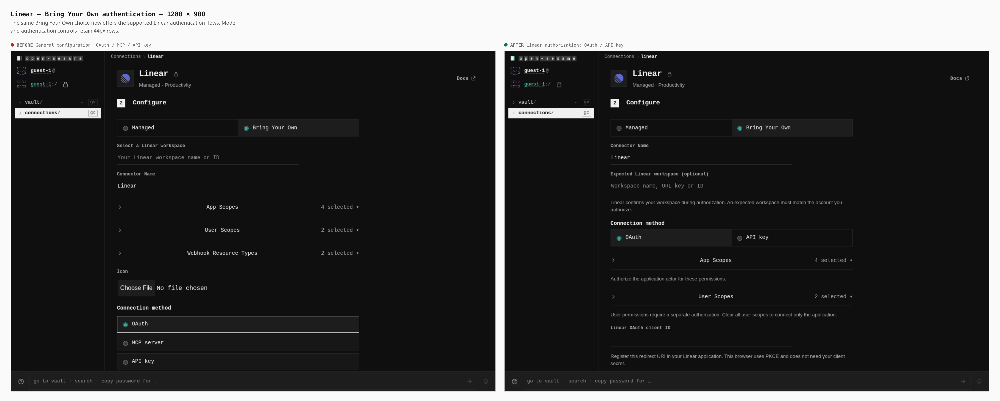
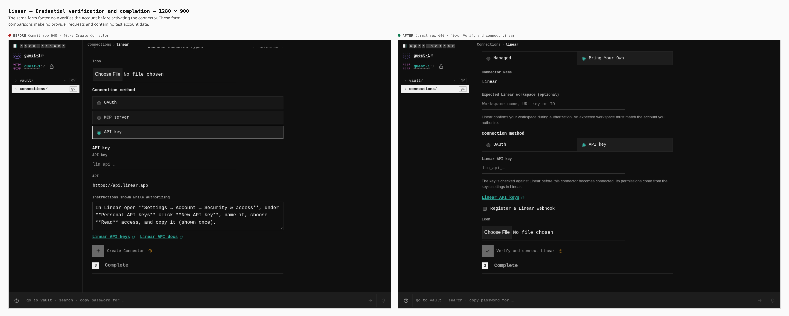
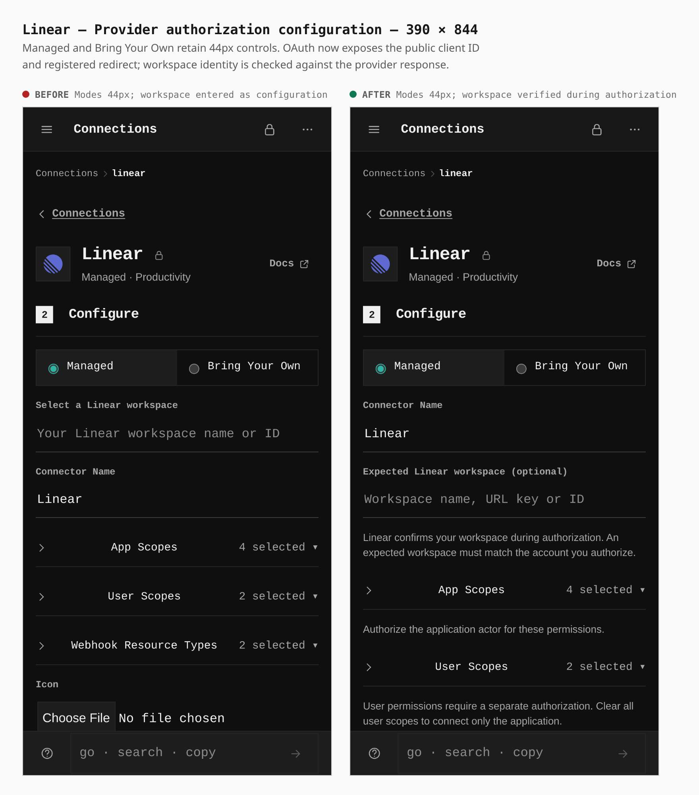
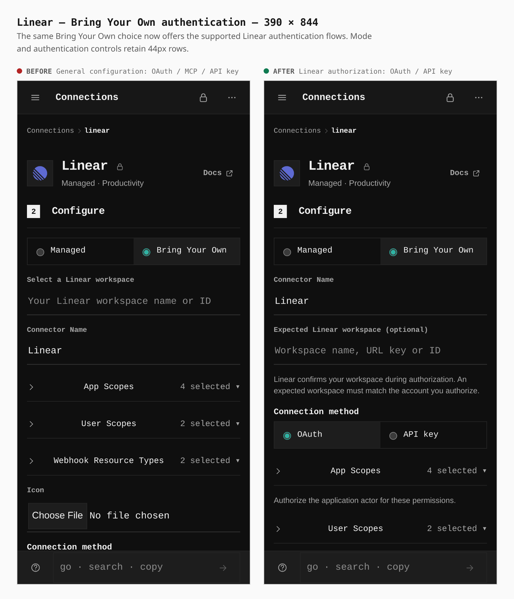
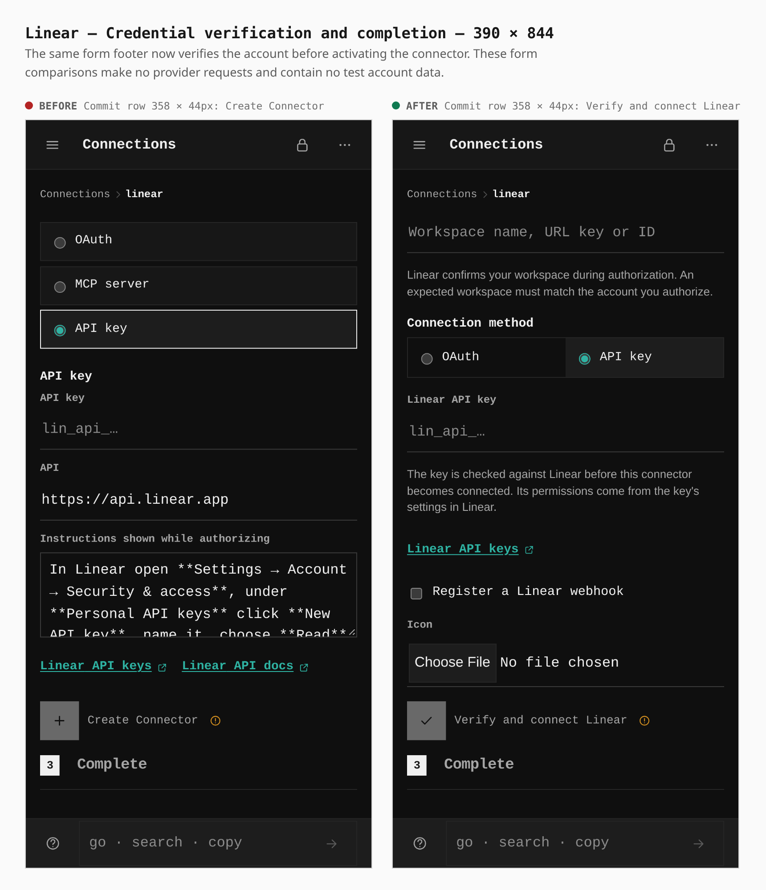
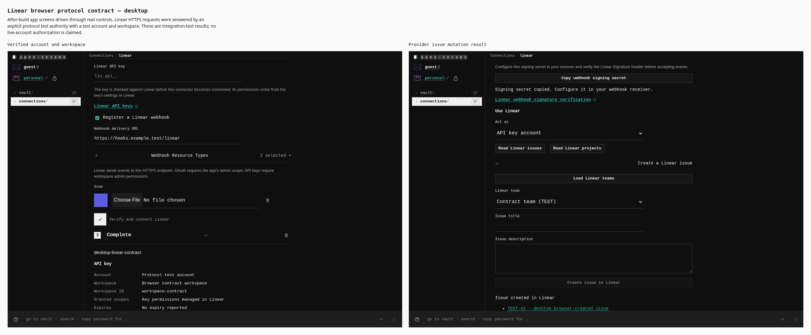
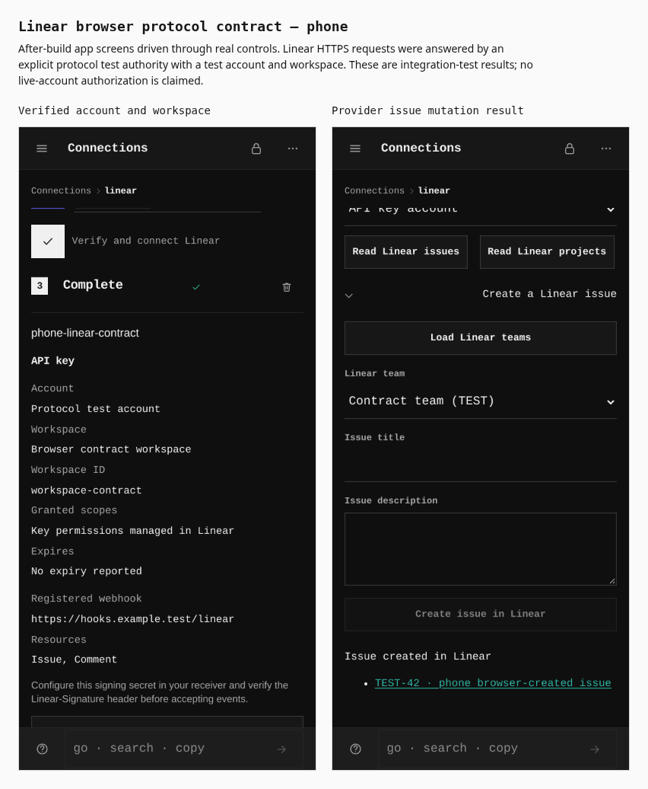
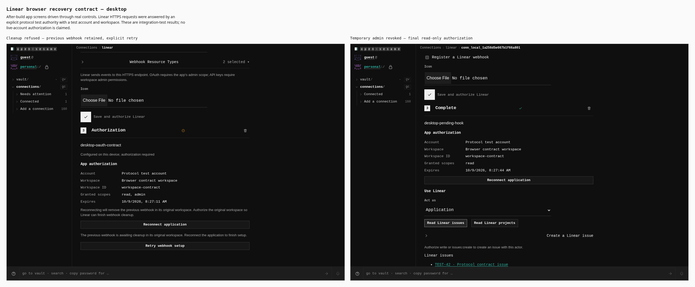
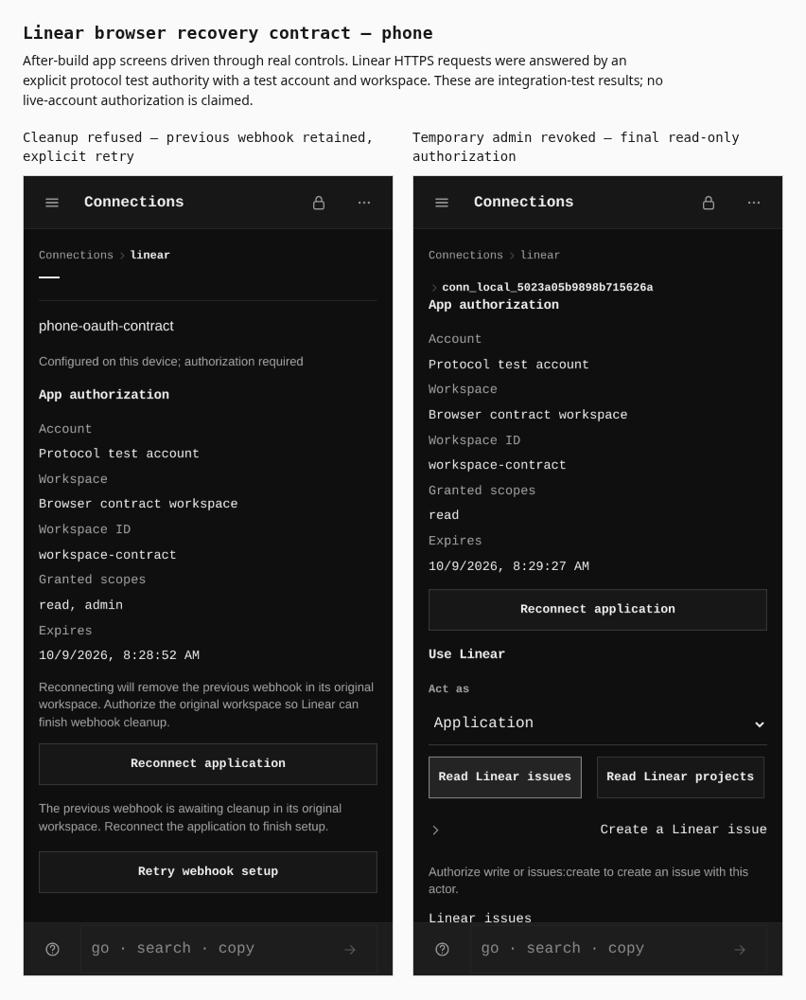

# Functional Linear connector

Before/after from two real production builds: base `9c820c84abb1dc457ead0eb1aff27f8576b98fd0` and this change. Both use `/OpenSesame/`, the same guest navigation, Settings → Night theme, and desktop mouse or phone touch contexts. The journey records the steps and browser measurements. No DOM state or screen elements are injected.

The comparisons below exercise the configuration controls without a provider account. The separate browser protocol contract routes HTTPS requests at Linear's official API and authorization URLs to an explicitly named test authority. It verifies request/response handling, encrypted reload, app and user consent, and operations; it does not claim a live Linear account was authorized.

## Desktop configuration — 1280 × 900

Configuration mode and scope controls remain at least 44px tall. Workspace identity is now confirmed by the provider, and the OAuth form exposes a public client ID and registered redirect URI.

## Desktop Bring Your Own — 1280 × 900

The general OAuth/MCP/API key configuration becomes the supported Linear OAuth/API key authorization form. Configuration mode controls remain 44px tall.

## Desktop verification — 1280 × 900

The commit row measures **640 × 40px** on both builds. Its action changes from **Create Connector** to **Verify and connect Linear**: activation requires a verified provider response.

## Phone configuration — 390 × 844

Configuration mode controls measure **44px** on both builds. The optional expected workspace must match Linear's verified workspace if entered.

## Phone Bring Your Own — 390 × 844

Linear's OAuth/API key methods use native radio controls, with **44px** configuration rows.

## Phone verification — 390 × 844

The commit row measures **358 × 44px** on both builds. The same footer now verifies the key with Linear before marking the connector connected.

## Verified identity and issue creation — protocol test authority

These are additional after-build screens from the production browser contract. They use a clearly named **protocol test account/workspace**, with official Linear HTTPS requests answered by a test authority. Both widths verify one workspace identity and render one issue returned by the provider mutation. The screenshots contain no fabricated app state or DOM replacements.

The browser contract also proves rejected keys, workspace mismatch and declined OAuth cannot activate a new connector; a consent retry uses a fresh state; app/user requests prove their S256 verifier and use distinct grants; encrypted reload can authenticate reads; webhook creation sends a stable ID and signing secret; an explicit clipboard action retrieves that exact secret without rendering it; removal deletes the provider webhook.

### Desktop — 1280 × 900

### Phone — 390 × 844

## Expired authorization and webhook recovery — protocol test authority

The production browser contract expires an app grant, refuses its refresh, and checks that the connected badge changes immediately. Reconsent retains the original registered webhook until cleanup succeeds. A replacement grant from a different workspace is rejected and revoked even when the optional workspace filter is blank. When deletion returns HTTP 503, the original cleanup obligation survives a locked-vault reload and the explicit **Retry webhook setup** action completes it exactly once.

The second recovery case accepts webhook creation remotely but loses the success response and refuses reconciliation. Its sealed pending intent survives reload. After that grant is revoked, disabling webhooks and narrowing permissions requires temporary **read, admin** consent for cleanup, revokes that temporary access and refresh token, then requests separate final **read** consent. The completed connector uses that narrower grant for an authenticated read and has no outstanding webhook cleanup.

The retry button measures **640 × 30px** on desktop and **358 × 44px** on phone. Both recovered screens fit their viewport without horizontal overflow. These after-build captures use the same clearly labeled HTTP protocol test authority as the identity and issue proof sheets; they make no live-account claim.

### Desktop — 1280 × 900

### Phone — 390 × 844

Reproduce the comparisons with `capture-evidence.mjs` and `journey.json` against the two builds. Reproduce the extra protocol and recovery proof sheets by running `verify:self-hosted-connectors`, then `compose-protocol-proof.mjs` with `PAGES_VERIFY_OUT` pointing at that run's capture directory. Raw app captures remain outside the repository; the committed images are labeled comparison/proof sheets.
