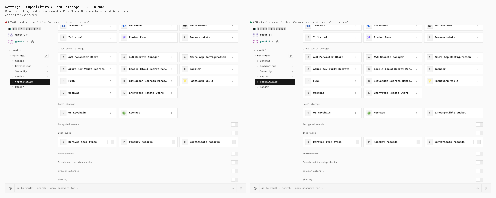
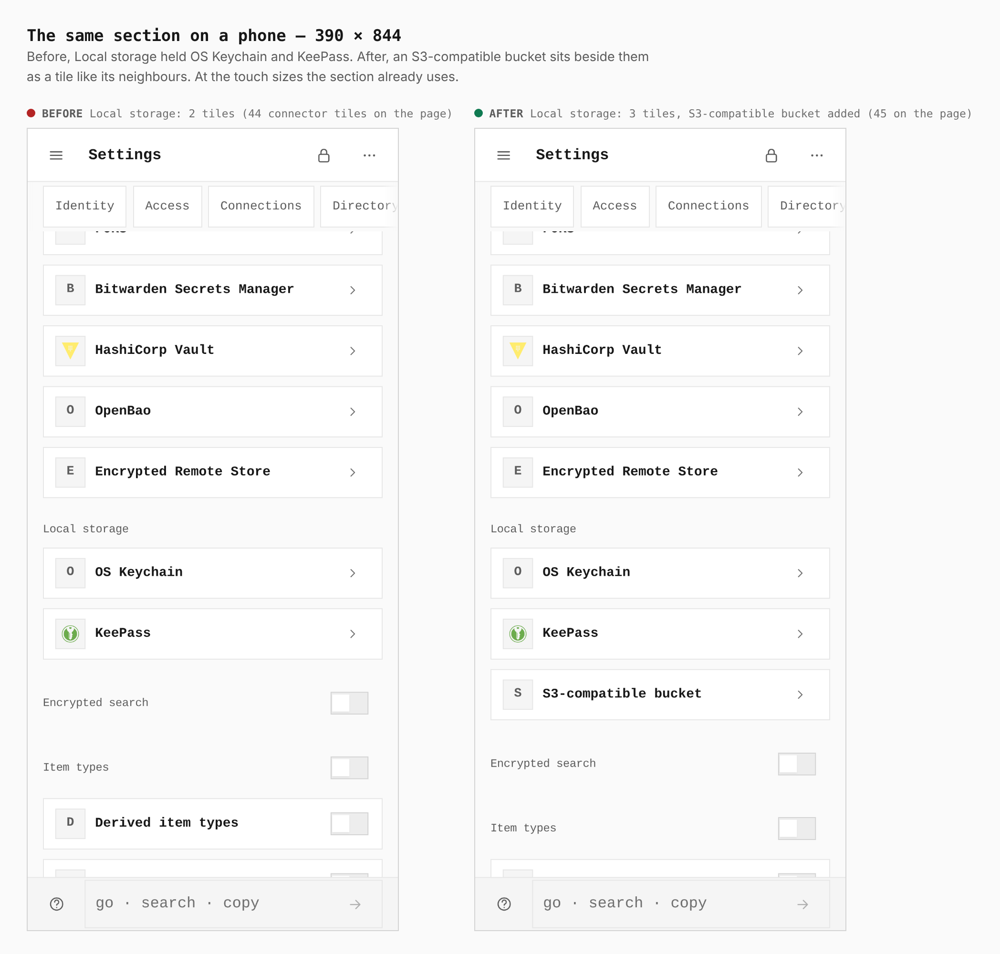
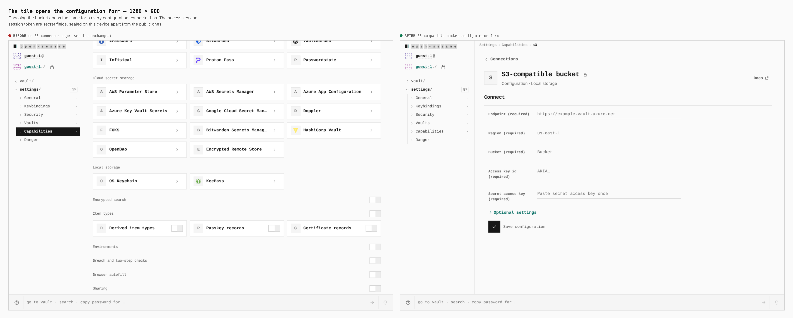
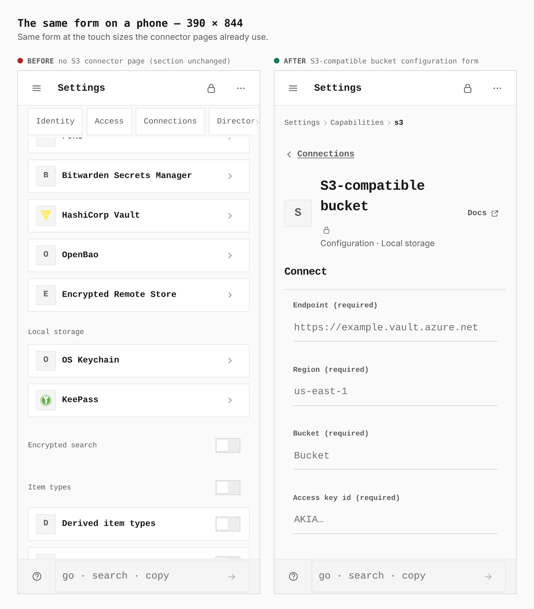

# S3-compatible bucket connector — Settings › Capabilities › Local storage

Before/after from two real builds, `main` (`4e9f458`) and this branch, walked the
same way (guest, Settings › Capabilities, Connections switched on), at desktop
and phone width. The journey is `journey.json`.

Measured in the browser: connector tiles on the page `44 → 45` at both widths;
Local storage `2 → 3` tiles.

## Local storage, 1280 × 900

Before: OS Keychain, KeePass. After: the S3-compatible bucket beside them.

## Local storage, 390 × 844

Same section at the touch sizes it already uses. Tile count `2 → 3`.

## The tile opens the configuration form, 1280 × 900

The form every configuration connector has: endpoint, region, bucket, access key
id, secret access key (a secret field, sealed on this device apart from the
public ones), with prefix and session token under Optional settings. The base
has no such page, so its sheet shows the section unchanged.

## The same form, 390 × 844

## Known wart

The Endpoint placeholder is the shared `endpoint` guidance (an Azure example).
Guidance is keyed by field name for every provider, so fixing it for S3 alone
means a per-provider override, which this change does not add.
