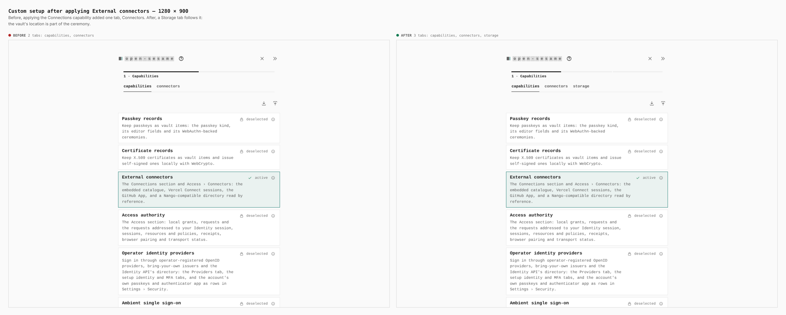
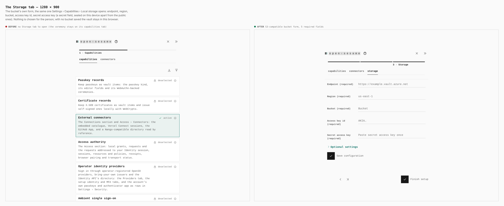
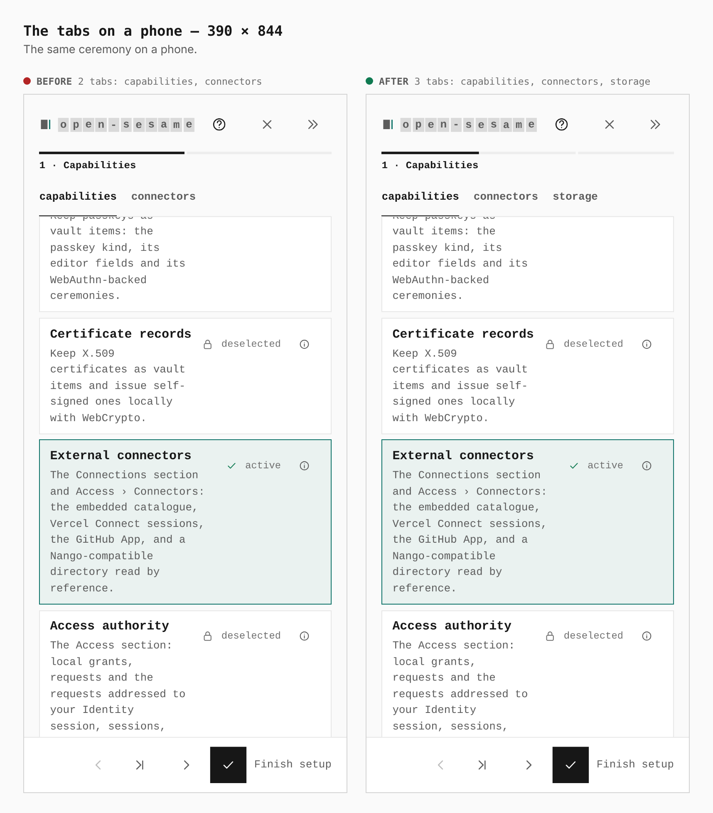
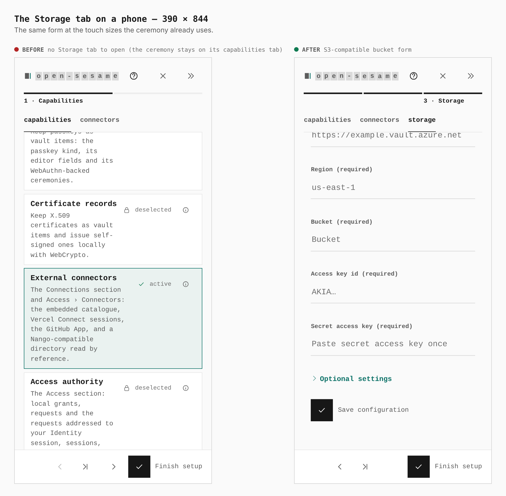

# S3-compatible bucket in the Custom setup ceremony

Before/after from two real builds, `main` (`49f04be`) and this branch, walked
the same way at desktop and phone width: Set up your own → Custom → Customize
this installation → Custom → External connectors → Save on this device → Apply
configuration. The journey is `journey.json`.

Measured in the browser: tabs in the ceremony after applying `[role=tab]`
`2 → 3` at both widths.

## The tabs, 1280 × 900

Before: capabilities, connectors. After: a Storage tab follows them.

## The Storage tab, 1280 × 900

The bucket's own form, the same one Settings › Capabilities › Local storage
opens: endpoint, region, bucket, access key id, secret access key (a secret
field, sealed on this device apart from the public ones). Nothing is chosen for
the person: with no bucket saved the vault stays in this browser.

## The tabs, 390 × 844

## The Storage tab, 390 × 844

## Known wart

The Endpoint placeholder is the shared `endpoint` field guidance (an Azure
example). Guidance is keyed by field name for every provider, so fixing it for
S3 alone means a per-provider override, which this change does not add.
