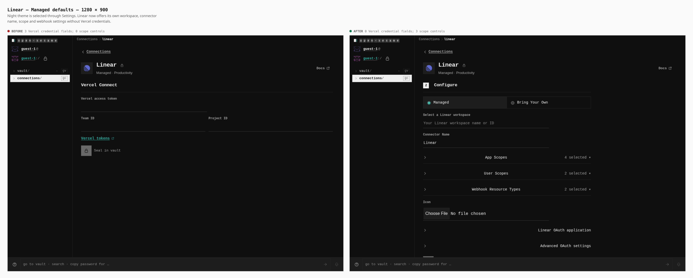
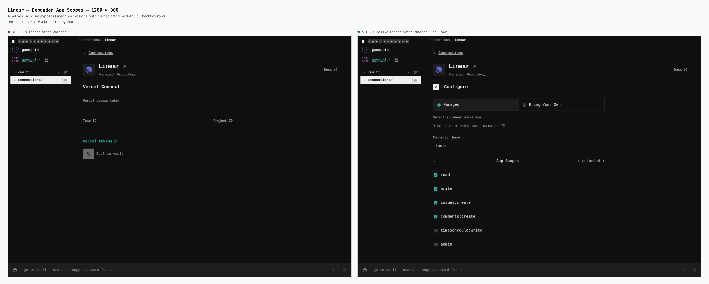
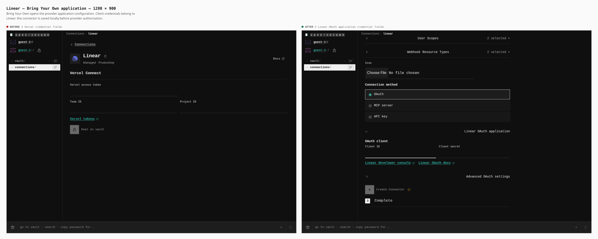
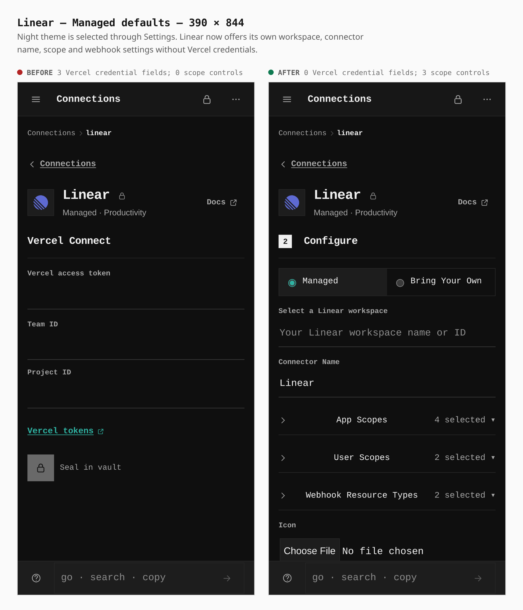
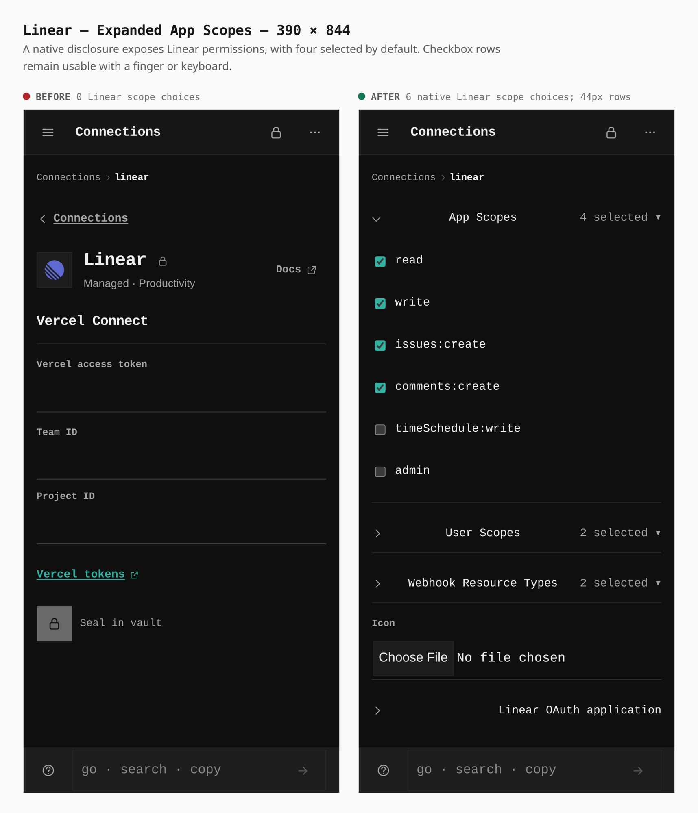
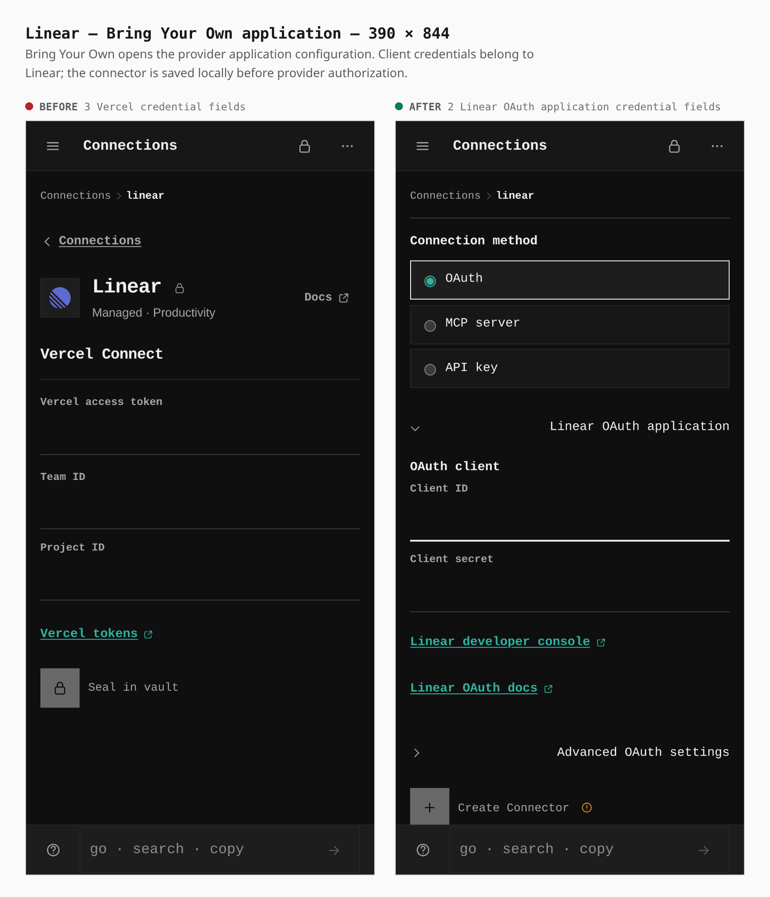

# Self-hosted provider configuration

Before/after captures from two real production builds: base `3b2729f73` and
this branch. Both walks enter as a guest, enable Connections in Capabilities,
select Night through Settings, and open `/connections/linear`. The same
deployment origin and viewport are used on each side. Screenshots are complete,
unchanged viewports. No backend, provider account, Vercel credentials or mocked
connector response is involved.

## Desktop — 1280 × 900

Linear previously showed three Vercel credential fields: access token, team ID
and project ID. It now shows zero Vercel credential fields and three provider
selection controls: App Scopes (4 selected), User Scopes (2 selected), and
Webhook Resource Types (2 selected), alongside Managed/Bring Your Own,
workspace, connector name and icon. The browser measures each scope disclosure
at **640 × 44 px**; the former Vercel inputs were 480/474 × 34 px.



Opening App Scopes exposes six native checkbox choices. Each label measures
**640 × 44 px**. Bring Your Own opens Linear's own OAuth application fields;
focusing Client ID brings those fields into view.





## Phone — 390 × 844, touch context

The same three Vercel fields are removed on a phone. Provider configuration is
available without a Vercel token. The phone uses a real coarse pointer context;
the capture is the unchanged viewport, with scrollable configuration below it.
The browser measures each scope disclosure at **358 × 45 px**. The former
Vercel inputs were 358 × 44 px. Both configuration modes and every scope
disclosure meet the 44 px control target; the document does not overflow
horizontally at either viewport.



The expanded checkbox labels measure **358 × 44 px**. The journey taps the last
scope twice, restoring its unchecked default while bringing the whole list into
view. The application view follows focus on Client ID. Both preserve the phone
viewport.





## Reproduce

The base lives in a separate worktree; the branch sources are never swapped.
Build both checkouts with the command below, then capture from the task checkout.
These checks used unmanaged Chrome for Testing 153.0.8010.12. The system-managed
Chromium disables non-proxied WebRTC UDP through enterprise policy; the keyboard
suite requires a browser that can gather real host candidates.

```sh
VITE_BASE=/OpenSesame/ corepack pnpm --filter @opensesame/pages build
TEST_CHROMIUM=/home/agent/.cache/ms-playwright/chromium-1243/chrome-linux64/chrome
PLAYWRIGHT_CHROMIUM="$TEST_CHROMIUM" \
  EVIDENCE_DIST=/workspace/work/opensesame-connector-base/apps/pages/dist \
  node apps/pages/scripts/capture-evidence.mjs capture before \
  docs/evidence/2026-10-08-self-hosted-connectors/journey.json
PLAYWRIGHT_CHROMIUM="$TEST_CHROMIUM" \
  node apps/pages/scripts/capture-evidence.mjs capture after \
  docs/evidence/2026-10-08-self-hosted-connectors/journey.json
PLAYWRIGHT_CHROMIUM="$TEST_CHROMIUM" \
  node apps/pages/scripts/capture-evidence.mjs compose \
  docs/evidence/2026-10-08-self-hosted-connectors/journey.json
PLAYWRIGHT_CHROMIUM="$TEST_CHROMIUM" \
  corepack pnpm --filter @opensesame/pages verify:self-hosted-connectors
PLAYWRIGHT_CHROMIUM="$TEST_CHROMIUM" \
  corepack pnpm --filter @opensesame/pages verify:keyboard
PLAYWRIGHT_CHROMIUM="$TEST_CHROMIUM" \
  corepack pnpm --filter @opensesame/pages verify:mobile
```

The verification script separately fills fictional provider application values,
saves the local configuration, reloads as a guest, reopens settings and edits
without revealing the stored secret. It verifies the configuration remains
pending provider authorization and makes no request to Vercel's API. It also
uploads a real 640 × 640 PNG, rejects a 16 × 16 PNG without replacing the
valid icon, and verifies the valid icon survives the reload. These generated
fixtures stay in `work/` and are not part of the visual evidence.

The focused browser contract passed **64 checks** at desktop and phone widths,
with zero hard errors and no Vercel API calls. Native keyboard controls were
verified on desktop: arrow keys change the configuration mode, Enter opens
and closes a scope disclosure, and Space clears and selects its checkbox.
The full keyboard suite passed at 1280 and 390 px, including two isolated browser
contexts connecting over WebRTC. The full mobile suite passed at all six
viewports: 320 × 568, 390 × 844, 430 × 932, 844 × 390, 1024 × 1366 and
1366 × 1024. No assertions were skipped or weakened.
