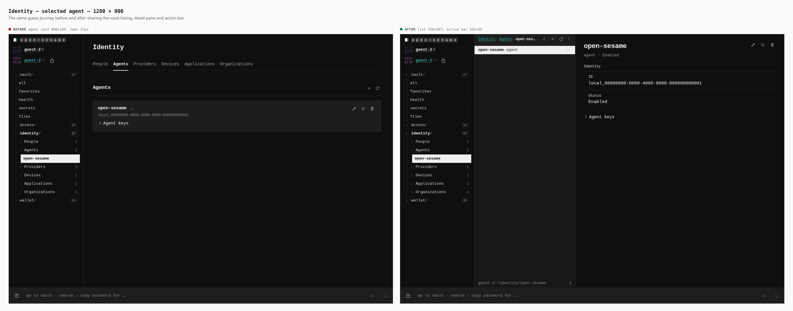
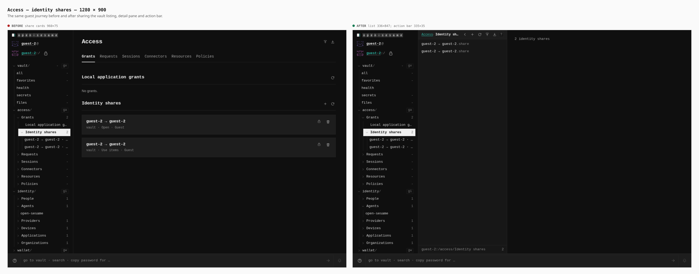
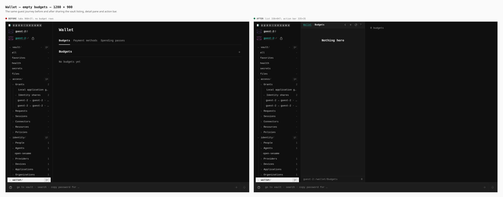
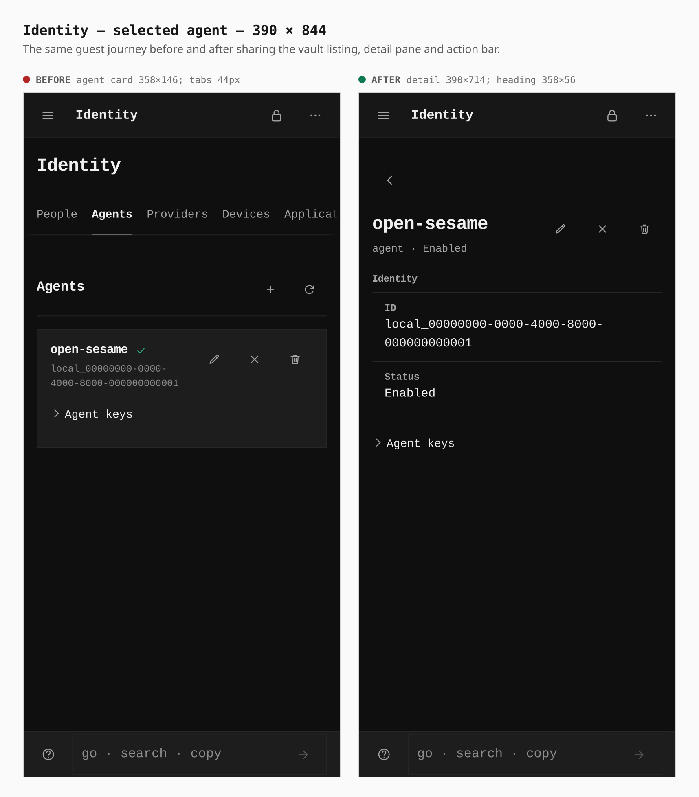
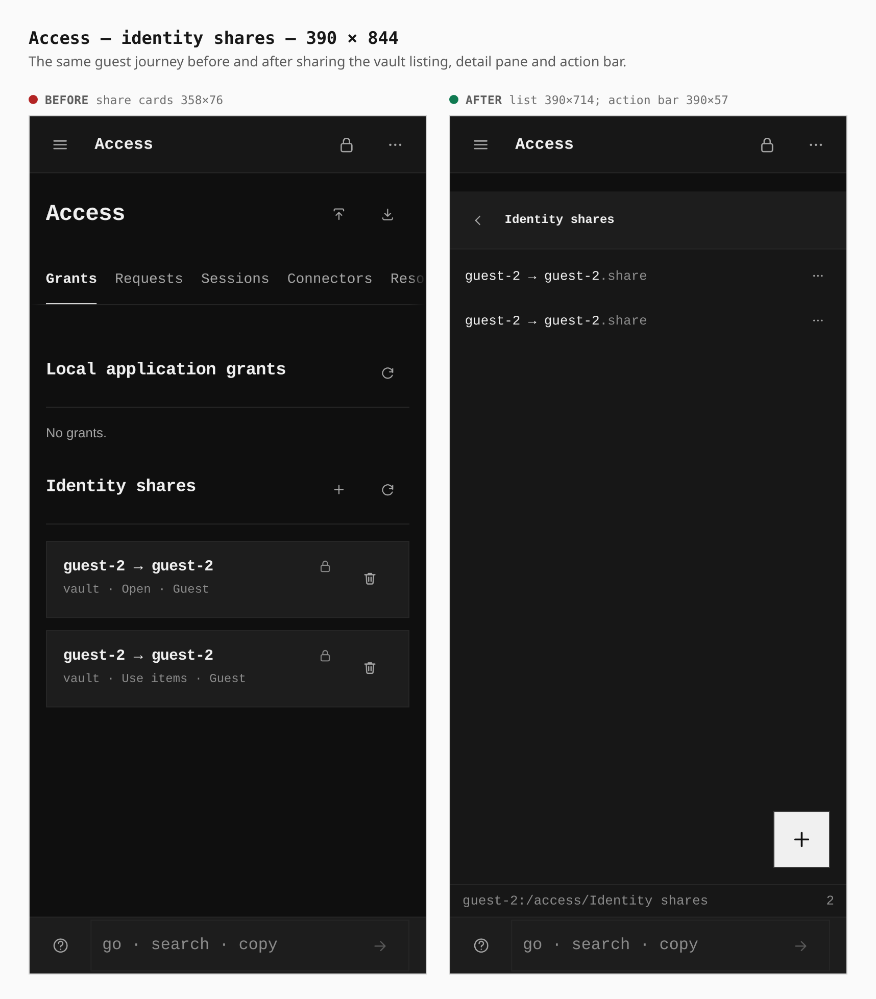
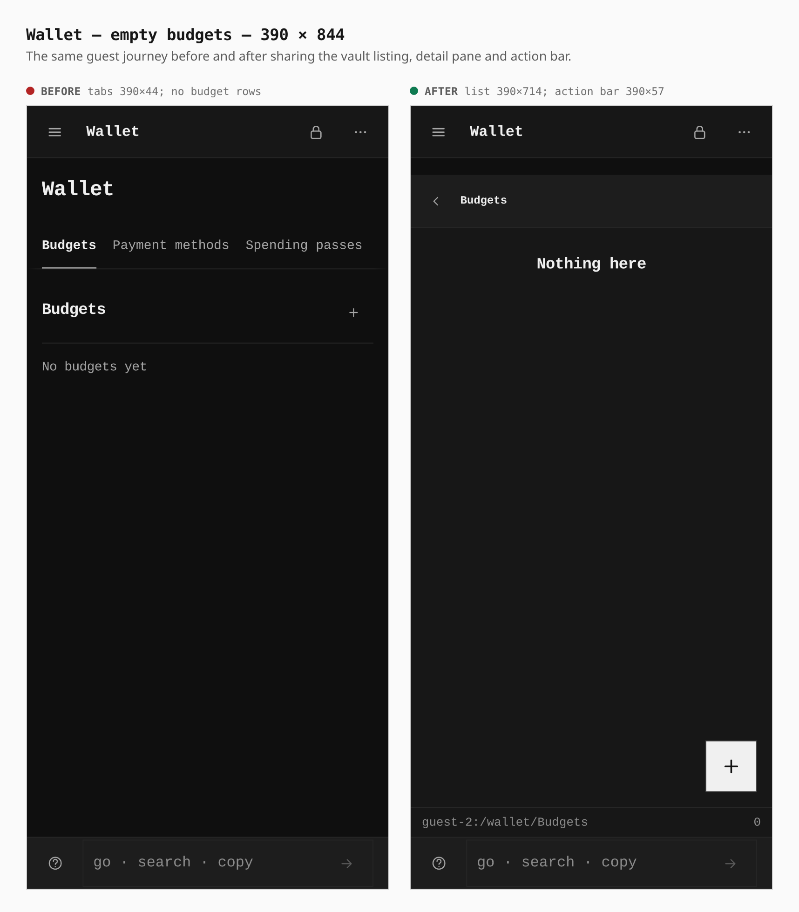
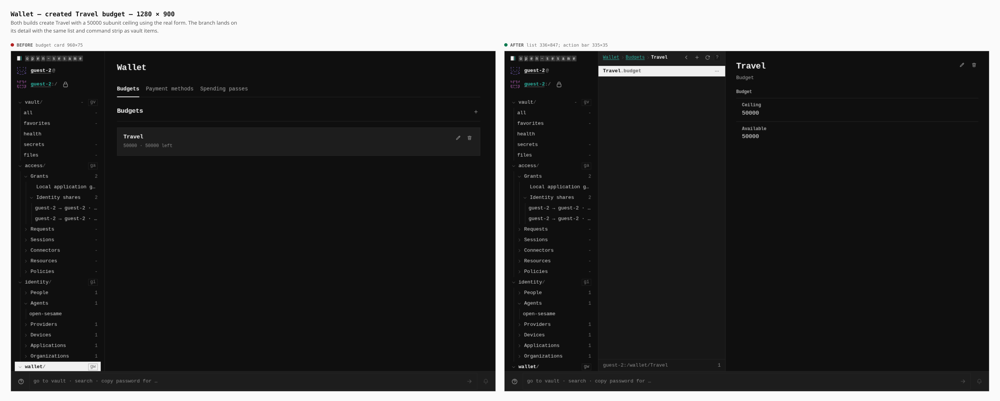
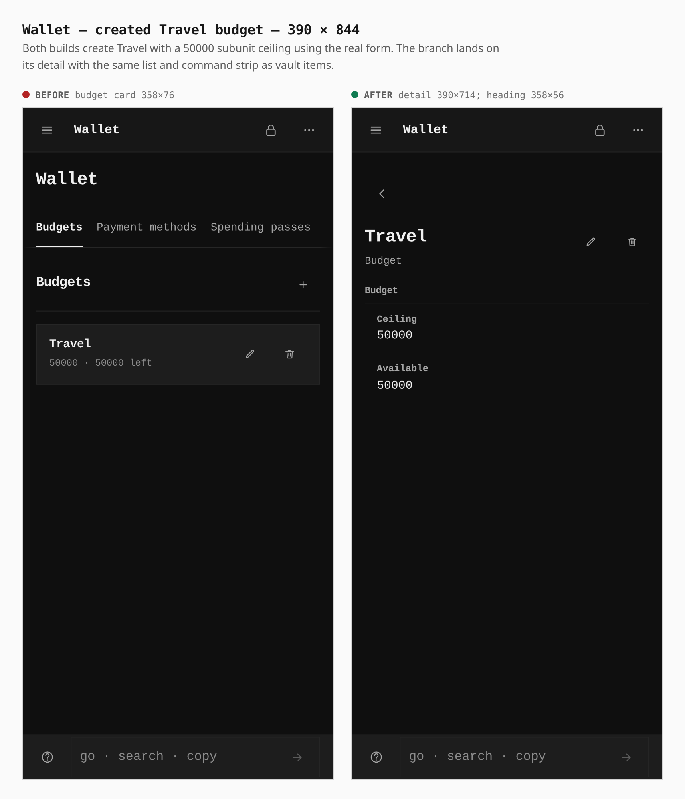

# Vault style for Identity, Access and Wallet

Before is an actual production build of `96b09b74f` (the starting `origin/main`); after is the final task branch production build, captured from `work/ci-dist-focus` after the CI fixes. Chromium walks the same guest setup, enables Identity, Directory, Access and Wallet through Settings, cold loads, chooses Night through Settings, and visits the same routes. Desktop subtrees are expanded with their real controls. The selected agent is `open-sesame`; the Travel budget is created with a 50000 subunit ceiling through the form in each build.

Captures are 1280 × 900 with a mouse and 390 × 844 with touch. Screenshots show the whole viewport. Measurements below come from `getBoundingClientRect()` in the browser; [measurements.json](measurements.json) holds the raw boxes and [journey.json](journey.json) holds the exact steps.

The after browser smoke also creates and edits a real agent, opens an identity share, verifies row action alignment, and creates then edits a real budget through its row menu at both widths. It reports no browser page errors. Connections is outside this change.

## Reproduce

Build the base in its own worktree. From this branch run:

```sh
PLAYWRIGHT_CHROMIUM=/usr/bin/chromium EVIDENCE_DIST=/path/to/base/apps/pages/dist node apps/pages/scripts/capture-evidence.mjs capture before docs/evidence/2026-10-08-vault-style-sections/journey.json
PLAYWRIGHT_CHROMIUM=/usr/bin/chromium EVIDENCE_DIST=/path/to/branch/dist node apps/pages/scripts/capture-evidence.mjs capture after docs/evidence/2026-10-08-vault-style-sections/journey.json
PLAYWRIGHT_CHROMIUM=/usr/bin/chromium node apps/pages/scripts/capture-evidence.mjs compose docs/evidence/2026-10-08-vault-style-sections/journey.json
```

## Identity — selected agent — 1280 × 900

agent card 960×104; tabs 37px → list 336×847; action bar 335×35.



## Access — identity shares — 1280 × 900

share cards 960×75 → list 336×847; action bar 335×35.



## Wallet — empty budgets — 1280 × 900

tabs 960×37; no budget rows → list 336×847; action bar 335×35.



## Identity — selected agent — 390 × 844

agent card 358×146; tabs 44px → detail 390×714; heading 358×56.



## Access — identity shares — 390 × 844

share cards 358×76 → list 390×714; action bar 390×57.



## Wallet — empty budgets — 390 × 844

tabs 390×44; no budget rows → list 390×714; action bar 390×57.



## Wallet — created Travel budget — 1280 × 900

budget card 960×75 → list 336×847; action bar 335×35.



## Wallet — created Travel budget — 390 × 844

budget card 358×76 → detail 390×714; heading 358×56.


