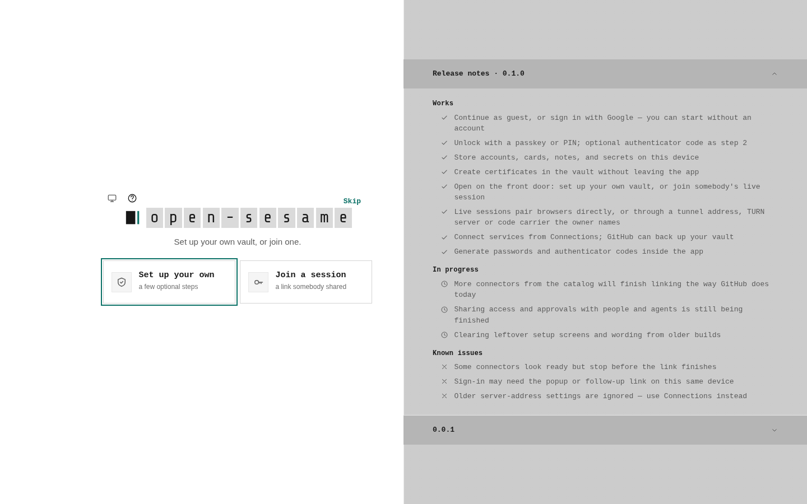
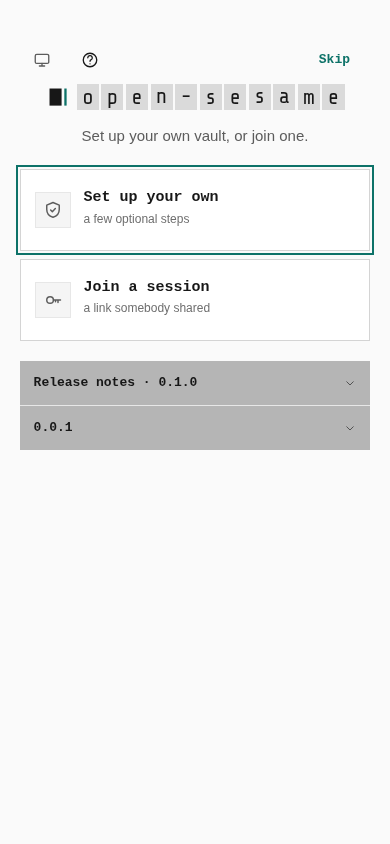
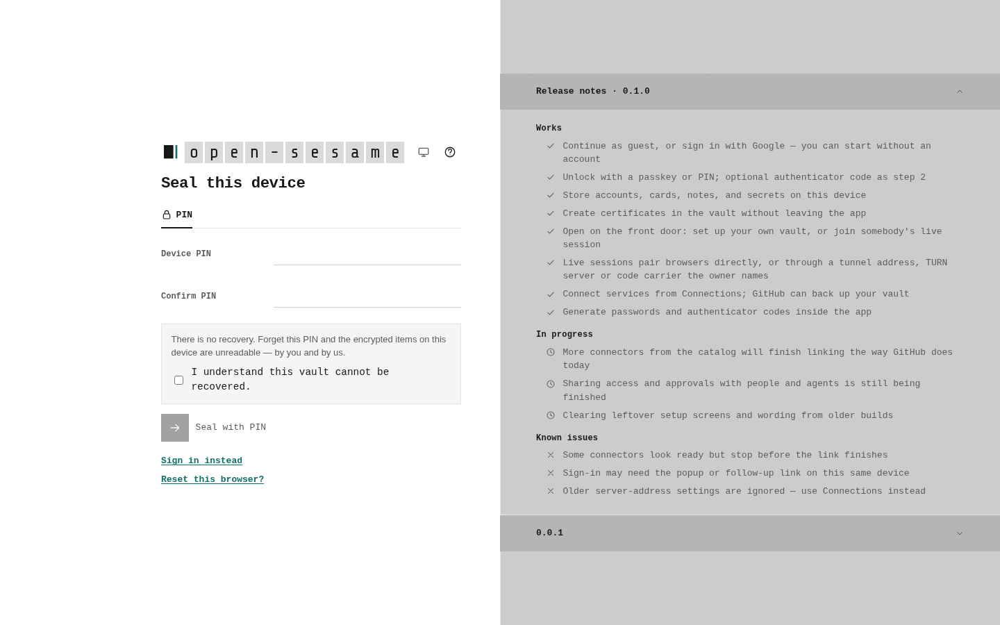
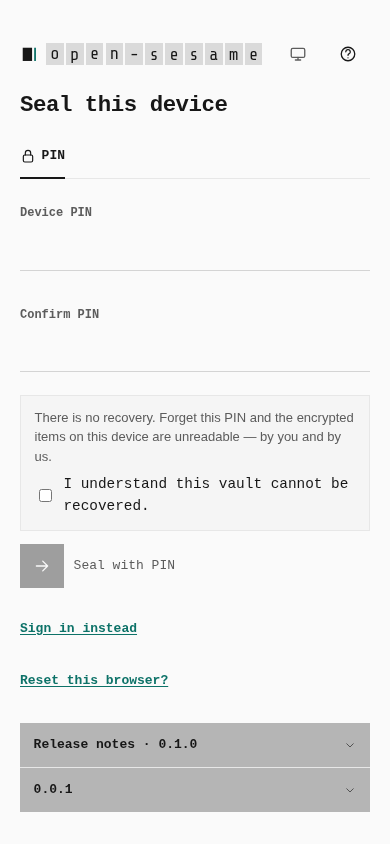
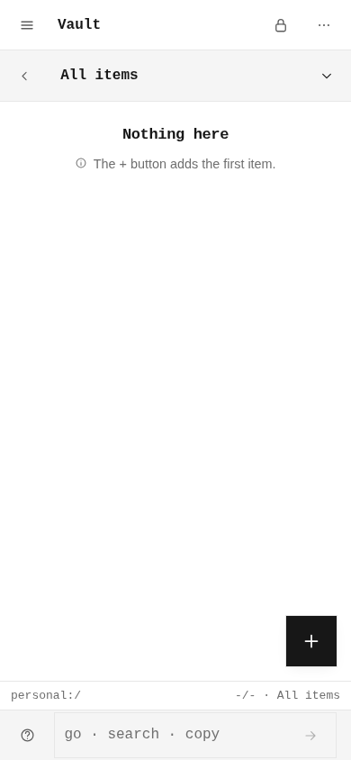

# Reviewed visual contract baselines

Five stale reference images now describe the current landed Pages UI. No rendered product code, comparison threshold, viewport, landmark or test count changes here. The desktop vault-list reference already passed and remains unchanged.

The prior references were captured before subsequent deliberate UI changes. The images labelled **historical reference** below are those exact prior committed images, not a newly rebuilt base. The **current capture** images come from a fresh production build and genuine browser journeys. This is a test-reference correction, not before/after evidence for a new feature.

## Actual validation

Two separate root-base Pages production builds, unchanged UI source, Chromium151.0.7922.173, desktop1440×900 and phone390×844. All six journeys reached captures. Comparing those captures with the production comparator passed for all six: four are pixel-identical; the remaining phone images differ by82 and8pixels. The preserved hosted front-door captures also compare within the same budgets against local captures.

The initial normal comparison retained five failures against the historical references and one desktop vault-list success. These failures were reviewed against the images and landed source history. After selective replacement, the normal six-case comparison must pass separately. Updating references is not itself a passing comparison.

| Historical comparison | Whole image difference | Content difference | Reviewed cause |
| --- | ---: | ---: | --- |
| Front door, desktop | 1.75% | 3.39% | Square focus and current release copy/panel spacing |
| Front door, phone | 46.52% | 46.52% | Current gutters and initially collapsed release rows |
| Seal, desktop | 4.28% | 7.48% | PIN form replaces removed first-run password creation |
| Seal, phone | 18.71% | 44.02% | PIN form, current spacing and collapsed notes |
| Vault, phone | 1.41% | 7.26% | Current56px toolbar and single square56px Add key |

The fixed budgets remain1.5% of all pixels and5% of content, with per-pixel threshold0.1. These historical differences are measurements from actual browser captures, not permitted new thresholds. Dimensions are unchanged.

## Source history reviewed

The old reference source is e53d2a2ca18628021be020f1c916a9aca793d93e. Later landed changes explain the reviewed differences: #737(c016f25d) replaces the rounded100px Add/menu pair with a56px square Add; #753(4b422255) makes corners square; #763(8b6499cb) removes first-run password creation; #767(afe58be3) introduces the56px mobile toolbar; #769(9c0eca72) aligns mobile20px gutters and collapses releases; #778(2fe44676) reopens the newest release on wide screens while keeping phone rows collapsed. Existing historical evidence reports the mobile toolbar71.39→56px and notes985→89px. Those two figures are historical measurements, not rerun measurements here.

Relevant current UI source matches the preserved hosted885head. Font-family tokens and the front-door road names/lede are unchanged; no font replacement was inferred from image drift. Local/hosted front-door differences are within the original comparison budgets.

## Reviewed images

Historical images link to the immutable parent commit. Current images are the exact committed browser captures; no cropping or image editing was applied.

### pages-desktop

Historical reference:

Current capture:

### pages-mobile

Historical reference:

Current capture:

### vault-unlock-desktop

Historical reference:

Current capture:

### vault-unlock-mobile

Historical reference:

Current capture:

### vault-list-mobile

Historical reference:

Current capture:

