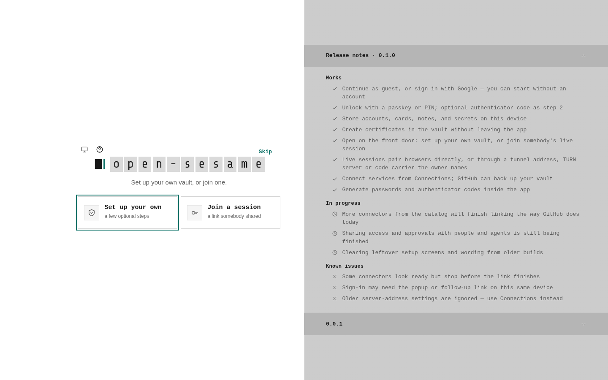
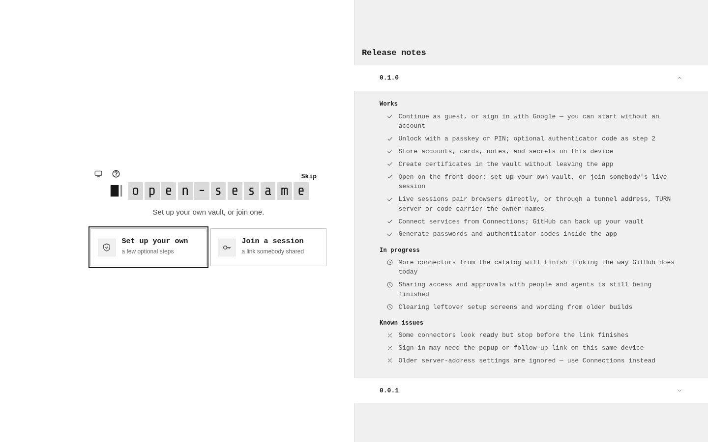
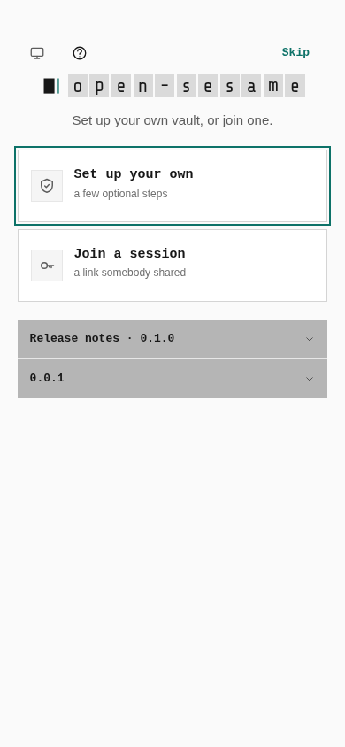
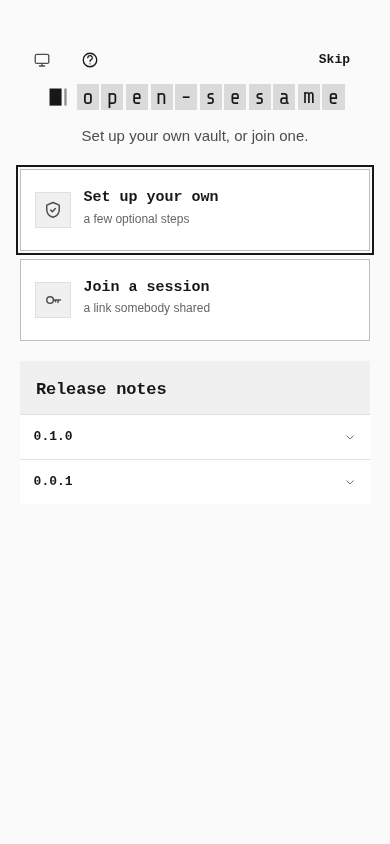
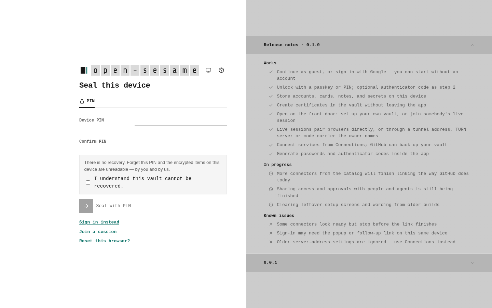
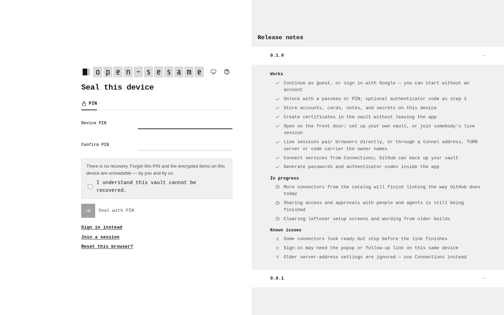
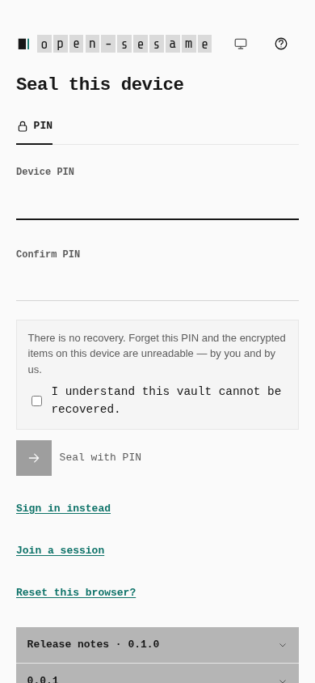
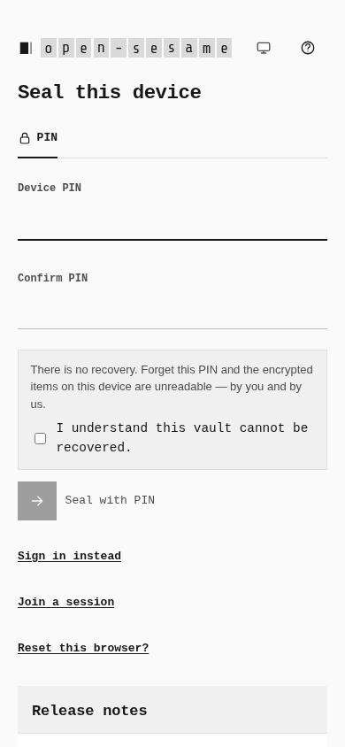

# Reviewed visual baselines from merged main

Clean main at `f48efc4e2006f02f634a7e92ef19756c26545fa5` reproduced the
connector branch's four visual-contract failures. Its already-merged greyscale
design (`8fcb14769`, #1001) changed the focus and link colours and release-notes
surface. Each previous baseline and genuine main capture was opened and reviewed.
Only these four baseline PNGs were replaced; both vault-list images were retained.
This correction changes no product code, screenshot journey, comparison logic or
threshold.

The unchanged six-screen Playwright journey ran against separate real production
builds on `http://127.0.0.1:5182/`: clean main and the completed connector working
tree based on `77f5d585fe87ffde004b89eeb5ea64b0bca34329`. Both use fresh browser
contexts and the actual first-run PIN flow. No provider responses or page elements
were staged. `VISUAL_UPDATE` was unset for both runs.

| Screen | Previous baseline versus clean main: pixels / content | Previous image | Reviewed main capture |
|---|---|---|---|
| Front door, 1440 × 900 | 47.41% / 91.74% |  |  |
| Front door, 390 × 844 | 9.68% / 27.14% |  |  |
| PIN seal, 1440 × 900 | 47.38% / 85.82% |  |  |
| PIN seal, 390 × 844 | 7.33% / 28.42% |  |  |

Main reproduced four failures and two passes in 16.7 seconds. After copying only
the reviewed main captures, the normal connector comparison passed all six
screens in 12.8 seconds. The original budgets remain 1.5% of all pixels and 5% of
content pixels, with pixelmatch sensitivity 0.1. Desktop front door and PIN seal
match main exactly; their phone comparisons differ by 0.0234% and 0.0368% of
pixels. The retained desktop vault-list baseline differs by 1.3012% of pixels
and 4.3727% of content; its phone counterpart matches exactly.

[The receipt](receipt.json) records source provenance, both complete build-manifest
hashes, every image hash and all six final comparison measurements. The provider
authentication screenshots remain in the separate
[connector gallery](../2026-10-09-provider-authentication/README.md).
