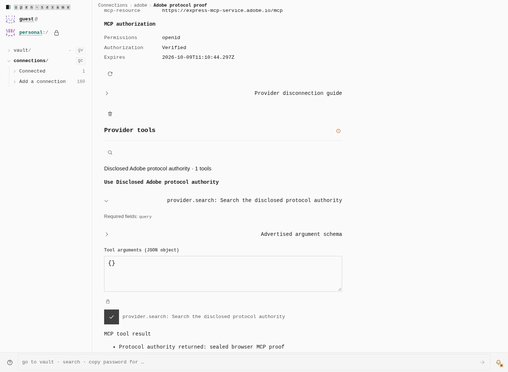
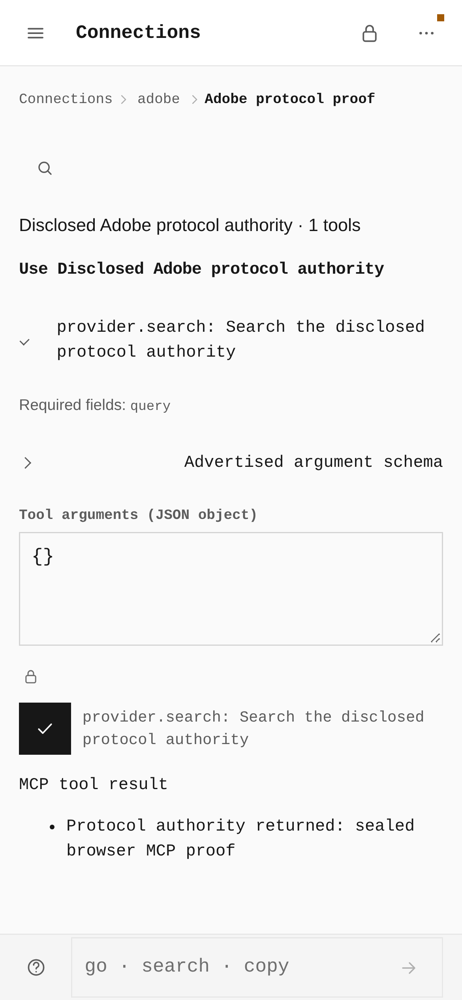
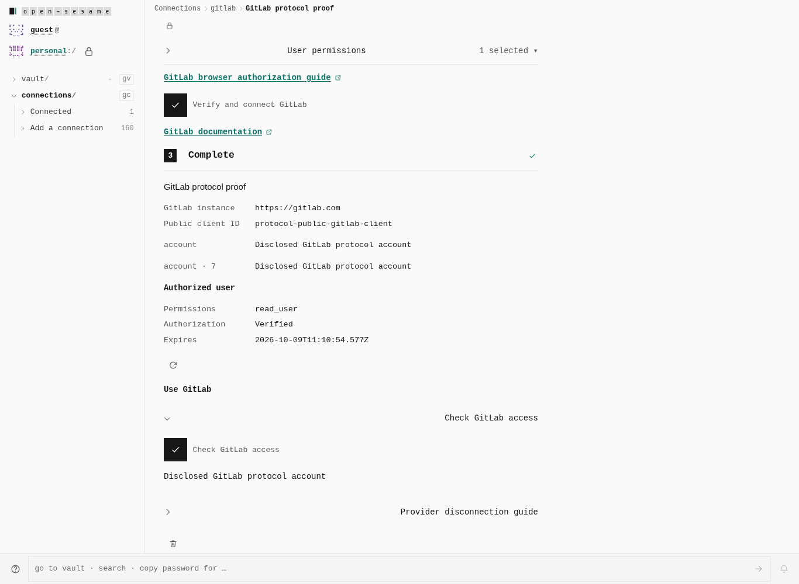
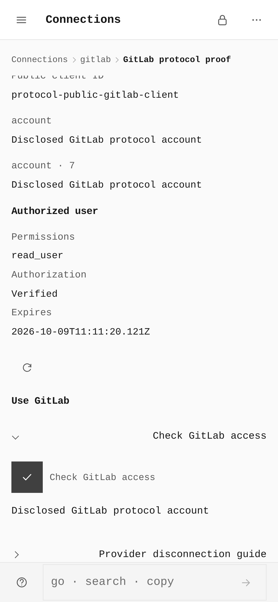

# Native public OAuth and MCP protocol evidence

This gallery records the earlier full-page redirect baseline. The current consent popup keeps the originating tab unlocked; see the [provider authentication gallery](../2026-10-09-provider-authentication/README.md) for the updated session flow and real-service evidence.

These four screenshots supplement the [two-build configuration comparison gallery](../2026-10-09-native-connectors/README.md). They show the production application performing actual browser HTTP protocols against a **disclosed synthetic upstream authority**, using the providers' compiled official endpoint URLs. No live account or live credential is claimed.

The harness supplies upstream HTTP responses and the static deployment files. It does not inject application state, replace modules, alter the app DOM, or fabricate a connected record. Each journey creates a real PIN-sealed vault, follows explicit consent through the built `auth/native-connector.html` bridge, unlocks after the callback, reloads cold, and uses the encrypted saved grant.

**306 assertions passed** at desktop and phone widths. No unexpected HTTP, console, page, missing-asset, loopback, or hosted Vercel Connect requests occurred. The independently reconstructed production capability graph passed with no violations or mismatches.

## What crossed the provider boundary

| Provider | Real production-browser journey |
|---|---|
| Adobe MCP | Read protected-resource and authorization-server metadata; register a public client; authorize with S256 PKCE and exact resource; exchange the callback code; initialize the SDK session; discover advertised tools; refuse hostile advertised input and output regex schemas with a precise notification-tray error before tool dispatch, recover with the safe schema, and show actual required fields and a read-only argument schema; reject malformed or non-object JSON before any upstream HTTP; explain invalid types and missing required arguments through the notification tray before tool dispatch; validate input and structured output; call `provider.search`; reject invalid input before dispatch; remove verified status after HTTP 401 without replay; revoke both issued tokens and delete the actual RFC 7592 registration receipt. |
| GitLab | Configure a public browser client; authorize `read_user` with S256 PKCE; exchange the callback code without a client secret; query the account; cold-reload and query it again from the saved grant; revoke both issued tokens on removal. |

Both flows assert exact deployed callback binding, consent-client continuity, verifier/challenge correspondence, no ambient cookies, and no private issued credentials in rendered prose or browser localStorage. A configuration save alone never receives verified status.

The production browser exposed a CSP incompatibility in code-generating schema validation. The final client uses the SDK's interpreter validator for both input and output; the CSP stays unchanged. The paginated discovery regression also verifies that earlier pages' output schemas remain enforced. A self-review then found a synchronous nested-regex denial of service. This final snapshot preflights both input and output schemas, finite local references and validation work before the interpreter runs. The physical journey supplies the hostile `^(a+)+$` schema in each position, reads the precise safety refusal in the notification tray, confirms no tool call, then discovers and uses the safe schema.

## Measured browser geometry

The width comes from `document.documentElement.scrollWidth`; every result fits its viewport without horizontal overflow. The phone uses a real coarse-pointer browser context.

| Journey | Viewport (CSS px) | Document width | Pointer | Provider HTTP calls |
|---|---|---|---|---|
| desktop · adobe | 1366 × 1000 | 1366 px | mouse | 46 |
| desktop · gitlab | 1366 × 1000 | 1366 px | mouse | 6 |
| phone · adobe | 390 × 844 | 390 px | coarse | 46 |
| phone · gitlab | 390 × 844 | 390 px | coarse | 6 |

## MCP advertised tool result

The tool name, description, input schema, output schema, and displayed result came from the HTTP authority through the actual SDK. Before execution, the journey opens the schema disclosure and checks its exact JSON against the server response. The required-field guide remains visible with the tool result; the authority is explicitly named in that result.





## Public GitLab account read

The account name is returned by the disclosed GitLab HTTP authority, and the action performs a fresh provider account query after PIN-sealed cold reload.





## Reproduce and provenance

Production snapshot: immutable build 9 (`native-browser-dist-build9`) built from the feature working tree based on `014cdc59cd7bbfa361ad13e12a394c5386e17207`. The exact shipped files, not the base commit alone, are identified by the digest below.

- Production dist SHA-256: `b3b6ffb58d8b5c7c794362d712224cdb11d8b4108968cf78a465c96323622c86`
- Production index SHA-256: `e494637c516efccab5e8d730112c79cfeb591f2112cd78e8dc726f566ad6a722`
- [Build provenance and artifact/source/image SHA-256 mappings](build-provenance.json)
- [Protocol assertions and request sequence](receipt.json)

```sh
VITE_BASE=/OpenSesame/ pnpm --filter @opensesame/pages build
PLAYWRIGHT_CHROMIUM=/path/to/chromium \
  node apps/pages/scripts/verify-native-public-protocol.mjs
```

`EVIDENCE_DIST` selects an immutable production directory; `PAGES_VERIFY_OUT` selects the capture destination. The owned authority helpers disclose their synthetic responses and admit only the compiled provider endpoints.
