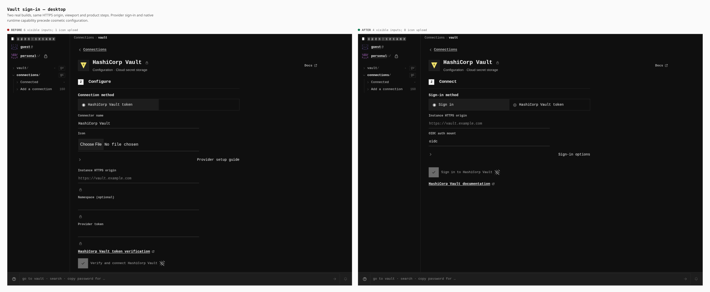
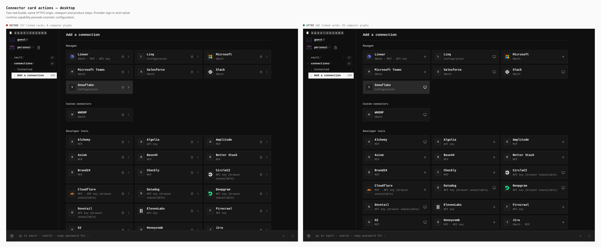
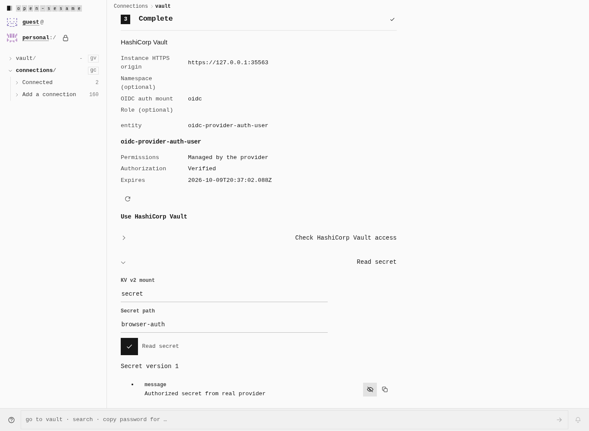
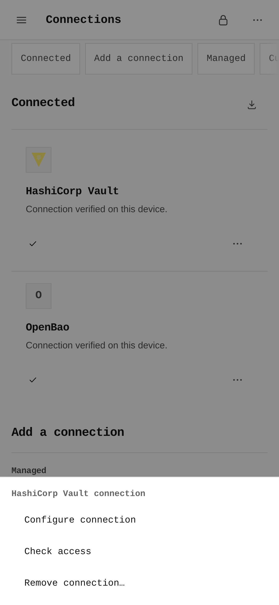

# Provider authentication and connector actions

The connector setup starts the provider's supported authorization flow. Browser connections are marked connected only after provider verification and durable credential storage. Catalog cards use a plus for an available browser connection, a computer for a required external runtime, and an actions menu for a verified saved connection.

Vault and OpenBao use their configured OIDC mount and role. Explicit KV v2 reads retain the selected secret path and mask returned values until reveal or copy. GitHub personal tokens authenticate against its public API; S3 credentials must pass a signed bucket permission check before the connection is saved. Shared credentials are forgotten locally on disconnect.

The required provider-auth gate runs genuine Vault and OpenBao authorization and secret reads, and a real pinned MinIO browser connection on desktop and phone. Provider HTTP responses are not replaced in those service checks. The static HTTPS callback host has no browser-session registry or credential exchange.

The visual comparison uses a genuine production build of main `49060b45ece37220c3570e27b246f4731e47b11d` and the reviewed connector source built on that same main revision. Both include the greyscale design, are built and served at `https://provider-auth.opensesame.test:33837/OpenSesame/` with the `dedicated_origin` profile and strict COOP and COEP headers, and follow the same product steps. Later unrelated upstream merges are outside this comparison. [capture-ui.mjs](./capture-ui.mjs) records the build manifests and measured controls without changing either artifact.

| Change | Desktop, 1366 × 1000 | Phone, 390 × 844 |
| --- | --- | --- |
| Provider sign-in before cosmetic configuration | [Before / after](./desktop-vault-signin.png) | [Before / after](./phone-vault-signin.png) |
| Available browser actions and external-runtime glyphs | [Before / after](./desktop-catalog-actions.png) | [Before / after](./phone-catalog-actions.png) |

The Vault form moves from six visible inputs, including an icon upload, to four visible inputs: two sign-in method choices, the instance origin and its OIDC mount. Optional role and namespace settings remain under Sign-in options. Cosmetic name/icon settings become available after verification. The 160-card curated catalog changes from 157 linked cards and no computer glyphs to 102 linked cards and 55 computer glyphs. Three policy-blocked cards remain unavailable. Measured phone form fields, buttons and catalog tiles retain a minimum 44px height.

The service screenshots come from the actual production browser journeys against locally running HashiCorp Vault 1.21.4, OpenBao 2.3.2 and pinned MinIO `RELEASE.2025-09-07T16-13-09Z`. Their provider HTTP responses are genuine. Returned Vault values shown after reveal are deliberately public fixture data; provider credentials and TLS keys are excluded from this bundle.

| Actual behavior | Desktop evidence | Phone evidence |
| --- | --- | --- |
| OIDC consent waiting with originating-session cancellation | [Sign-in pending](./desktop-vault-real-oidc-signing-in.png) | [Sign-in pending](./phone-vault-real-oidc-signing-in.png) |
| Verified saved connection actions | [Installed menu](./desktop-vault-real-oidc-installed-menu.png) | [Installed menu](./phone-vault-real-oidc-installed-menu.png) |
| KV v2 resource read with retained mount/path and explicit reveal | [Real Vault read](./desktop-vault-real-oidc-connected.png) | Phone behavior verified by the required gate |
| Signed bucket permission and object-key read | [Real MinIO read](./desktop-s3-verified.png) | [Real MinIO read](./phone-s3-verified.png) |

[The passing service receipt](./provider-auth-receipt.json) records concurrent originating tabs under COOP, null provider openers, wrong-state/source/replay rejection, cancellation and vault-lock fencing, actual resource reads, sealed cold reload, upstream OIDC revocation and local shared-token removal. MinIO additionally rejects an incorrect signing secret, verifies its bucket, lists a real object key, and proves removal after cold reload. The callback worker checks cover all five exact auth documents online, missing and offline, with the SPA cache preserved. Google SDK behavior is separately labeled as a contract fixture and does not establish a live customer grant.

[Build manifests and UI measurements](./ui-measurements.json) contain all 233 before-build and 239 reviewed-build files. SHA-256 of each compact JSON manifest array, in its recorded order:

- Before: `973c79851b03c480d04d4f09945ae757d49563a941b4ce0d96d4f1fc48ee6bec`.
- Reviewed connector build: `543ea5e8cec2e0ec57bc0b8057d0abc43b2deab3880eb4a35a70fe86813767cd`.

The capture asserts that both manifests remain byte-identical after all browser journeys. No staged DOM, success route interception, restamped baseline artifact or weakened production header policy is used in these comparisons.

## Final runtime verification

[The final runtime receipt](./final-runtime-verification.json) records a fresh build on main `f48efc4`: real provider services passed again after the Linear retry fix, along with 307 public-protocol, 2,170 connector and 477 Linear assertions. All 225 identities were audited at desktop and phone widths. Three fresh build profiles met the existing bundle and capability-graph limits.

Linear cancellation and denial now retry the same durable connection with a fresh consent state. Its physical browser gate exercises independent app/user popups, the still-unlocked originating tab, encrypted cold reload, provider operations and webhook recovery. These two screenshots use a disclosed HTTP protocol stand-in at official Linear URLs; they do not claim a live Linear account.

| Linear proof | Screenshot |
|---|---|
| Final narrowed consent and an authorized issue operation | [Desktop](./desktop-linear-narrowed-consent.png) |
| Authorized issue creation from the provider team picker | [Phone](./phone-linear-created-issue.png) |
