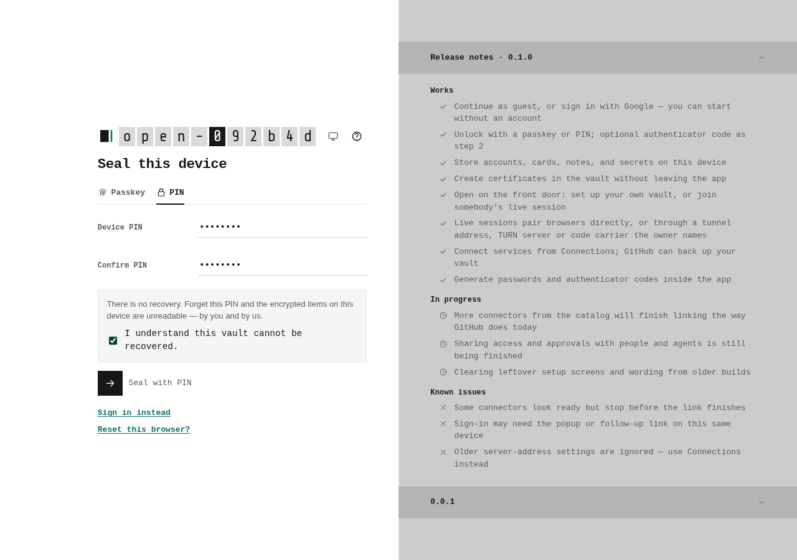
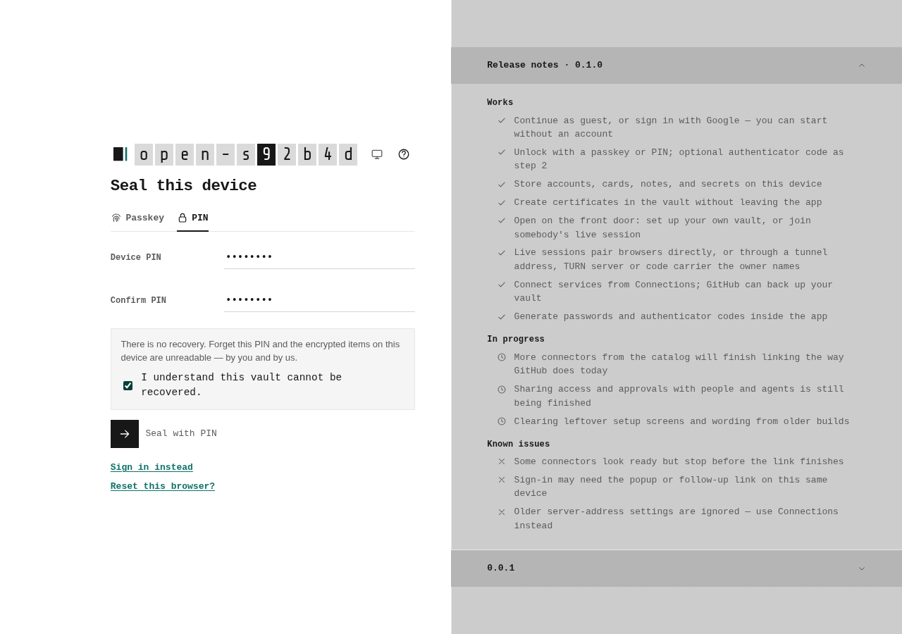
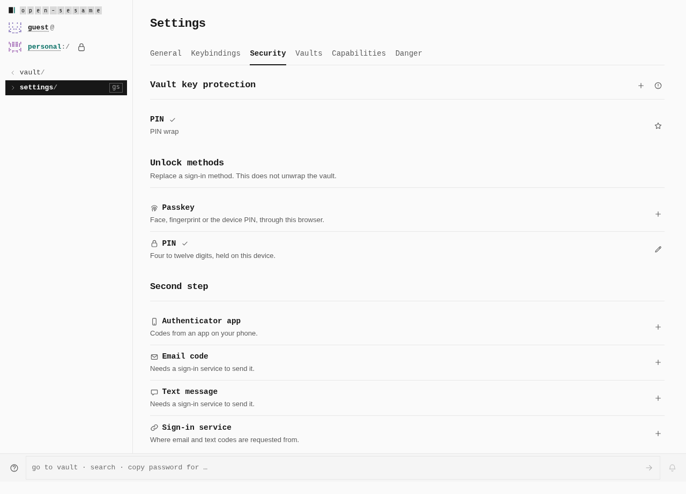
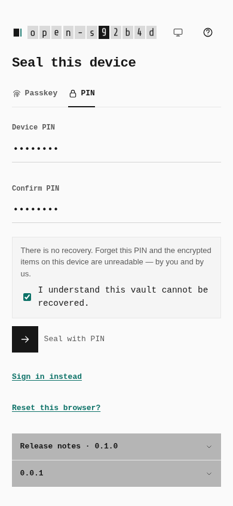
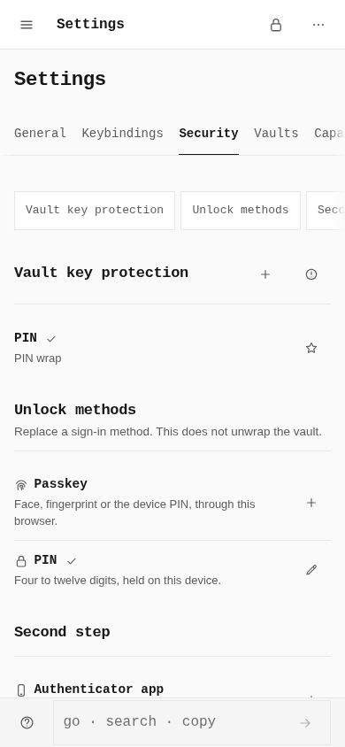

# Retired-password management: original journey

These are untouched screenshots from two real PWA builds and native Chromium
journeys. The same PIN setup and initial Settings → Security navigation ran in
each build. Only test-controlled credentials and data were used.

The initial Security images are byte-identical. They preserve the original top
view; the added retired-password row is below the captured area. Native DOM
measurements found **0 → 1** matching management rows on both profiles. That
measurement does not make the new row visible in these images. The actual new
review, consent, and refusal views are shown in the separate
[management interaction gallery](interactions/README.md).

## Desktop PIN setup

Measured window: **1280 × 900**, coarse pointer false in both runs. Both PNGs:
**1280 × 900**. Capture follows actual PIN setup and settled session admission.

| Before | After |
| --- | --- |
|  |  |

## Desktop initial Security

Measured window: **1280 × 900**, coarse pointer false. Full-page PNGs:
**1280 × 923**, identical SHA-256. Native management-row count: **0 → 1**;
the new row is outside this captured top view.

| Before | After |
| --- | --- |
|  |  |

## Phone PIN setup

Measured window: **390 × 844**, coarse pointer true in both emulated phone
contexts. Both PNGs: **390 × 844**; no full-page resizing.

| Before | After |
| --- | --- |
|  |  |

## Phone initial Security

Measured window: **390 × 844**, coarse pointer true. Both PNGs:
**390 × 844**, identical SHA-256. Native management-row count: **0 → 1**;
the new row is outside this viewport.

| Before | After |
| --- | --- |
|  |  |

## Provenance and scope

[journey.json](journey.json) records every image SHA, PNG dimensions, native
measurements, complete build-pin SHA and actual runtime receipt and source-only qualification index. It
is an evidence index for the named drivers, not a generic capture-harness input.
The before build has 247 pinned files; the after build has 246. After execution
retained all build bytes and 3,954 source pins. No images were edited or cropped.

The before desktop and phone capture journeys passed individually; the aggregate
also included a failing original multi-document baseline. The after desktop and
phone management journeys each passed six controls. Their genuine native
IndexedDB, OPFS and crypto paths used zero authentication or storage doubles;
only static asset delivery was substituted and external networking was refused.

Phone captures are browser emulation, not hardware tests. Service workers were
blocked, so installation and offline behavior remain untested. Retired login,
synthetic isolation/exit, receiver delivery, native SDK, connector/MCP escape
and full-client activation are outside this evidence. The corrected after build
also passes the unchanged original three-document stale-unlock regression.
The earlier stale retained-document failure is preserved, not replaced. Separate
Core compilation and 94 controls passed; their browser/remote delivery doubles
are qualified in the evidence index. These are bounded controls, not a complete
production-readiness proof.
