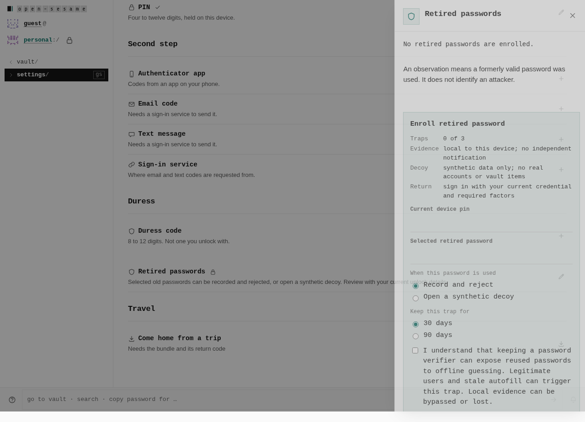
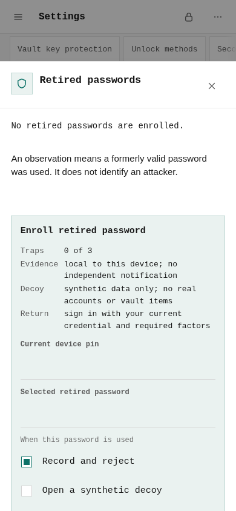
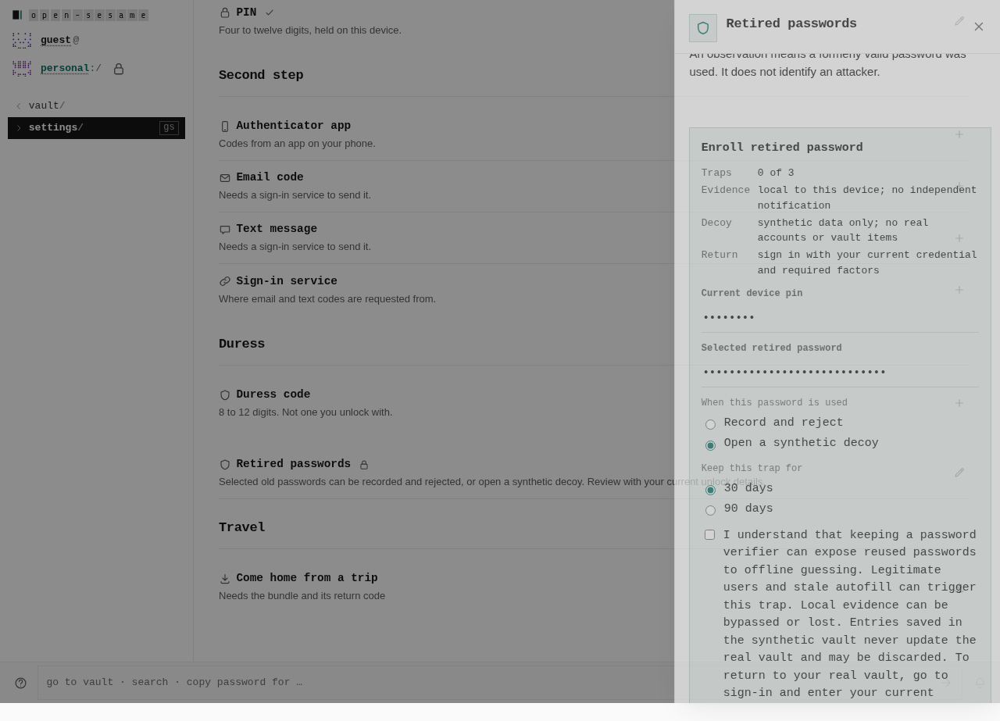
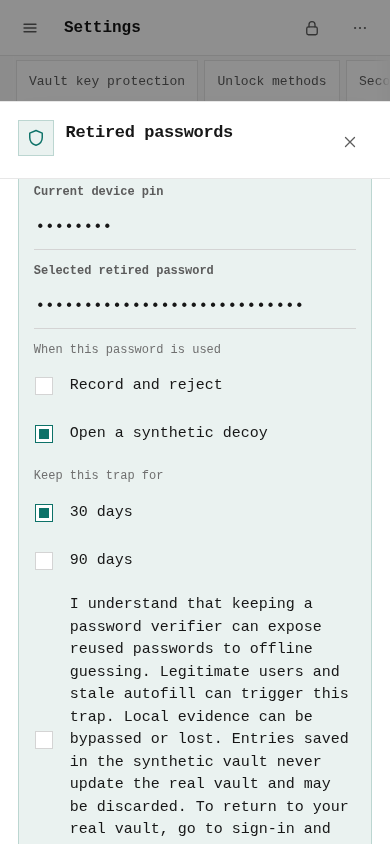
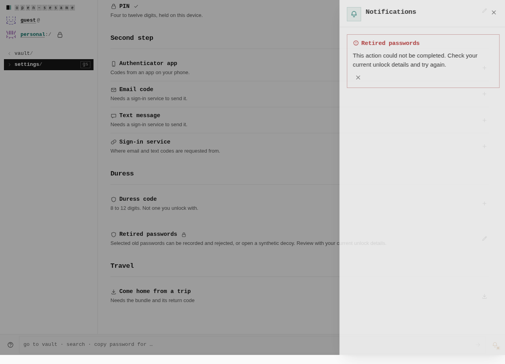
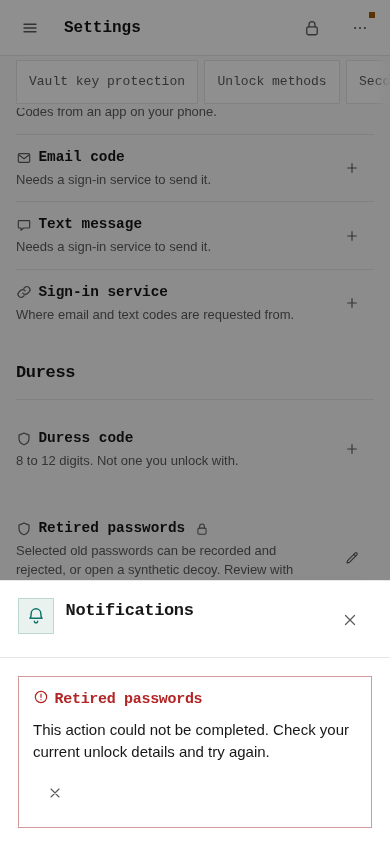

# Actual management interactions

These six untouched after-build screenshots show a different journey from the
[matching initial screens](../README.md). There is no corresponding before
management modal: the before build has no retired-password management row.

Native measurements for every desktop capture: **1280 × 900**, coarse pointer
false, full-page screenshot. Every phone capture: **390 × 844**, coarse pointer
true, emulated phone context, viewport screenshot without resizing. Exact PNG
dimensions and hashes are in [journey.json](journey.json).

## Fresh review and monitor/reject default

Actual current-PIN authentication reached the empty review. The native accessible
review output reports no enrolled passwords; response defaults to monitor/reject.

| Desktop | Phone |
| --- | --- |
|  |  |

## Synthetic-mode owner consent

The owner warnings cover stale autofill and legitimate old-password use, synthetic
writes not changing the real vault, possible discarded data, and returning to
sign-in for fresh real authentication. Switching away and back requires another
acknowledgement. This tests configuration consent, not synthetic login or exit.

| Desktop | Phone |
| --- | --- |
|  |  |

## Current credential refused in Notifications

After one real encrypted trap enrollment, attempted current-PIN enrollment is
refused through the existing native Notifications tray. A subsequent fresh
current-PIN review still finds exactly one trap. The tray is the actual product
feedback destination; no inline alert was manufactured for the capture.

| Desktop | Phone |
| --- | --- |
|  |  |

## Scope

Both actual native Chromium profile journeys passed all six management controls.
Native browser IndexedDB, OPFS and crypto were exercised with no authentication
or storage doubles. Test-only PINs and credentials were used. Images have no
crops, overlays, DOM manipulation or edits. Phone hardware and service-worker
installation/offline behavior were not tested.

The synthetic/classifier/native-bridge feature remains inactive in this build;
these controls do not demonstrate retired login, real-authority isolation,
synthetic exit, receiver delivery, connector/MCP or native SDK integration. They
do not by themselves prove the ordinary stale-tab unlock path. That path has a
separate passing original three-document browser regression on this corrected
build, retaining its earlier failed control. See the
[parent scope and provenance](../README.md#provenance-and-scope).
