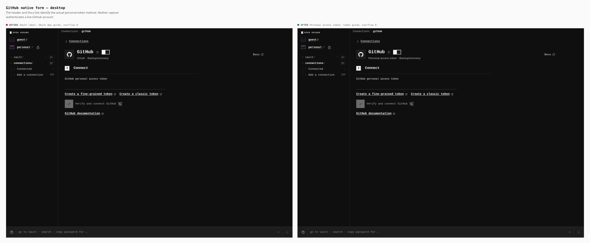
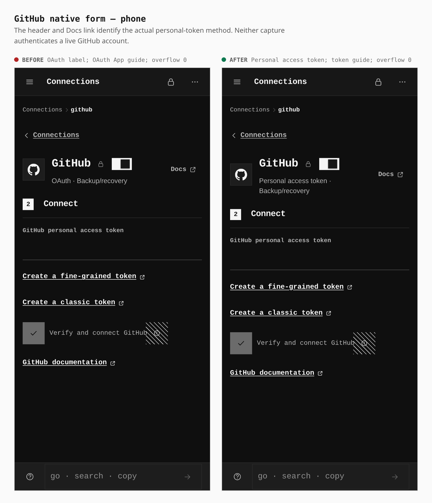
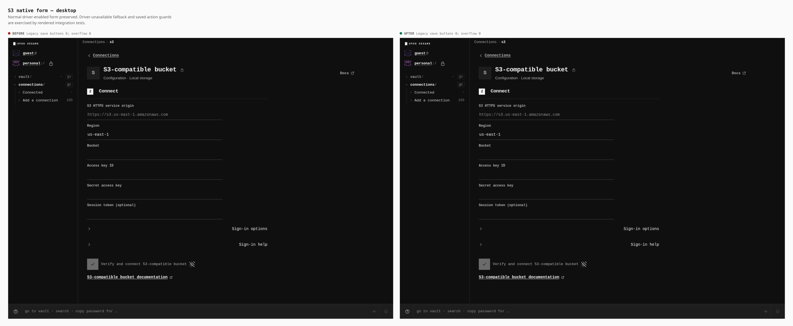
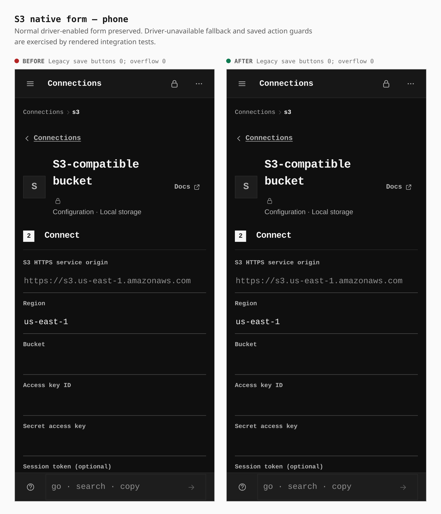
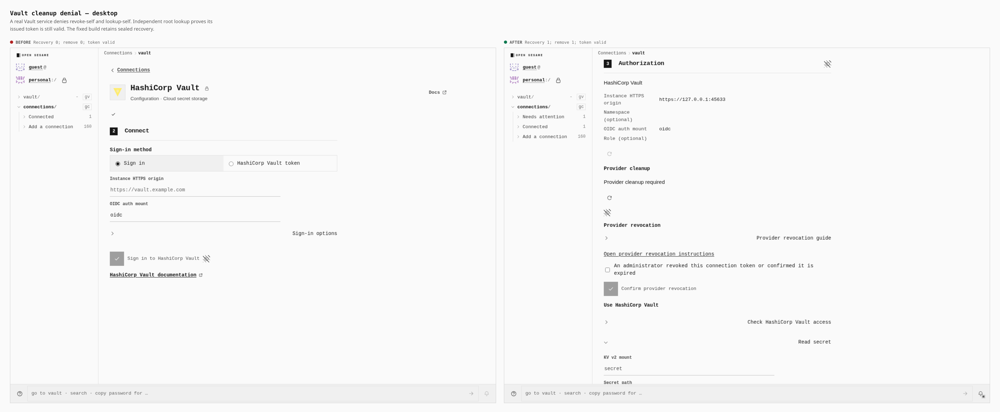
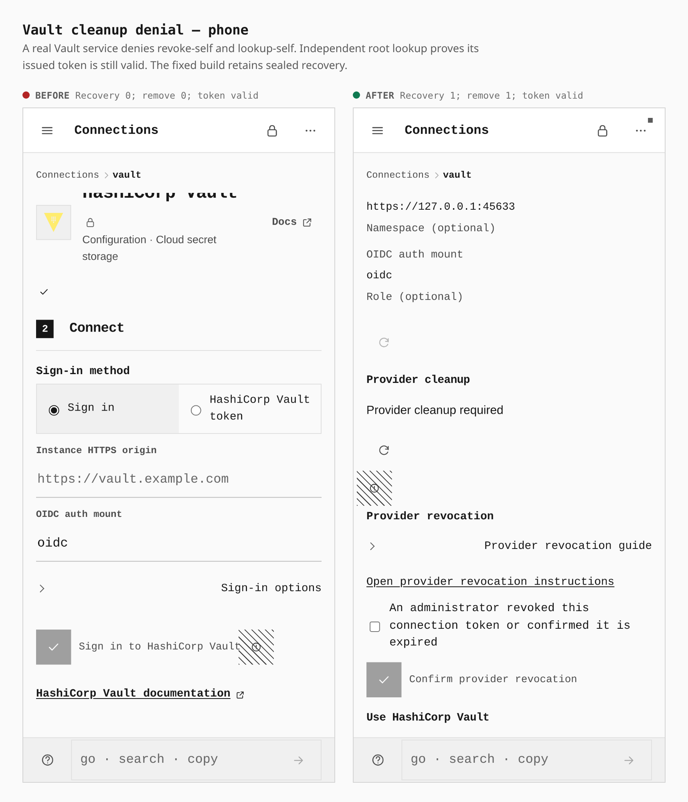
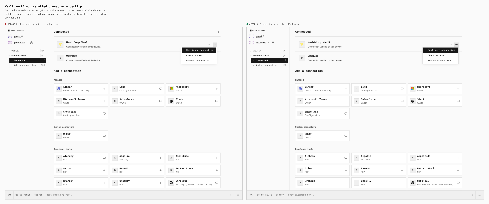
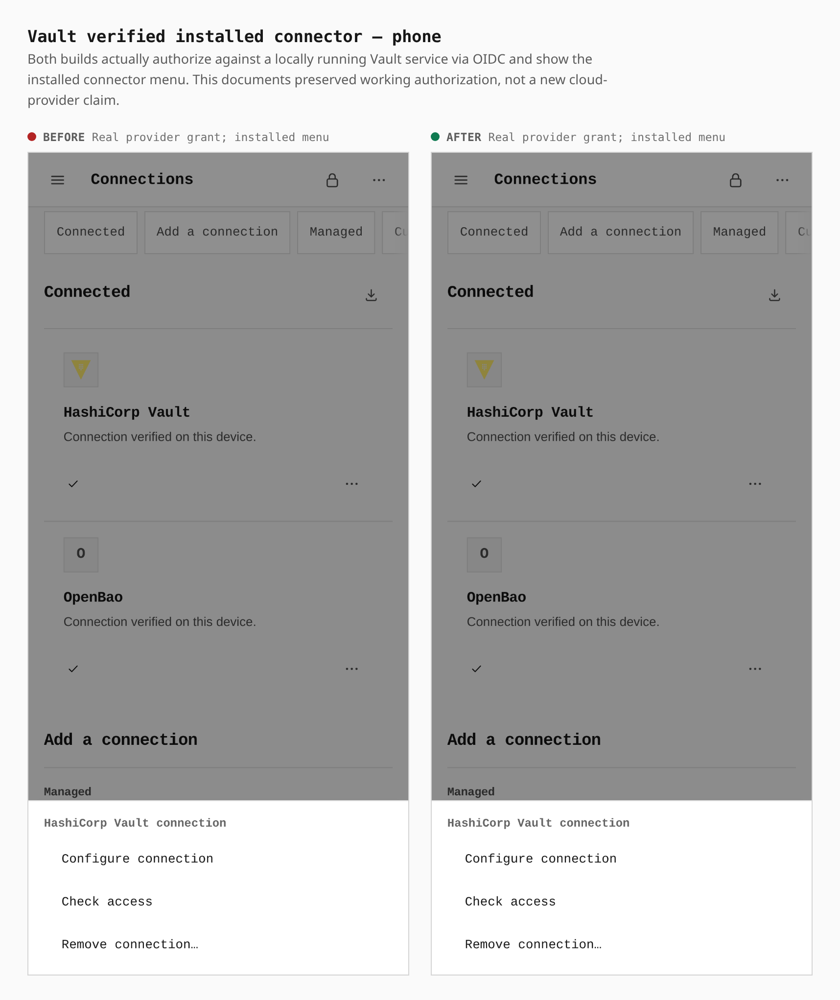

# Connector self-review

Before: `83883018e` (the incoming `main` build). After: this change. Both are actual static Pages builds, using the same browser journeys on desktop (1366 × 1000) and phone (390 × 844 CSS pixels). No DOM overlays or fabricated connected state.

## GitHub authentication identity

The native GitHub connection uses a personal access token. Its header previously said OAuth and its Docs link opened OAuth App registration documentation. It now says **Personal access token** and links to GitHub's token guide. Neither build below has authenticated a live GitHub account.

Measurements: OAuth label → Personal access token label; OAuth App Docs URL → personal access token Docs URL; horizontal overflow **0 → 0**. The driver-unavailable and stale GitHub App status regressions are covered by rendered integration tests, rather than by altering the browser's driver capabilities for these screenshots.

## S3 native form preservation

The ordinary native S3 form remains available. The fixed descriptor also keeps a driver-unavailable connection on its native unavailable surface rather than falling through to a configuration-only form; that condition is covered by rendered integration tests. Saved resource actions now require an available method and active driver.

Measurements: legacy Save configuration buttons **0 → 0**, horizontal overflow **0 → 0** in the normal driver-enabled journey. These pairs document preservation, not a new cloud authorization claim.

## Vault cleanup permission denial

A genuine HashiCorp Vault 1.21.4 service issues an OIDC token through oidc-provider 9.11.2. A policy denies both revoke-self and lookup-self. An independent root-authorized lookup proves the token is still valid. The before build discards its recovery record. The after build retains the sealed credential and the removal action.

Measurements: retained provider recovery regions **0 → 1**, removal actions **0 → 1**, token independently valid **true → true**. The after journey reloads the sealed store before asserting recovery. Vault's HTTP 403 is no longer treated as proof of revocation.

After an administrator actually revokes the token, the provider can still answer 403. The bounded confirmation forgets only the selected local recovery credential after explicit administrator acknowledgment. It does not claim provider verification or mark a connection as working. Tests also reject wrong provider/connection bindings, active exchanges, stale revisions and a locked commit.

## Genuine installed connector

These comparisons show the installed connector menu after genuine Vault OIDC authorization in both builds. The browser reads an authorized KV secret, and the installed card exposes configuration through its menu. This working path is preserved by the review fixes.

Measurements: successful real provider-issued grant **true → true**, installed configuration menu **present → present**. These are locally running provider services, not a live customer cloud account.

## Reproduction and scope

`capture-native-ui.mjs before|after <dist> <raw-directory>` captures GitHub/S3 from a supplied build. `compose-gallery.mjs <native-raw> <provider-before> <provider-after>` uses the repository composition tool to frame the untouched captures with measured captions; only those comparison sheets are committed. `apps/pages/scripts/verify-provider-auth.mjs` builds a dedicated-origin deployment and runs genuine Vault/OpenBao OIDC and MinIO services, alongside explicitly marked Google SDK fixtures. `provider-vault-cleanup-policy.mjs` contains the real permission-denial and administrator-revocation journeys. The before regression receipt and public measurements contain no bearer credentials.

This evidence establishes the tested service behavior. It does not establish live authorization against every cloud provider, or browser-only GitHub App provisioning. Public OAuth clients still require provider registration and allowed redirect URIs; confidential-client-only routes remain external-runtime capabilities.
