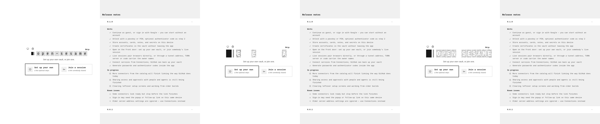
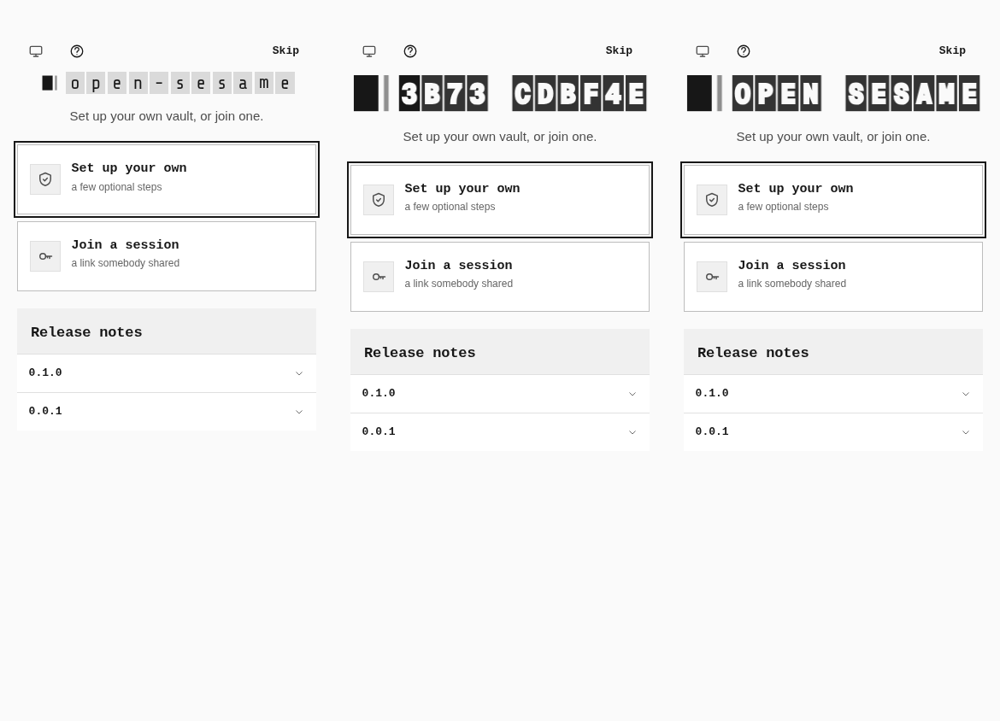

# Front-door visual contract after the merged brand update

Main's approved brand change `4ce98a580` (#1012) replaced the narrow slot reel
with fitted canvas plates. The front-door contract still compared against the
earlier reel and captured the new canvas before its cipher had finished. CSS
animation suppression does not stop the canvas's requestAnimationFrame loop.

The harness now waits for the actual `cipher-wordmark--settled` state. Only
the two front-door baselines were refreshed after inspecting the completed
letters. Production rendering, the four vault baselines, pixelmatch sensitivity
0.1, and the 1.5% pixel / 5% content budgets are unchanged.

Each sheet shows three full frames, left to right: the previous committed
baseline; the failed capture before the settle wait; the reviewed completed
cipher capture used as the new baseline. These are historical baseline and
actual runtime captures, not two newly built product versions. This change
repairs the test contract for the already merged design. The original product
before/after evidence is in the [brand gallery](../2026-10-10-brand-plates/README.md).
Raw intermediate frames remain outside version control.

## Desktop, 1440 × 900

The browser measures the completed wordmark canvas at 480 × 65.83px and the
first road at y=479.95px. Both correspond to the merged brand's larger plate
layout. The previous baseline differs from the reviewed completed capture by
1.71% of all pixels and 3.62% of content.

## Phone, 390 × 844

The browser measures the completed canvas at 350 × 50.17px, the first road at
y=192.66px, and release notes at y=384.59px. The larger plate layout moves the
roads and notes down about 24px relative to the previous reel. The previous
baseline differs by 6.24% of all pixels and 14.43% of content.

## Validation and source provenance

All six ordinary visual comparisons pass in 34.1s with `VISUAL_UPDATE` unset.
The visual package's 22 unit tests and TypeScript check pass. Fresh browser
contexts verify both the settled class and completed cursor value `-1`.

[The receipt](receipt.json) records exact pixel comparisons, image hashes,
browser geometry, and the git blob / SHA-256 hashes of the front door,
wordmark, canvas implementation, font and relevant CSS. Every listed production
source is byte-identical to main `83883018e`; the current build includes the
connector fixes but has no front-door product changes. The harness adds only
an explicit readiness wait, with no masks, motion overrides or increased
budgets.
